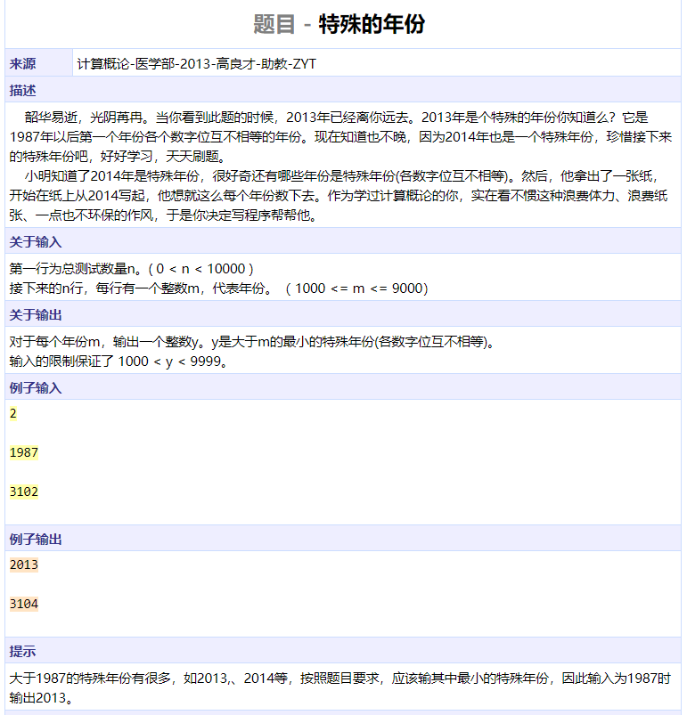
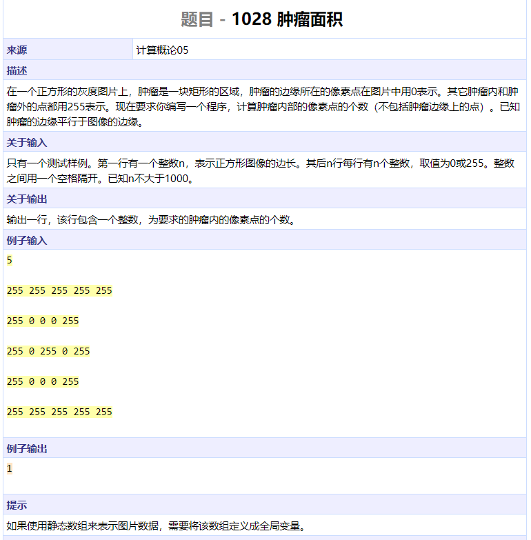
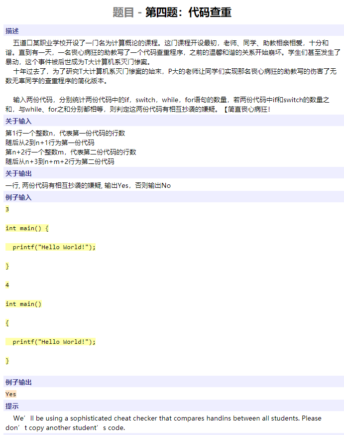
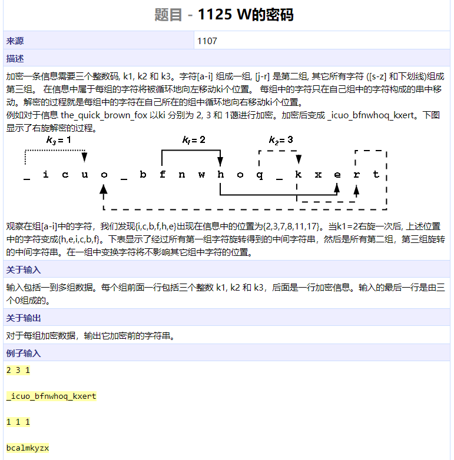
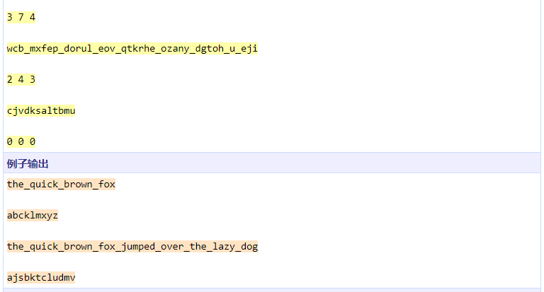
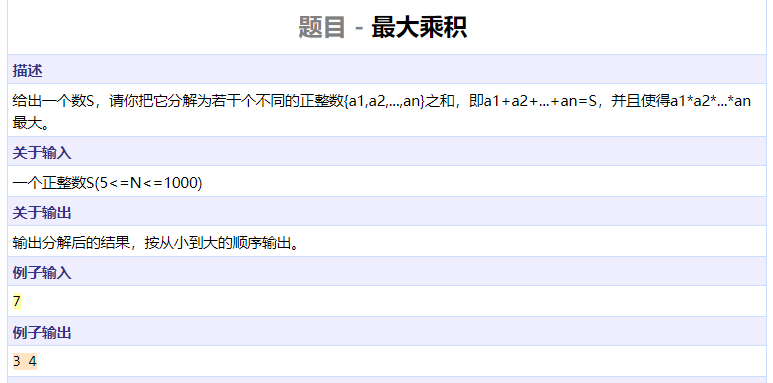
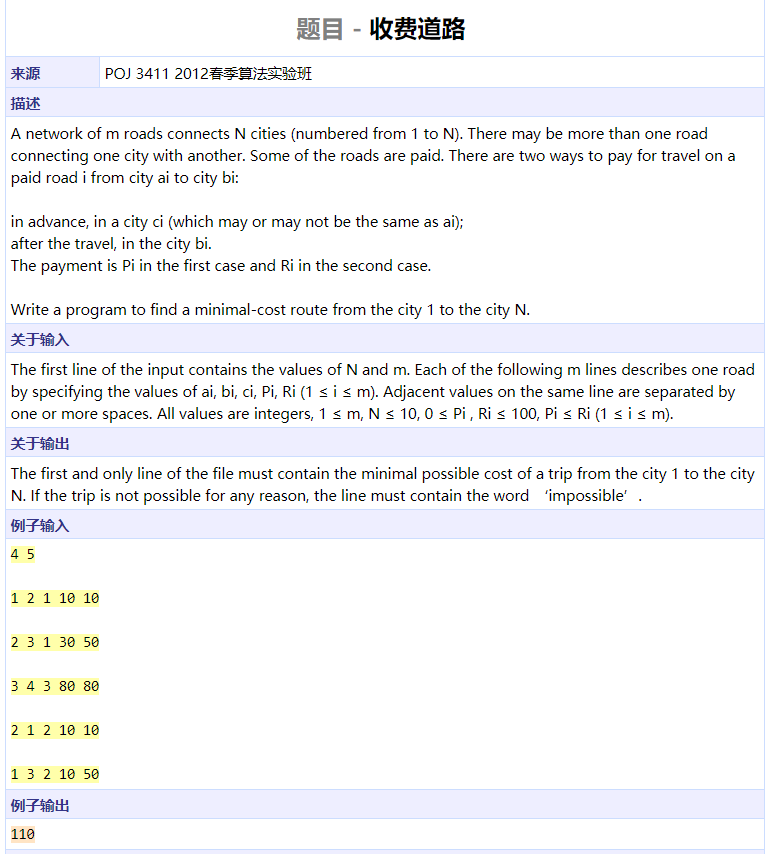

```cpp
#include <algorithm>
#include <iostream>
#include <functional>
#include <vector>
using namespace std;

int main()
{
	int n;
	cin >> n;
	cout << ((n == 1 || n == 3 || n == 5) ? "NO" : "YES") << endl;
	return 0;
}
```


```cpp
#include <algorithm>
#include <iostream>
using namespace std;

struct People {
	int id;
	int key;
	friend bool operator < (const People &a, const People &b) {
		return a.key > b.key || a.key == b.key && a.id < b.id;
	}
} peo[10000];

int main()
{
	int t, n, k;
	cin >> t;
	while (t--) {
		cin >> n >> k;
		for (int i = 0; i < n; ++i) {
			peo[i].id = i + 1;
			cin >> peo[i].key;
		}
		sort(peo, peo + n);
		k = min(k, n);
		cout <<  k << endl;
		for (int i = 0; i < k; ++i) {
			if (i == k - 1)
				cout << peo[i].id << endl;
			else
				cout << peo[i].id << ' ';
		}
	}
	return 0;
}
```




```cpp
#include <algorithm>
#include <iostream>
#include <functional>
#include <vector>
using namespace std;

int main()
{
	int n, tmp;
	bool seen[110] = {false};
	cin >> n;
	for (int i = 0; i < n; ++i) {
		cin >> tmp;
		seen[tmp] = true;
	}
	for (int i = 1; i <= n; ++i)
		if (!seen[i])
			cout << i << endl;
	return 0;
}
```




```cpp
#include <algorithm>
#include <iostream>
#include <functional>
#include <vector>
using namespace std;

bool related4(int n)
{
	if (n % 4 == 0)
		return true;
	while (n) {
		if (n % 10 == 4)
			return true;
		n /= 10;
	}
	return false;
}

int main()
{
	int n, res = 0, num = 1, k = 0;
	cin >> n;
	while (k < 10) {
		while (related4(num))
			num++;
		res += num;
		num++, k++;
	}
	cout << res << endl;
	return 0;
}
```






```cpp
#include <algorithm>
#include <iostream>
#include <functional>
#include <vector>
using namespace std;

int main()
{
	int m, n, nums[100][100];
	cin >> m >> n;
	for (int i = 0; i < m; ++i)
		for (int j = 0; j < n; ++j)
			cin >> nums[i][j];
	for (int k = 0; k < m + n - 1; ++k) {
		int i = 0, j = k;
		if (j >= n) {
			j = n - 1;
			i = k - j;
		}
		while (i < m && j >= 0) {
			cout << nums[i][j] << endl;
			i++, j--;
		}
	}
	return 0;
}
```




```cpp
#include <algorithm>
#include <iostream>
#include <functional>
#include <vector>
using namespace std;

int num[20000];

int main()
{
	int n, res = 0;
	cin >> n;
	for (int i = 0; i < n; ++i)
		cin >> num[i];
	for (int i = 0; i < n; ++i) {
		int minh = num[i];
		for (int j = i; j < n; ++j) {
			minh = min(minh, num[j]);
			res = max(res, minh * (j - i + 1));
		}
	}
	cout << res << endl;
	return 0;
}
```




```cpp
#include <algorithm>
#include <iostream>
#include <functional>
#include <vector>
#include <cmath>
using namespace std;

struct Group {
	double grow;
	int id;
} g[100];

bool cmp(const Group &a, const Group &b)
{
	return a.grow < b.grow || a.grow == b.grow && a.id < b.id;
}

int main()
{
	int n;
	double a, b;
	cin >> n;
	for (int i = 0; i < n; ++i) {
		cin >> g[i].id;
		cin >> a >> b;
		g[i].grow = b / a;
	}
	sort(g, g + n, cmp);
	double ave = (g[0].grow + g[n - 1].grow) / 2;
	int split = 0;
	while (split < n && g[split].grow < ave)
		split++;
	cout << n - split << endl;
	for (int i = split; i < n; ++i)
		cout << g[i].id << endl;
	cout << split << endl;
	for (int i = 0; i < split; ++i)
		cout << g[i].id << endl;
	return 0;
}
```

