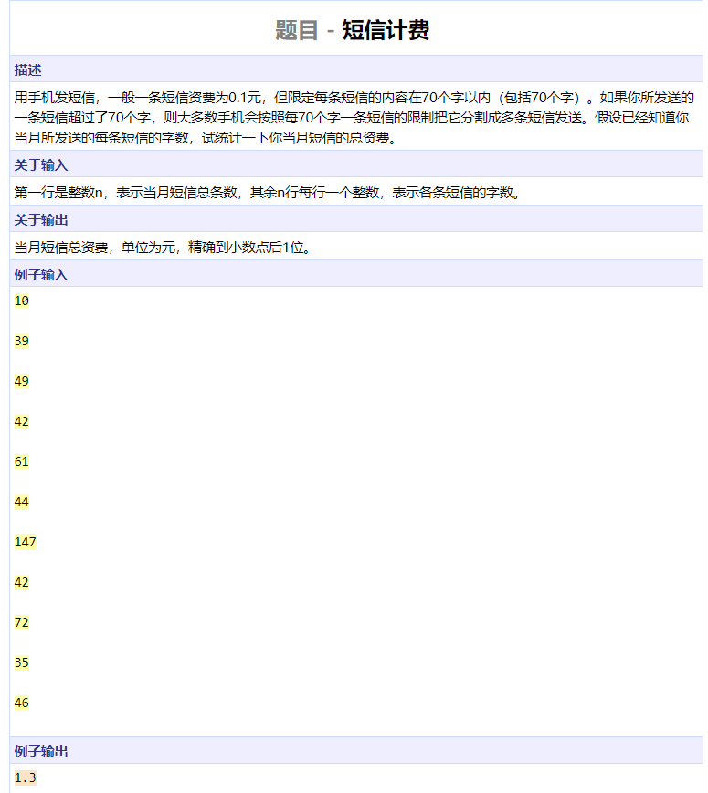

```cpp
#include <algorithm>
#include <iostream>
#include <functional>
#include <vector>
#include <cmath>
#include <cstdio>
using namespace std;

int main()
{
	int n, tmp;
	double res = 0;
	cin >> n;
	while (n--) {
		cin >> tmp;
		res += (tmp + 69) / 70;
	}
	printf("%.1f\n", res / 10);
	return 0;
}
```


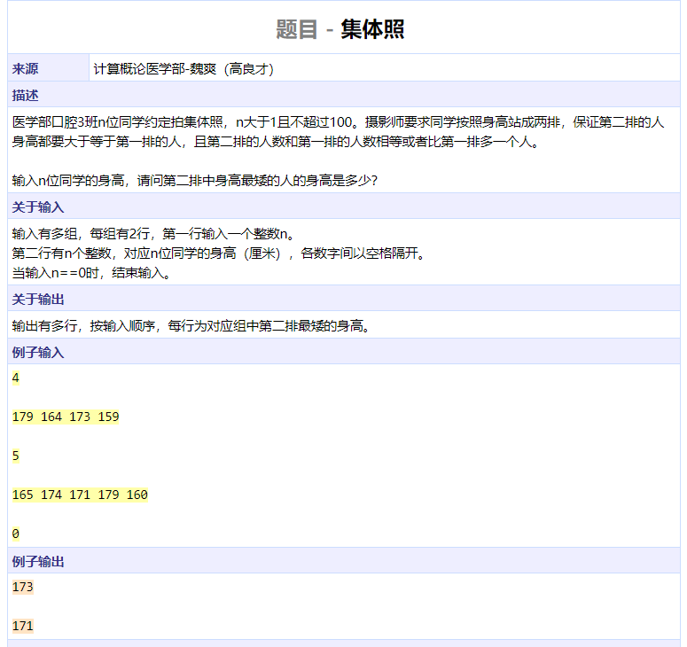

```cpp
#include <algorithm>
#include <iostream>
#include <functional>
#include <vector>
#include <cmath>
#include <cstdio>
using namespace std;

int main()
{
	int n;
	int nums[100];
	while (cin >> n && n != 0) {
		for (int i = 0; i < n; ++i)
			cin >> nums[i];
		sort(nums, nums + n);
		cout << nums[n / 2] << endl;
	}
	return 0;
}
```


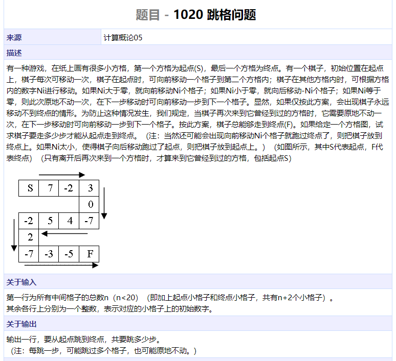

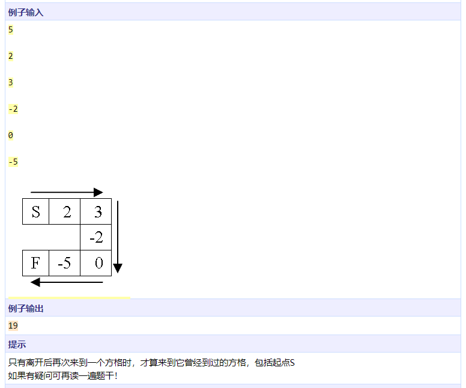

```cpp
#include <iostream>
using namespace std;

int main()
{
	int nums[30], n;
	bool visited[30] = {false};
	nums[0] = 1;
	cin >> n;
	for (int i = 1; i <= n; ++i)
		cin >> nums[i];
	int res = 0, idx = 0;
	while (true) {
		if (idx > n)
			break;
		if (idx < 0)
			idx = 0;
		if (visited[idx]) {
			idx += 1;
			res += 2;
		} else if (nums[idx] == 0) {
			visited[idx] = true;
			res += 2;
			idx += 1;
		} else {
			res += 1;
			visited[idx] = true;
			idx += nums[idx];
		}
	}
	cout << res << endl;
	return 0;
}

```


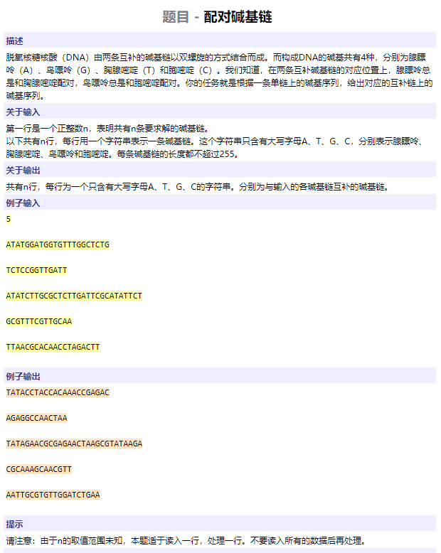

```cpp
#include <cstring>
#include <iostream>
using namespace std;

char s1[256], s2[256];

int main()
{
    int n;
    cin >> n;
    while (n--) {
        cin >> s1;
        int l = strlen(s1);
        for (int i = 0; i < l; ++i) {
            if (s1[i] == 'A')
                s2[i] = 'T';
            else if (s1[i] == 'T')
                s2[i] = 'A';
            else if (s1[i] == 'C')
                s2[i] = 'G';
            else
                s2[i] = 'C';
        }
        s2[l] = '\0';
        cout << s2 << endl;
    }
    return 0;
}
```


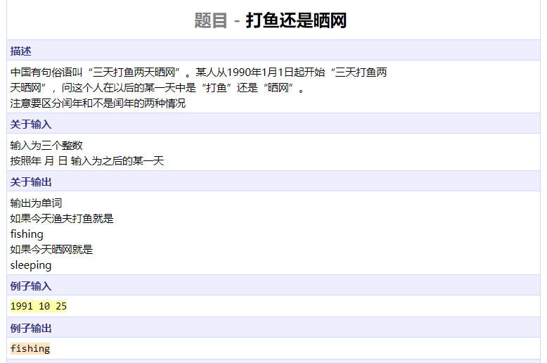

```cpp
#include <iostream>
using namespace std;

int main()
{
	int year, month, day;
	int ms[] = { 0, 31, 28, 31, 30, 31, 30, 31, 31, 30, 31, 30, 31 };
	cin >> year >> month >> day;
	int d = 0;
	for (int i = 1990; i < year; ++i)
		if (i % 4 == 0 && i % 100 != 0 || i % 400 == 0)
			d += 366;
		else
			d += 365;
	for (int i = 1; i < month; ++i)
		d += ms[i];
	if (month > 2 && (year % 4 == 0 && year % 100 != 0 || year % 400 == 0))
		d += 1;
	d += day - 1;
	d %= 5;
	cout << (d < 3 ? "fishing" : "sleeping") << endl; 
	return 0;
}
```


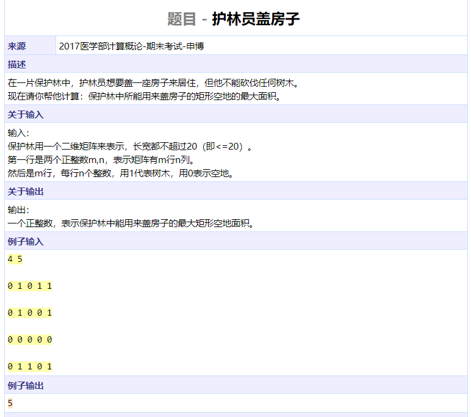

```cpp
#include <iostream>
using namespace std;

bool judge(int mat[][20], int i, int j, int k, int l)
{
	for (int x = i; x < j; ++x)
		for (int y = k; y < l; ++y)
			if (mat[x][y] != 0)
				return false;
	return true;
}

int main()
{
	int m, n, mat[20][20];
	cin >> m >> n;
	for (int i = 0; i < m; ++i)
		for (int j = 0; j < n; ++j)
			cin >> mat[i][j];
	int res = 0;
	for (int i = 0; i < m; ++i)
		for (int j = i + 1; j <= m; ++j)
			for (int k = 0; k < n; ++k)
				for (int l = k + 1; l <= n; ++l)
					if (judge(mat, i, j, k, l))
						res = max(res, (j - i) * (l - k));
	cout << res << endl;
	return 0;
}
```


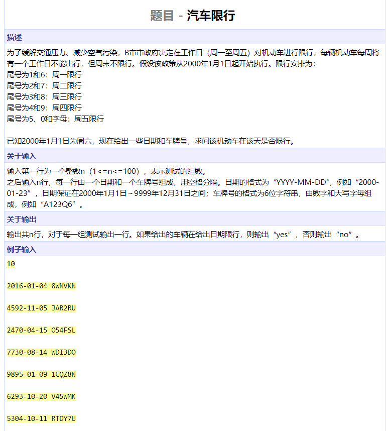

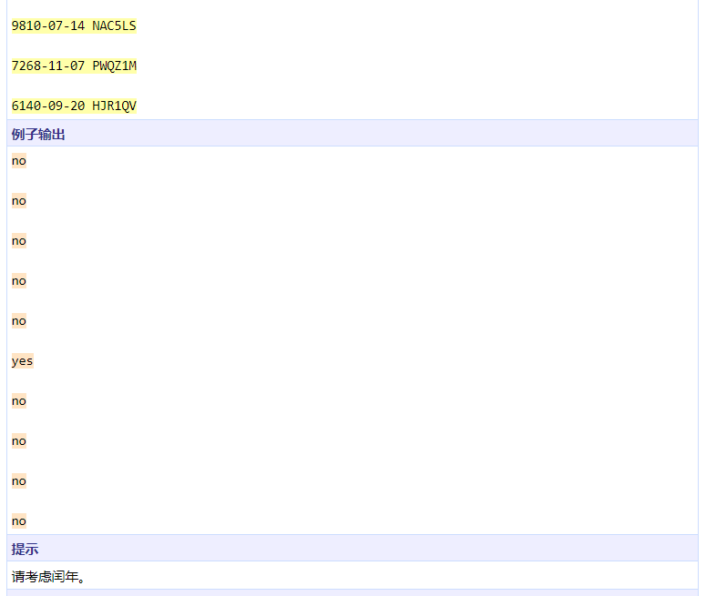

```cpp
#include <iostream>
#include <cstring>
using namespace std;

bool leap(int year)
{
	return year % 4 == 0 && year % 100 != 0 
		|| year % 400 == 0;
}

int weekday(int year, int month, int day)
{
	int start = 5;		// 0-6 for 周一-日
	for (int i = 2000; i < year; ++i)
		start += leap(i) ? 366 : 365;
	int months[] = { 0, 31, 28, 31, 30, 31, 30, 31, 31, 30, 31, 30, 31 };
	if (leap(year))
		months[2] = 29;
	for (int i = 1; i < month; ++i)
		start += months[i];
	start += day - 1;
	return start % 7;
}

bool restrict(int DAY, char end)
{
	return DAY == 0 && (end == '1' || end == '6')
		|| DAY == 1 && (end == '2' || end == '7')
		|| DAY == 2 && (end == '3' || end == '8')
		|| DAY == 3 && (end == '4' || end == '9')
		|| DAY == 4 && (end == '5' || end == '0' || isalpha(end));
}

int main()
{
	int n;
	cin >> n;
	while (n--) {
		int year, month, day;
		char tmp;
		char id[10];
		cin >> year >> tmp >> month >> tmp >> day;
		cin >> id;
		int DAY = weekday(year, month, day);
		cout << (restrict(DAY, id[5]) ? "yes" : "no") << endl;
	}
	return 0;
}
```


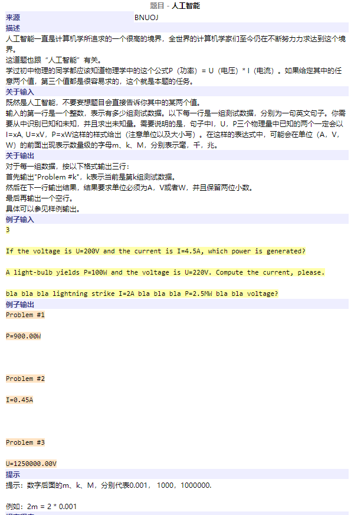

```cpp
#include <cstdio>
#include <iostream>
#include <cstring>
using namespace std;

bool getpattern(char s[], int l, const char pattern[],  double *res)
{
	char *p = strstr(s, pattern);
	if (p == NULL)
		return false;
	p += strlen(pattern);
	char c;
	sscanf(p, "%lf%c", res, &c);
	switch (c)
	{
	case 'm':
		*res /= 1000;
		break;
	case 'k':
		*res *= 1000;
		break;
	case 'M':
		*res *= 1e6;
		break;
	}
	return true;
}

int main()
{
	char s[1010];
	int n;
	cin >> n;
	cin.get();
	double P, I, U;
	bool gotIUP[3] = { false };
	for (int i = 0; i < n; ++i) {
		cin.getline(s, 1000);
		printf("Problem #%d\n", i + 1);
		int l = strlen(s);
		gotIUP[0] = getpattern(s, l, "I=", &I);
		gotIUP[1] = getpattern(s, l, "U=", &U);
		gotIUP[2] = getpattern(s, l, "P=", &P);
		int idx = 0;
		for (int i = 0; i < 3; ++i)
			if (!gotIUP[i])
				idx = i;
		switch (idx)
		{
		case 0:
			I = P / U;
			printf("I=%.2lfA\n", I);
			break;
		case 1:
			U = P / I;
			printf("U=%.2lfV\n", U);
			break;
		case 2:
			P = U * I;
			printf("P=%.2lfW\n", P);
			break;
		default:
			printf("???\n");
			break;
		}
	}
	return 0;
}
```


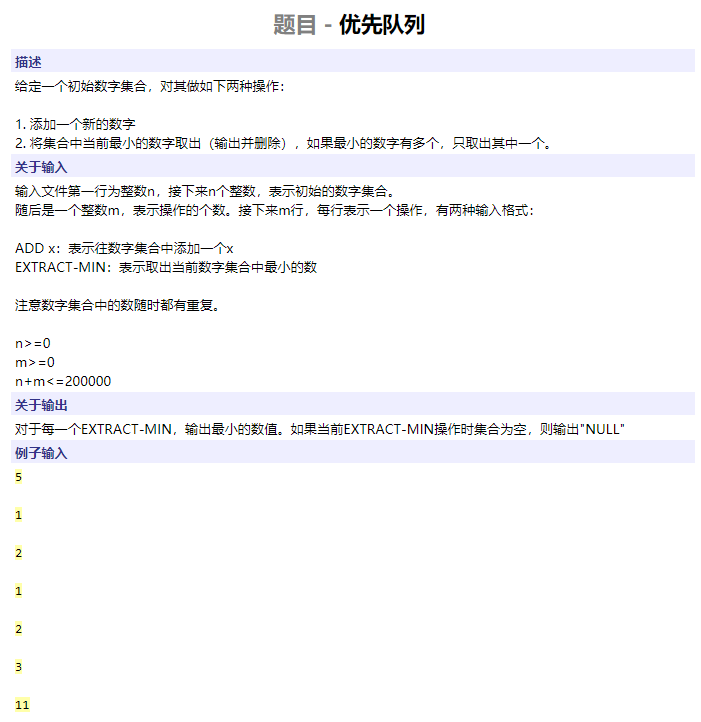

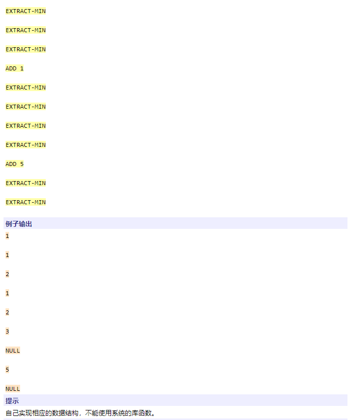

```cpp
#include <iostream>
#include <cstring>
using namespace std;

int array[200000];		// 本题不要求掌握，有兴趣的同学可以自学堆
int asize = 0;

void up(int array[], int size, int idx)
{
	while (idx > 0) {
		int parent = (idx - 1) / 2;
		if (array[parent] > array[idx]) {
			swap(array[parent], array[idx]);
			idx = parent;
		} else {
			break;
		}
	}
}

void down(int array[], int size, int idx)
{
	int leftidx = idx * 2 + 1;
	int rightidx = idx * 2 + 2;
	while (leftidx < size) {
		int minidx = rightidx;
		if (rightidx >= size || array[leftidx] < array[rightidx])
			minidx = leftidx;
		if (array[minidx] < array[idx]) {
			swap(array[minidx], array[idx]);
			idx = minidx;
			leftidx = idx * 2 + 1;
			rightidx = idx * 2 + 2;
		} else {
			break;
		}
	}
}

int extract(int array[], int &size)
{
	swap(array[0], array[size - 1]);
	size--;
	down(array, size, 0);
	return array[size];
}

void insert(int array[], int &size, int val)
{
	array[size++] = val;
	up(array, size, size - 1);
	return;
}


void heapify(int array[], int size)
{
	for (int i = (size - 1) / 2; i >= 0; --i)
		down(array, size, i);
	return;
}

int main()
{
	cin >> asize;
	for (int i = 0; i < asize; ++i)
		cin >> array[i];
	heapify(array, asize);
	int k, val;
	char ope[100];
	cin >> k;
	while (k--) {
		cin >> ope;
		if (ope[0] == 'A') {
			cin >> val;
			insert(array, asize, val);
		} else {
			if (asize == 0)
				cout << "NULL" << endl;
			else
				cout << extract(array, asize) << endl;
		}		
	}
	return 0;
}
```

