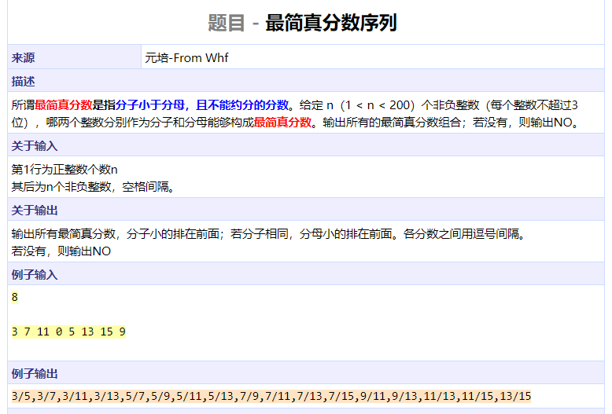
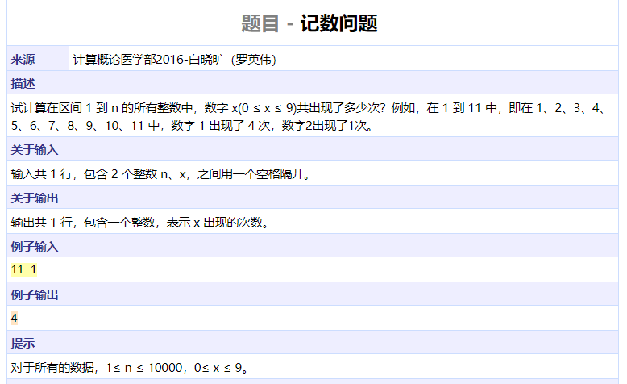
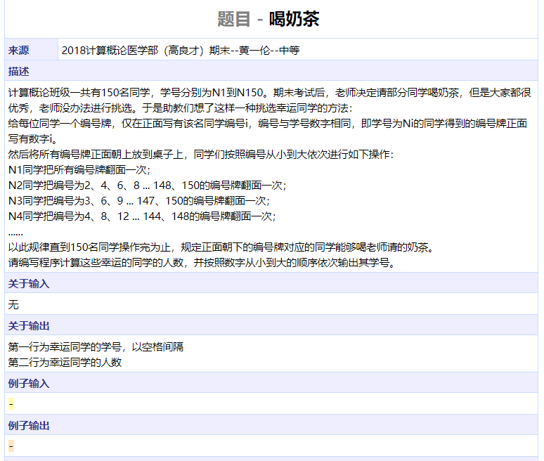
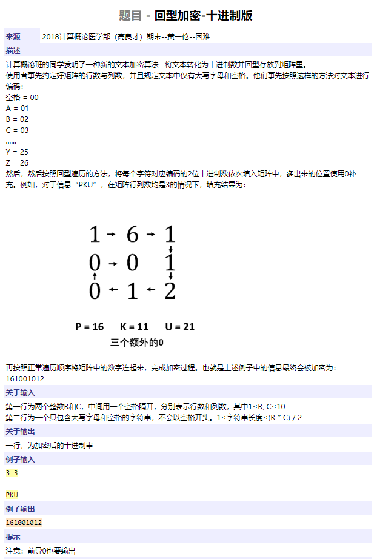
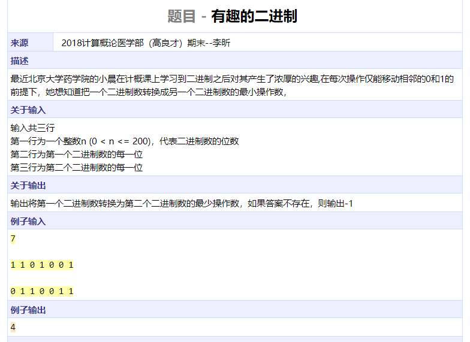
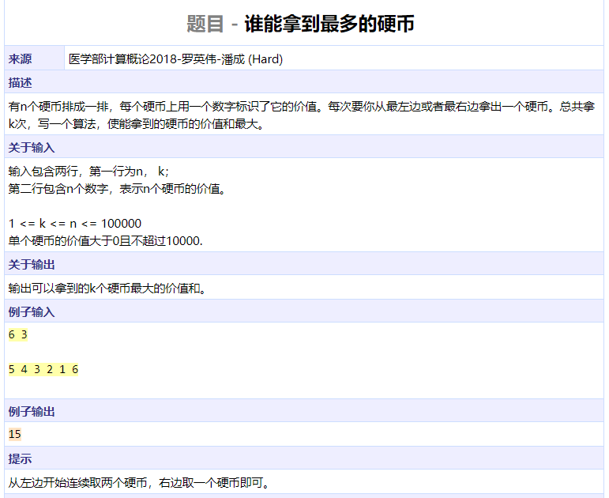
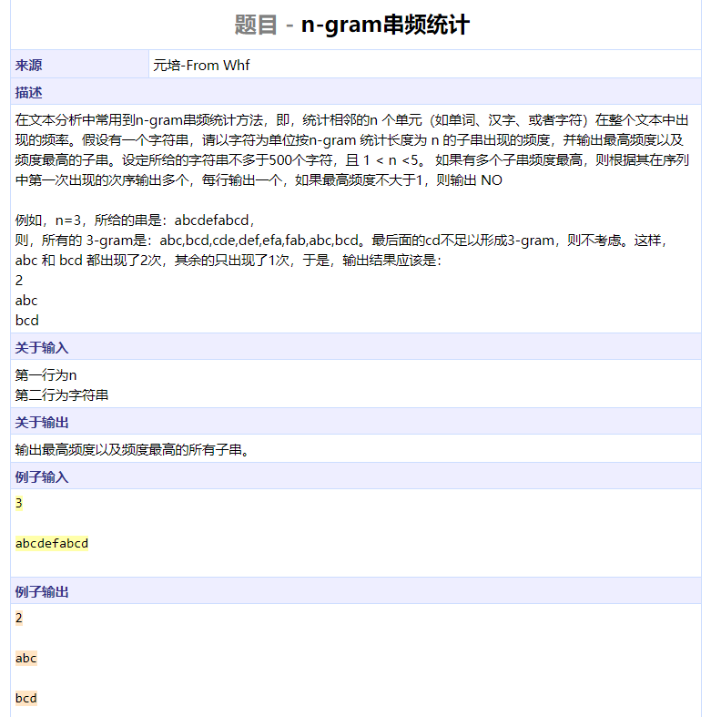
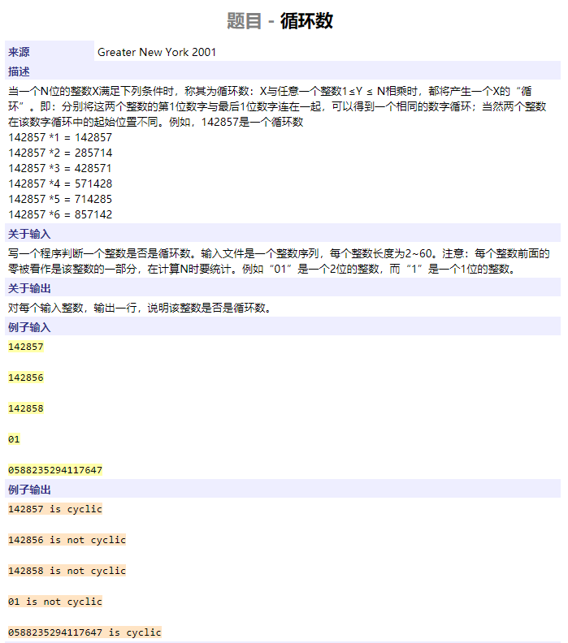
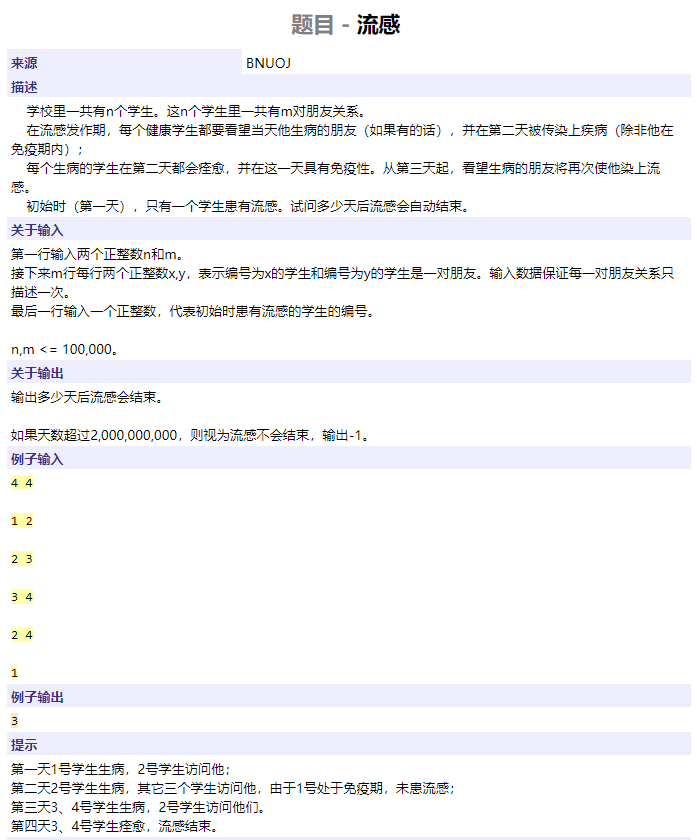

```cpp
#include <iostream>
#include <cstring>
#include <algorithm>
using namespace std;

int gcd(int x, int y) { return x == 0 ? y : gcd(y % x, x); }

int main()
{
	int n;
	int nums[200];
	cin >> n;
	for (int i = 0; i < n; ++i)
		cin >> nums[i];
	sort(nums, nums + n);
	bool flag = false;
	for (int i = 0; i < n - 1; ++i) {
		if (nums[i] == 0)
			continue;
		for (int j = i + 1; j < n; ++j) {
			if (gcd(nums[i], nums[j]) == 1) {
				if (!flag) {
					flag = true;
					printf("%d/%d", nums[i], nums[j]);
				} else {
					printf(",%d/%d", nums[i], nums[j]);
				}
			}
		}
	}
	if (!flag)
		cout << "NO";
	cout << endl;
	return 0;
}
```




```cpp
#include <iostream>
#include <cstring>
#include <algorithm>
using namespace std;

int main()
{
	int upper, x;
	cin >> upper >> x;
	int cnt[10] = { 0 };
	for (int i = 1; i <= upper; ++i) {
		int tmp = i;
		while (tmp) {
			cnt[tmp % 10]++;
			tmp /= 10;
		}
	}
	cout << cnt[x] << endl;
	return 0;
}
```




```cpp
#include <iostream>
#include <cstring>
#include <algorithm>
using namespace std;

int main()
{
	int cnt = 0;
	for (int i = 1; i * i <= 150; ++i) {
		if (cnt > 0)
			cout << ' ';
		cout << 'N' << i * i;
		cnt++;
	}
	cout << endl << cnt << endl;
	return 0;
}
```




```cpp
#include <iostream>
#include <cstring>
#include <algorithm>
using namespace std;

int main()
{
	int m, n;
	char s[110], fill[220];
	char matrix[11][11];
	bool visited[11][11];
	cin >> m >> n;
	cin.get();
	cin.getline(s, 102);
	int l = strlen(s);
	int idx = 0;
	for (int i = 0; i < l; ++i) {
		int num = s[i] == ' ' ? 0 : s[i] - 'A' + 1;
		fill[idx++] = num / 10 + '0';
		fill[idx++] = num % 10 + '0';
	}
	for (int i = l * 2; i < m * n; ++i)
		fill[idx++] = '0';
	fill[idx] = '\0';
	memset(visited, false, sizeof(visited));
	memset(matrix, 0, sizeof(matrix));
	int dx[] = { 0, 1, 0, -1 };
	int dy[] = { 1, 0, -1, 0 };
	int dir = 0, i = 0, j = 0, cnt = 0;
	while (cnt < m * n) {
		matrix[i][j] = fill[cnt++];
		visited[i][j] = true;
		int ii = i + dx[dir], jj = j + dy[dir];
		if (ii >= m || ii < 0 || jj >= n || jj < 0 || visited[ii][jj])
			dir = (dir + 1) % 4;		
		i = i + dx[dir], j = j + dy[dir];
	}
	for (int i = 0; i < m; ++i)
		cout << matrix[i];
	cout << endl;
	return 0;
}
```




```cpp
#include <iostream>
#include <cstring>
#include <algorithm>
using namespace std;

int main()
{
	int n;
	int nums1[200], nums2[200];
	int idxs1[200], idxs2[200];
	int idx1 = 0, idx2 = 0;
	cin >> n;
	for (int i = 0; i < n; ++i)
		cin >> nums1[i];
	for (int i = 0; i < n; ++i)
		cin >> nums2[i];
	for (int i = 0; i < n; ++i)
		if (nums1[i] == 1)
			idxs1[idx1++] = i;
	for (int i = 0; i < n; ++i)
		if (nums2[i] == 1)
			idxs2[idx2++] = i;
	if (idx1 != idx2)
		cout << -1 << endl;
	else {
		int res = 0;
		for (int i = 0; i < idx1; ++i)
			res += abs(idxs1[i] - idxs2[i]);
		cout << res << endl;
	}
	return 0;
}
```




```cpp
#include <iostream>
#include <cstring>
#include <algorithm>
using namespace std;

int nums[100010], presum[100010];

int main()
{
	int n, k;
	presum[0] = 0;
	cin >> n >> k;
	for (int i = 1; i <= n; ++i) {
		cin >> nums[i];
		presum[i] = nums[i] + presum[i - 1];
	}
	int minn = presum[n];
	for (int i = n - k; i <= n; ++i)
		minn = min(minn, presum[i] - presum[i - n + k]);
	cout << presum[n] - minn << endl;
	return 0;
}
```




```cpp
#include <iostream>
#include <cstring>
#include <algorithm>
using namespace std;

char s[510];
char words[500][10];
int words_idx;
char tmp[10];
int cnts[500];

int main()
{
	int k;
	cin >> k >> s;
	int l = strlen(s);
	for (int i = 0; i < l - k + 1; ++i) {
		char saved = s[i + k];
		s[i + k] = '\0';
		strcpy(tmp, s + i);
		s[i + k] = saved;
		bool flag = false;
		for (int i = 0; i < words_idx; ++i) {
			if (strcmp(words[i], tmp) == 0) {
				cnts[i]++;
				flag = true;
				break;
			}
		}
		if (!flag)
			strcpy(words[words_idx++], tmp);
	}
	int maxn = 0;
	for (int i = 0; i < words_idx; ++i)
		maxn = max(maxn, cnts[i]);
	if (maxn == 0) {
		cout << "NO" << endl;
		return 0;
	}
	cout << maxn + 1 << endl;
	for (int i = 0; i < words_idx; ++i)
		if (cnts[i] == maxn)
			cout << words[i] << endl;
	return 0;
}-
```




```cpp
#include <iostream>
#include <cstring>
#include <algorithm>
using namespace std;

char s1[200], s2[200];

bool iscycl(char s1[], char s2[])
{
	int l1 = strlen(s1);
	int l2 = strlen(s2);
	if (l1 != l2)
		return false;
	for (int i = 1; i < l1; ++i) {
		int cnt = 0;
		for (int j = 0; j < l1; ++j)
			if (s1[j] == s2[(j + i) % l1])
				cnt += 1;
		if (cnt == l1)
			return true;
	}
	return false;
}

void add(char s1[], char s2[])
{
	int l1 = strlen(s1);
	int l2 = strlen(s2);		// in fact, l1 equals with l20
	reverse(s1, s1 + l1);
	reverse(s2, s2 + l2);
	for (int i = 0; i < l1; ++i) {
		s1[i + 1] += (s1[i] - '0' + s2[i] - '0') / 10;
		s1[i] = (s1[i] - '0' + s2[i] - '0') % 10 + '0';
	}
	reverse(s1, s1 + l1);
	reverse(s2, s2 + l1);
}

int main()
{
	while (cin >> s1) {
		strcpy(s2, s1);
		int l1 = strlen(s1);
		bool flag = true;
		for (int i = 0; i < l1 - 1; ++i) {
			add(s1, s2);
			if (s1[l1] != '\0' || !iscycl(s1, s2)) {		// 如果发生了进位，不是循环数
				flag = false;
				break;
			}
		}
		cout << s2;
		cout << (flag ? " is cyclic" : " is not cyclic") << endl;
	}
	return 0;
}
```




```cpp
#include <cstdio>
#include <cstring>
#include <algorithm>
#include <queue>
#include <vector>
using namespace std;

vector<int> G[100010];
int waited[100010];
bool isvis[100010];
int n, m, u, v, s;
int ans;
queue<int> que;

int main(){
	scanf("%d %d", &n, &m);
	for (int i = 0; i < m; i++) {
		scanf("%d %d", &u, &v);
		G[u].push_back(v);
		G[v].push_back(u);
	}
	scanf("%d", &s);
	memset(isvis, 0, sizeof(isvis));
	ans = 0;
	que.push(s);
	isvis[s] = true;                                               
	while (!que.empty()){
		++ans;
		int cnt = 0;
		while(!que.empty()){
			u = que.front();
			que.pop();
			for(int i = 0; i < G[u].size(); i++){
				v = G[u][i];
				if(!isvis[v]){
					isvis[v] = true;
					waited[cnt] = v;
					++cnt;
				}
			}
		}
		for(int i = 0; i < cnt; i++)
			que.push(waited[i]);
	}
	printf("%d", ans);
	return 0;
}
```

