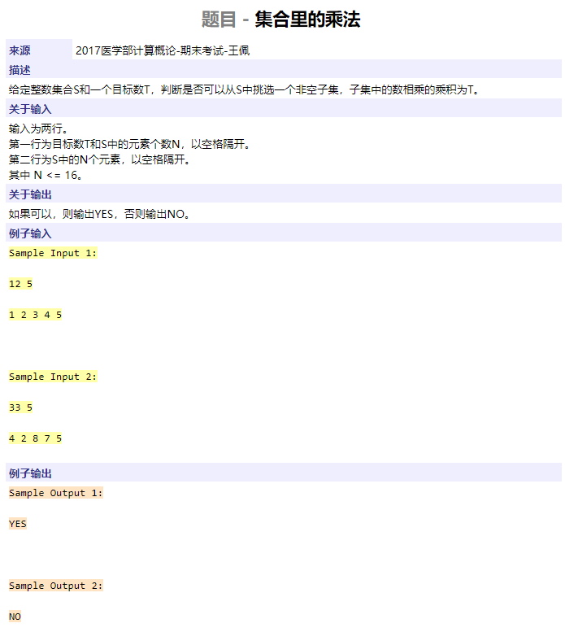

```cpp
#include <iostream>
using namespace std;

int main()
{
	int T;
	int array[200];
	cin >> T;
	while (T--) {
		int n, m, cnt = 0;
		cin >> n >> m;
		for (int i = 0; i < n; ++i) {
			int t = 0, tmp;
			for (int j = 0; j < m; ++j) {
				cin >> tmp;
				t += tmp;
			}
			if (t * 2 >= m)
				cnt += 1;
		}
		cout << cnt << endl;
	}
	return 0;
}
```


```cpp

```




```cpp

```


```cpp

```


```cpp

```


```cpp

```


```cpp
#include <algorithm>
#include <iostream>
using namespace std;

struct {
	int l, r;
	int n;
	int val;
} a[110];

void calval(int k)
{
	if (a[k].l == 0 && a[k].r == 0)
		return;
	if (a[k].l != 0) {
		calval(a[k].l);
		a[k].val += a[a[k].l].val;
	}
	if (a[k].r != 0) {
		calval(a[k].r);
		a[k].val += a[a[k].r].val;
	}
	return;
}

int search(int k)
{
	if (a[k].l == 0 && a[k].r == 0)
		return k;
	if (a[k].l == 0)
		return search(a[k].r);
	if (a[k].r == 0)
		return search(a[k].l);
	if (a[a[k].l].val < a[a[k].r].val)
		return search(a[k].r);
	return search(a[k].l);
}

int main()
{
	int T, n;
	cin >> T;
	while (T--) {
		cin >> n;
		for (int i = 1; i <= n; ++i) {
			cin >> a[i].val;
			a[i].l = a[i].r = 0;
			a[i].n = i;
		}
		for (int i = 0; i < n - 1; ++i) {
			int y1, y2, type;
			cin >> y1 >> y2 >> type;
			if (type == 0)
				a[y1].l = y2;
			else
				a[y1].r = y2;
		}
		calval(1);
		cout << search(1) << endl;
	}
	return 0;
}
```


```cpp
#include <algorithm>
#include <iostream>
#include <map>
#include <set>
#include <cstring>
using namespace std;

struct Node {
	Node *left, *right;
	int l, r;
	int id;
};

Node *build(int l, int r, int id = -1)
{
	Node *root = new Node;
	root->left = root->right = NULL;
	root->l = l;
	root->r = r;
	root->id = id;
	if (root->l < root->r) {
		int mid = (l + r) / 2;
		root->left = build(l, mid, id);
		root->right = build(mid + 1, r, id);
	}
	return root;
}

void add(Node *root, int l, int r, int id)
{
	if (root == NULL)
		return;
	if (l <= root->l && r >= root->r) {
		root->id = id;
		return;
	}
	if (l > root->r || r < root->l)
		return;
	if (root->id != -1) {
		root->left->id = root->id;
		root->right->id = root->id;
	}
	root->id = -1;
	add(root->left, l, r, id);
	add(root->right, l, r, id);
	return;
}

int ls[10000], rs[10000], lrs[20000];
set<int> s;
void cnt(Node *root)
{
	if (root == NULL)
		return;
	if (root->id != -1) {
		if (s.find(root->id) == s.end())
			s.insert(root->id);
		return;
	}
	cnt(root->left);
	cnt(root->right);
	return;
}

int main()
{
	int k;
	cin >> k;
	while (k--) {
		int t;
		cin >> t;
		for (int i = 0; i < t; ++i)
			cin >> ls[i] >> rs[i];
		memcpy(lrs, ls, t * sizeof(int));
		memcpy(lrs + t, rs, t * sizeof(int));
		sort(lrs, lrs + 2 * t);
		map<int, int> m;
		for (int i = 0; i < 2 * t; ++i)
			m[lrs[i]] = i;
		Node *root = build(0, 2 * t - 1);
		for (int i = 0; i < t; ++i)
			add(root, m[ls[i]], m[rs[i]] - 1, i);
		s.clear();
		cnt(root);
		cout << s.size() << endl;
	}
	return 0;
}
```


```cpp
#include <iostream>
#include <cstdio>
#include <cmath>
using namespace std;

int main()
{
	int K;
	cin >> K;
	for (int h = 0; h < K; ++h) {
		int t, n, tmp;
		double res = 0;
		cin >> n >> t;
		for (int i = 0; i < n; ++i) {
			cin >> tmp;
			double p = i * (n - i) + (n - i - 1) * (i + 1) + n;
			p = p / n / n;
			double p1 = (1 - pow(1 - 2 * p, 1.0 * t)) / 2;	// 伯努利事件发生奇数次的概率，二项式定理
			double p2 = 1 - p1;
			if (tmp == 1)
				swap(p1, p2);
			res += p1;
		}
		printf("Case #%d: %.4lf\n", h + 1, res);
	}
	return 0;
}
```

