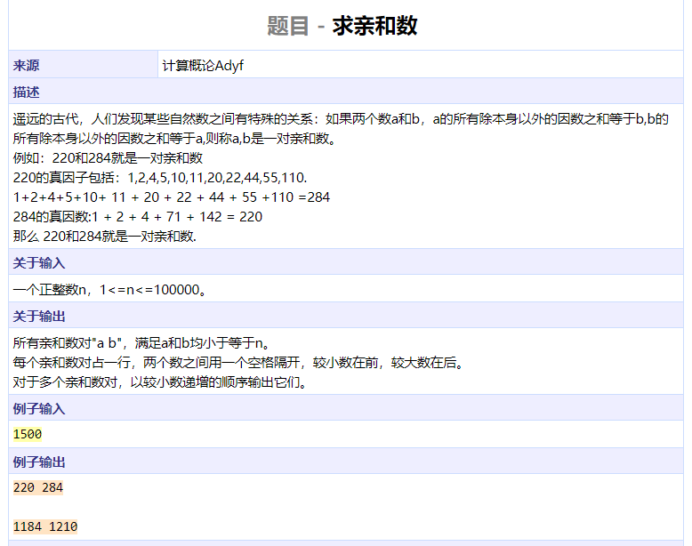
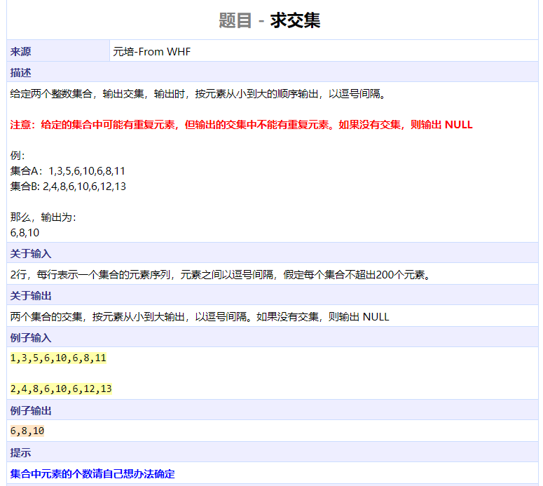
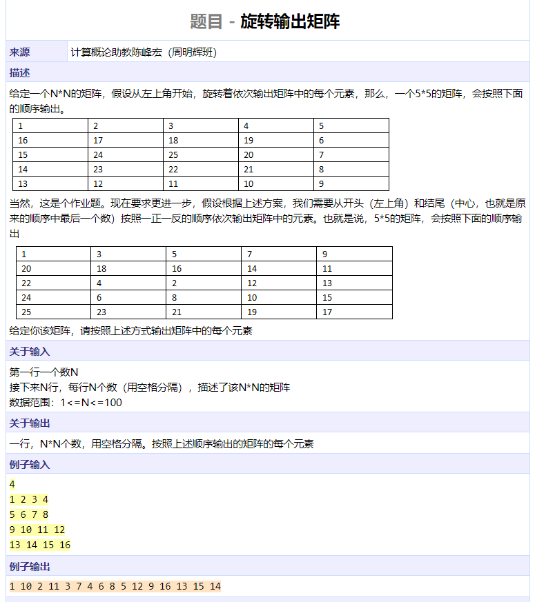
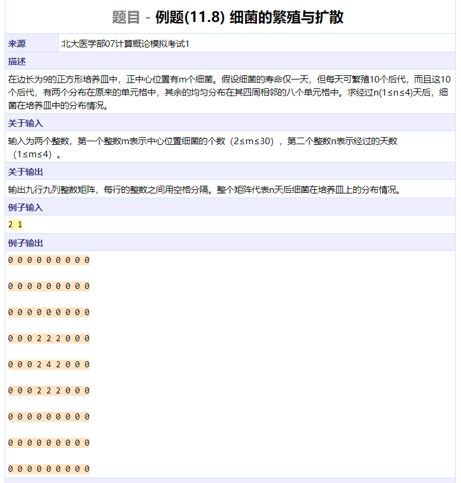
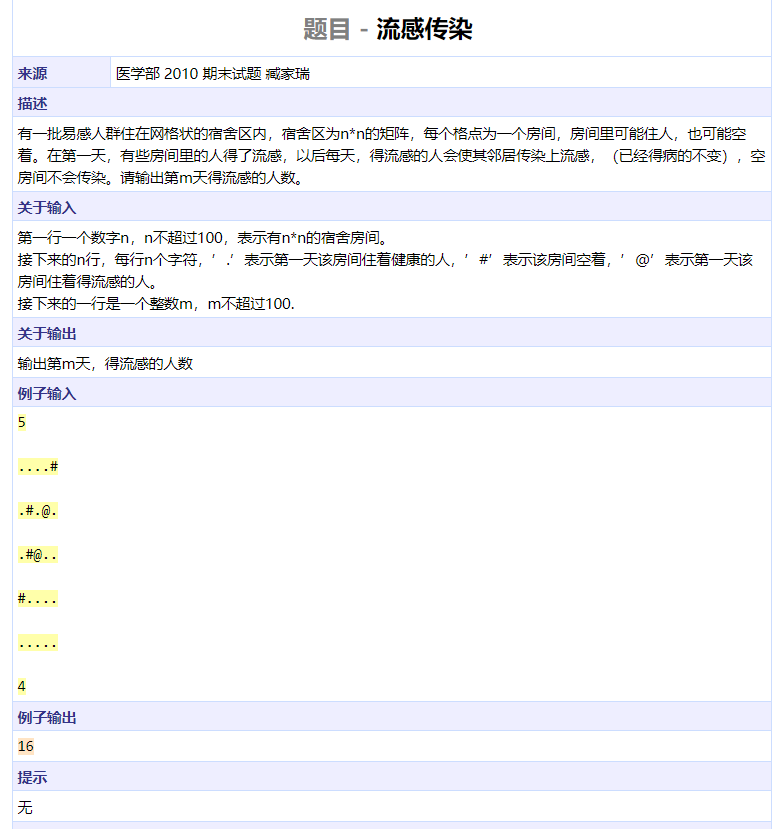
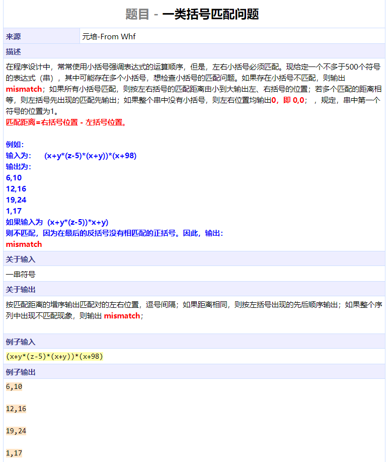
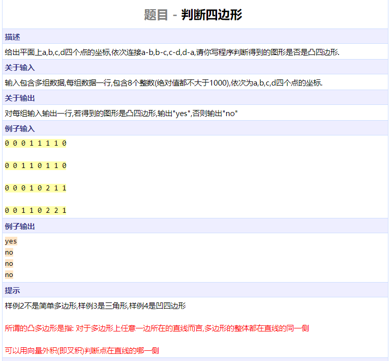
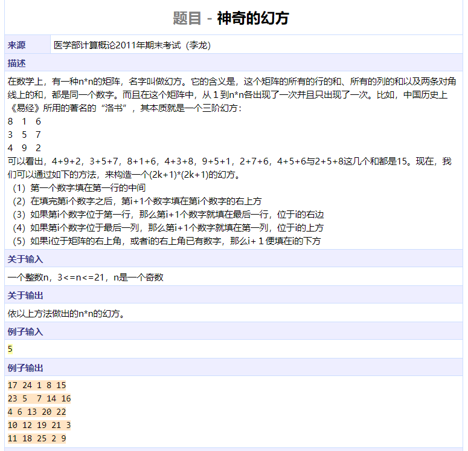
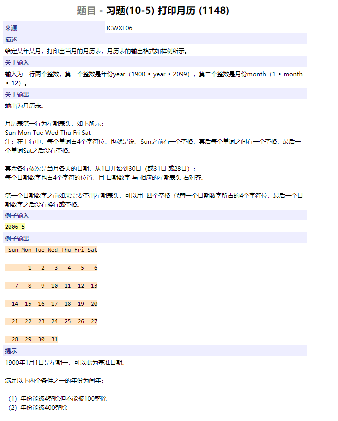

```cpp
#include <iostream>
using namespace std;

int acc[100010];

int func(int num)
{
	int res = 0;
	for (int i = 1; i * i <= num; ++i) {
		if (num % i == 0) {
			res += i;
			if (i != num / i && i != 1)
				res += num / i;
		}
	}
	return res;
}

int main()
{
	int n;
	cin >> n;
	for (int i = 1; i <= n; ++i)
		acc[i] = func(i);
	for (int i = 1; i < n; ++i)
		if (i < acc[i] && acc[i] <= n && acc[acc[i]] == i)
			cout << i << ' ' << acc[i] << endl;
	return 0;
}
```




```cpp
#include <algorithm>
#include <iostream>
using namespace std;


int main()
{
	int num1[210], num2[210], num3[210];
	int idx1 = 0, idx2 = 0, idx3 = 0;
	char c;
	while (true) {
		cin >> num1[idx1++];
		cin.get(c);
		if (c == '\n')
			break;
	}
	while (true) {
		cin >> num2[idx2++];
		cin.get(c);
		if (c == '\n')
			break;
	}
	sort(num1, num1 + idx1);
	sort(num2, num2 + idx2);
	for (int i = 0; i < idx1; ++i)
		for (int j = 0; j < idx2; ++j)
			if (num1[i] == num2[j])
				num3[idx3++] = num1[i];
	if (idx3 == 0)
		cout << "NULL" << endl;
	else {
		sort(num3, num3 + idx3);
		int *end = unique(num3, num3 + idx3);
		for (int *p = num3; p != end; ++p) {
			if (p + 1 == end)
				cout << *p << endl;
			else
				cout << *p << ',';
		}
	}
	return 0;
}
```




```cpp
#include <algorithm>
#include <iostream>
#include <cstring>
using namespace std;


int main()
{
	int n, num[100][100], mem[100][100];
	int arr[10000], idx = 0;
	int dx[] = {0,1,0,-1}, dy[] = {1,0,-1,0}, dir = 0;
	cin >> n;
	for (int i = 0; i < n; ++i)
		for (int j = 0; j < n; ++j)
			cin >> num[i][j];
	memset(mem, 0, sizeof(mem));
	int x = 0, y = 0, cnt = 0;
	while (cnt < n * n) {
		arr[idx++] = num[x][y];
		mem[x][y] = 1;
		int xx = x + dx[dir];
		int yy = y + dy[dir];
		if (xx < 0 || xx >= n || yy < 0 || yy >= n || mem[xx][yy]) {
			dir = (dir + 1) % 4;
			xx = x + dx[dir];
			yy = y + dy[dir];
		}
		x = xx, y = yy;
		cnt++;
	}
	bool flag = false;
	int i = 0, j = n * n - 1;
	for (int t = 0; t < n * n / 2; ++t) {
		if (!flag) {
			cout << arr[t];
			flag = true;
		} else {
			cout << ' ' << arr[t];
		}
		cout << ' ' << arr[n * n - 1 - t];
	}
	if (n % 2 == 1) {
		if (flag)
			cout << ' ';
		cout << arr[n * n / 2];
	}
	cout << endl;
	return 0;
}
```




```cpp
#include <algorithm>
#include <iostream>
#include <cstring>
using namespace std;

int main()
{
	int num1[9][9], num2[9][9];
	int m, n;
	memset(num1, 0, sizeof(num1));
	cin >> num1[4][4] >> n;
	while (n--) {
		memset(num2, 0, sizeof(num2));
		for (int i = 0; i < 9; ++i)
			for (int j = 0; j < 9; ++j)
				if (num1[i][j] > 0) {
					for (int x = i - 1; x <= i + 1; ++x)
						for (int y = j - 1; y <= j + 1; ++y)
							num2[x][y] += num1[i][j];
				}
		for (int i = 0; i < 9; ++i)
			for (int j = 0; j < 9; ++j)
				num1[i][j] += num2[i][j];
	}
	for (int i = 0; i < 9; ++i)
		for (int j = 0; j < 9; ++j)
			if (j == 8)
				cout << num1[i][j] << endl;
			else
				cout << num1[i][j] << ' ';
	return 0;
}
```




```cpp
#include <iostream>
using namespace std;

int main()
{
	char grids[100][100];
	int n, k;
	int dx[] = {1, 0, -1, 0};
	int dy[] = {0, 1, 0, -1};
	cin >> n;
	for (int i = 0; i < n; ++i)
		for (int j = 0; j < n; ++j)
			cin >> grids[i][j];
	cin >> k;
	while (--k) {
		for (int i = 0; i < n; ++i)
			for (int j = 0; j < n; ++j) {
				if (grids[i][j] != '@')
					continue;
				for (int k = 0; k < 4; ++k) {
					int ii = i + dx[k];
					int jj = j + dy[k];
					if (ii < 0 || ii >= n || jj < 0 || jj >= n)
						continue;
					if (grids[ii][jj] == '.')
						grids[ii][jj] = '!';
				}
			}
		for (int i = 0; i < n; ++i)
			for (int j = 0; j < n; ++j)
				if (grids[i][j] == '!')
					grids[i][j] = '@';
	}
	int sum = 0;
	for (int i = 0; i < n; ++i)
		for (int j = 0; j < n; ++j)
			sum += grids[i][j] == '@';
	cout << sum << endl;
	return 0;
}
```




```cpp
#include <algorithm>
#include <iostream>
#include <cstring>
using namespace std;

int fake_stack[510];
int stack_idx = 0;	

void push(int val) { fake_stack[stack_idx++] = val; }
int pop() { return fake_stack[--stack_idx]; }
int top() { return fake_stack[stack_idx - 1]; }

struct Pair {
	int start, end;
} pairs[500];
int pair_idx = 0;

bool cmp(const Pair &a, const Pair &b)
{
	if (a.end - a.start < b.end - b.start)
		return true;
	if (a.end - a.start > b.end - b.start)
		return false;
	return a.start < b.start;
}

int main()
{
	char s[510];
	cin.get(s, 500);
	int l = strlen(s);
	for (int i = 0; i < l; ++i) {
		if (s[i] == '(')
			push(i);
		else if (s[i] == ')') {
			if (stack_idx == 0) {
				cout << "mismatch" << endl;
				goto end;
			}
			int start = pop();
			pairs[pair_idx].start = start + 1;
			pairs[pair_idx].end = i + 1;
			pair_idx++;
		}
	}
	if (stack_idx > 0) {
		cout << "mismatch" << endl;
		goto end;
	}
	if (pair_idx == 0) {
		cout << "0,0" << endl;
		goto end;
	}
	sort(pairs, pairs + pair_idx, cmp);
	for (int i = 0; i < pair_idx; ++i)
		cout << pairs[i].start << ',' << pairs[i].end << endl;
end:
	return 0;
}
```




```cpp
#include <iostream>
using namespace std;


bool judge(int x[], int y[])
{
	for (int i = 0; i < 4; ++i) {
		int v1_x = x[(i + 1) % 4] - x[i];	// vector AB
		int v1_y = y[(i + 1) % 4] - y[i];	
		int v2_x = x[(i + 2) % 4] - x[(i + 1) % 4];	// vector BC
		int v2_y = y[(i + 2) % 4] - y[(i + 1) % 4];
		int v3_x = x[(i + 3) % 4] - x[(i + 1) % 4];	// vector BD
		int v3_y = y[(i + 3) % 4] - y[(i + 1) % 4];
		int prod1 = v1_x * v2_y - v1_y * v2_x;		// AB x BC
		int prod2 = v1_x * v3_y - v1_y * v3_x;		// AB x BD
		if (1.0 * prod1 * prod2 <= 0)		// different sign
			return false;
	}
	return true;
}

int main()
{
	int x[4], y[4];
	while (cin >> x[0] >> y[0] >> x[1] >> y[1] >> x[2] >> y[2] >> x[3] >> y[3])
		cout << (judge(x, y) ? "yes" : "no") << endl;
	return 0;
}
```




```cpp
#include <iostream>
#include <cstring>
using namespace std;

int main()
{
	int grids[30][30], n;
	bool visited[30][30];
	memset(visited, 0, sizeof(visited));
	cin >> n;
	int num = 1;
	int i = 0, j = n / 2;
	while (num <= n * n) {
		grids[i][j] = num++;
		visited[i][j] = true;
		if (i == 0 && j == n - 1 
		    || i - 1 >= 0 && j + 1 < n && visited[i - 1][j + 1]) {
			i = i + 1;
		} else if (i == 0) {
			i = n - 1;
			j++;
		} else if (j == n - 1) {
			j = 0;
			i--;
		} else {
			i--, j++;
		}
	}
	for (int i = 0; i < n; ++i) {
		cout << grids[i][0];
		for (int j = 1; j < n; ++j)
			cout << ' ' << grids[i][j];
		cout << endl;
	}
	return 0;
}
```




```cpp
#include <iostream>
#include <cstring>
#include <cstdio>
using namespace std;

bool leap(int year)
{
	return (year % 4 == 0 && year % 100 != 0) || year % 400 == 0;
}

int main()
{
	int months[] = { 0, 31, 28, 31, 30, 31, 30, 31, 31, 30, 31, 30, 31 };
	int year, month, d = 1;		// 0-6 for Sun-Sat
	cin >> year >> month;
	for (int i = 1900; i < year; ++i)
		if (leap(i))
			d += 366;
		else
			d += 365;
	if (leap(year))
		months[2] = 29;
	for (int i = 1; i < month; ++i)
		d += months[i];
	d %= 7;
	printf(" Sun Mon Tue Wed Thu Fri Sat\n");
	for (int i = 0; i < d; ++i)
		printf("    ");
	for (int i = 1; i <= months[month]; ++i) {
		printf("%4d", i);
		if ((d + 1) % 7 == 0)
			printf("\n");
		d += 1;
	}
	return 0;
}
```

