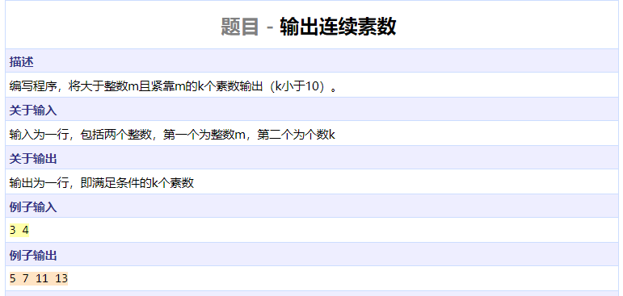
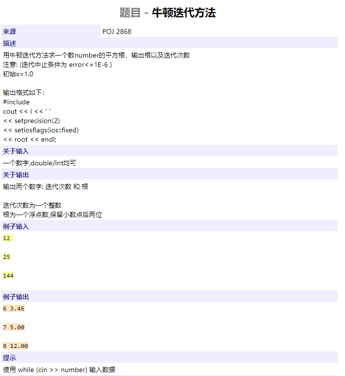
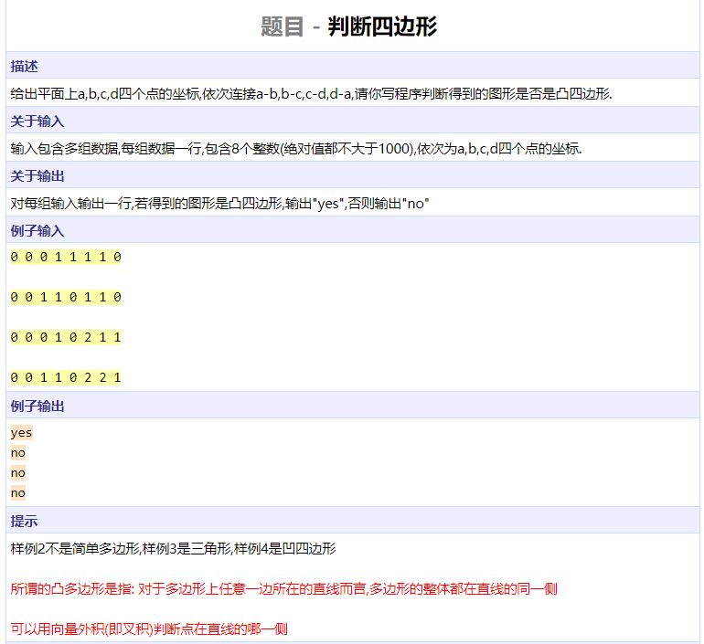
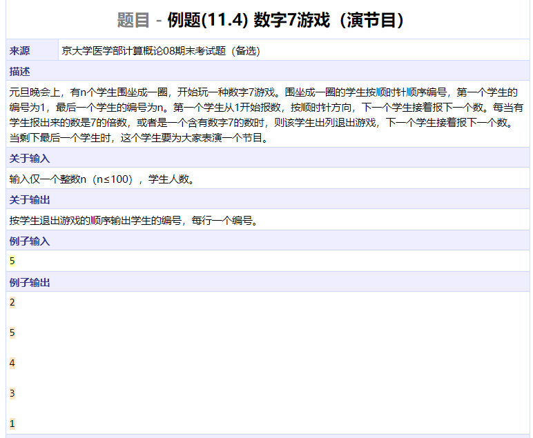
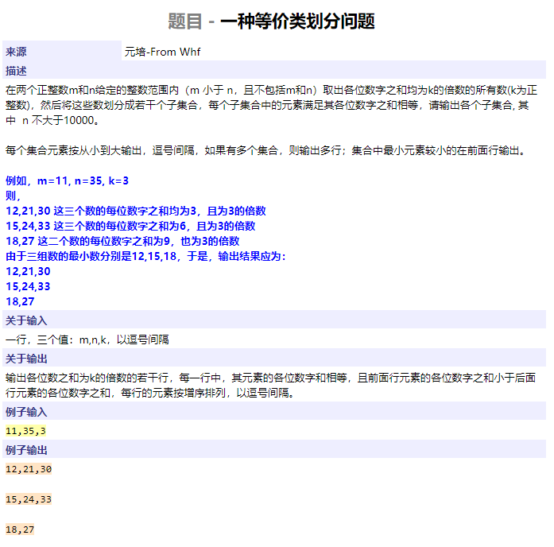

```cpp
#include <iostream>
using namespace std;

bool check(int n)
{
	if (n < 2)
		return false;
	for (int i = 2; i * i <= n; ++i)
		if (n % i == 0)
			return false;
	return true;
}

int main()
{
	int m, k;
	cin >> m >> k;
	m += 1;
	while (k--) {
		while (!check(m))
			m++;
		cout << m;
		if (k != 0)
			cout << " ";
		m++;
	}
	return 0;
}
```




```cpp
#include <iostream>
#include <iomanip>
#include <cmath>
using namespace std;

int main()
{
	double n;
	while (cin >> n) {
		double root = 1.0, prev = 0;
		int counter = 0;
		while (abs(root - prev) > 1e-6) {
			prev = root;
			root = (root + n / root) / 2;
			counter++;
		}
		cout << counter << ' ' << setprecision(2)
			<< setiosflags(ios::fixed) << root << endl;
	}
	return 0;
}
```




```cpp
#include <iostream>
using namespace std;


bool judge(int x[], int y[])
{
	for (int i = 0; i < 4; ++i) {
		int v1_x = x[(i + 1) % 4] - x[i];	// vector AB
		int v1_y = y[(i + 1) % 4] - y[i];	
		int v2_x = x[(i + 2) % 4] - x[(i + 1) % 4];	// vector BC
		int v2_y = y[(i + 2) % 4] - y[(i + 1) % 4];
		int v3_x = x[(i + 3) % 4] - x[(i + 1) % 4];	// vector BD
		int v3_y = y[(i + 3) % 4] - y[(i + 1) % 4];
		int prod1 = v1_x * v2_y - v1_y * v2_x;		// AB x BC
		int prod2 = v1_x * v3_y - v1_y * v3_x;		// AB x BD
		if (1.0 * prod1 * prod2 <= 0)		// different sign
			return false;
	}
	return true;
}

int main()
{
	int x[4], y[4];
	while (cin >> x[0] >> y[0] >> x[1] >> y[1] >> x[2] >> y[2] >> x[3] >> y[3])
		cout << (judge(x, y) ? "yes" : "no") << endl;
	return 0;
}
```




```cpp
#include <iostream>
using namespace std;

bool check(int n)
{
	if (n % 7 == 0)
		return true;
	while (n) {
		if (n % 10 == 7)
			return true;
		n /= 10;
	}
	return false;
}

int main()
{
	bool site[100] = { false };
	int n, cnt = 0, idx = 0, num = 1;
	cin >> n;
	while (cnt < n) {
		if (!site[idx]) {
			if (check(num)) {
				cout << idx + 1 << endl;
				site[idx] = true;
				cnt += 1;
			}
			num += 1;
		}
		idx = (idx + 1) % n;
	}
	return 0;
}
```




```cpp
#include <iostream>
using namespace std;

int nums[40][10000];
int idxs[40];

int cal(int n)
{
	int res = 0;
	while (n) {
		res += n % 10;
		n /= 10;
	}
	return res;
}

int main()
{

	char c;
	int m, n, k;
	cin >> m >> c >> n >> c >> k;
	for (int i = m + 1; i < n; ++i) {
		int p = cal(i);
		if (p % k == 0) {
			nums[p / k][idxs[p / k]] = i;
			idxs[p / k]++;
		}
	}
	for (int i = 0; i < 40; ++i) {
		for (int j = 0; j < idxs[i]; ++j) {
			if (j > 0)
				cout << ',';
			cout << nums[i][j];
			if (j == idxs[i] - 1)
				cout << endl;
		}
	}
	return 0;
}
```

