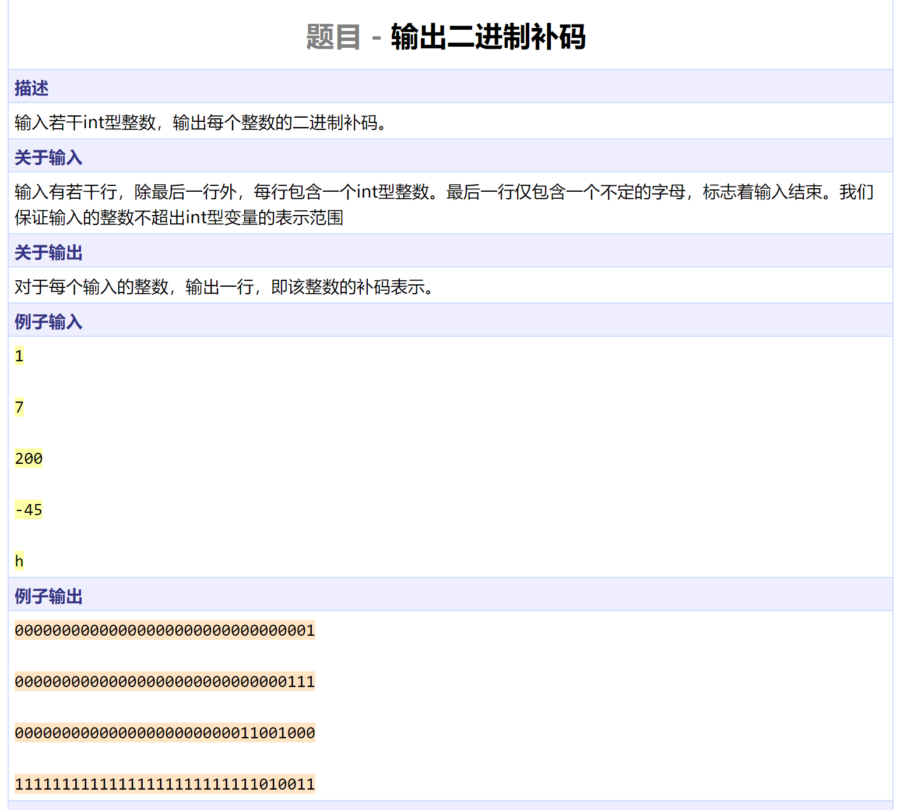
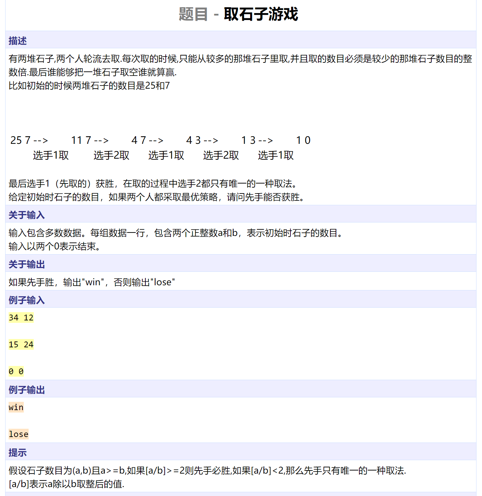
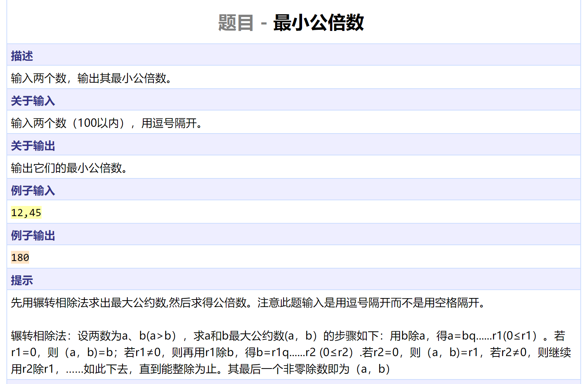
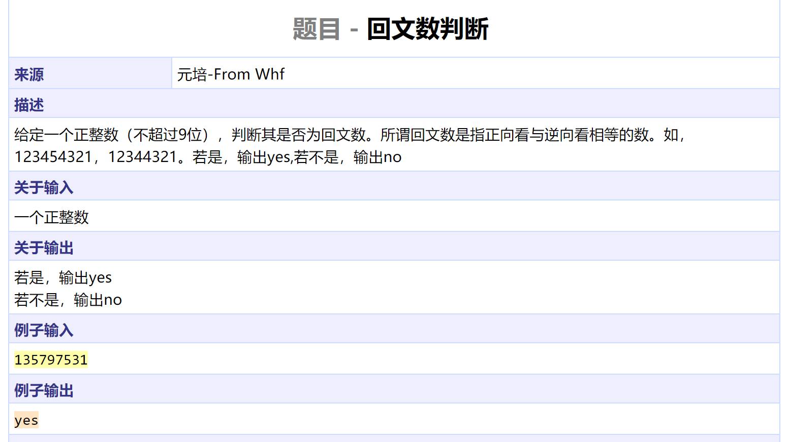
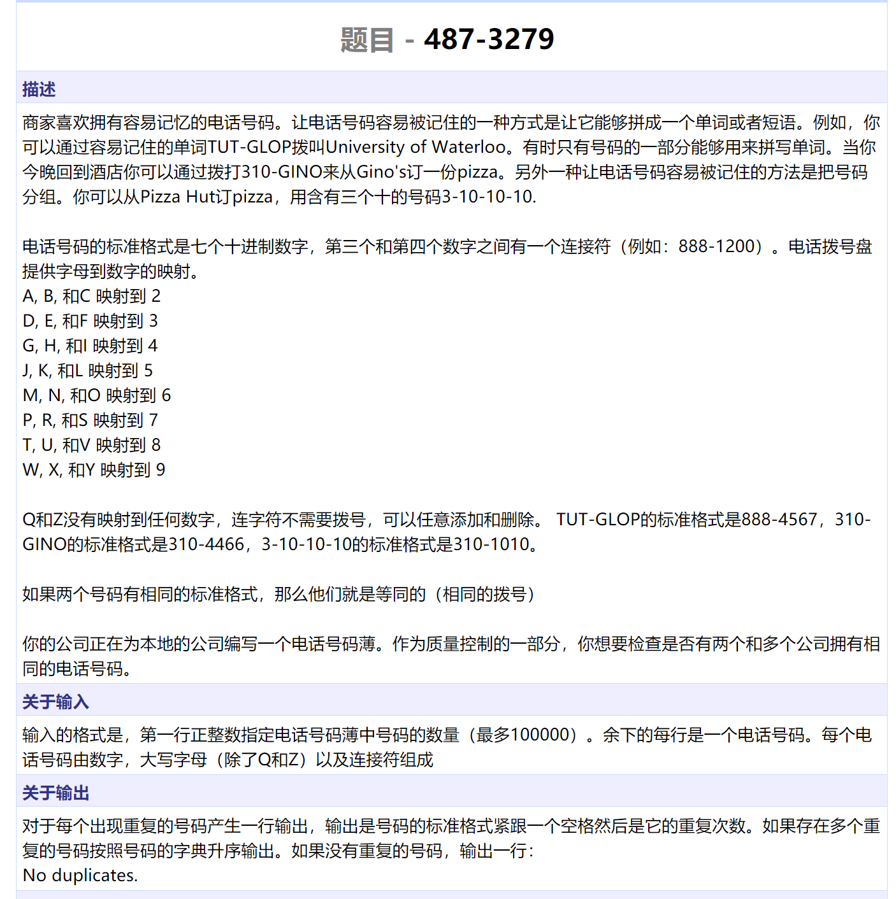
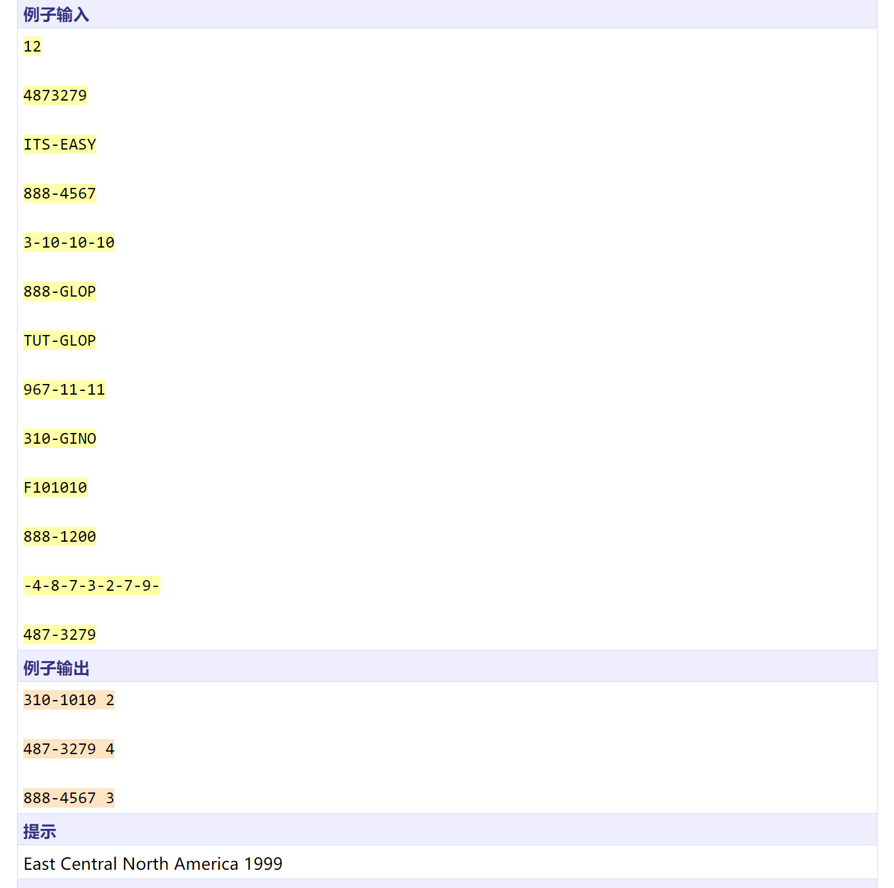
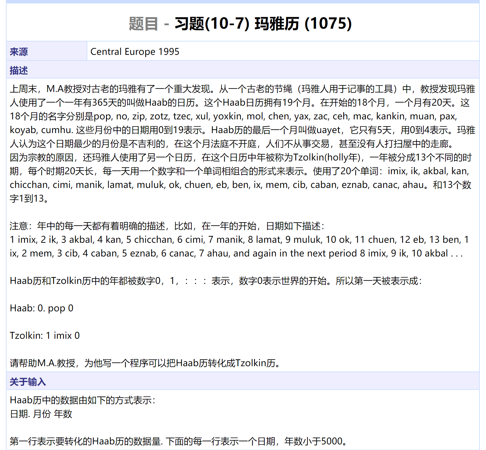
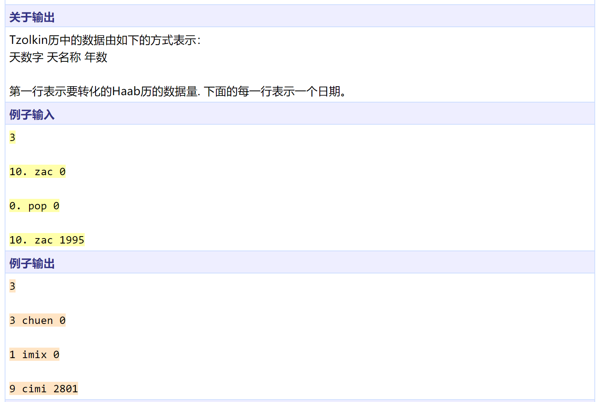

```cpp
#include <iostream>
#include <cstring>
#include <algorithm>
using namespace std;

int main()
{
	int n;
	while (!isalpha(cin.peek())) {
		cin >> n;
		cin.get();	// remove '\n'
		char nums[40];
		memset(nums, '0', sizeof(nums));
		bool neg = n < 0;
		n = n < 0 ? -n : n;	// assume n is not INT_MIN
		int idx = 1;	// preserve nums[0] for '\0'
		while (n) {
			nums[idx++] = n % 2 + '0';
			n /= 2;
		}
		if (neg) {
			for (int i = 1; i < 33; ++i)
				nums[i] = (1 - (nums[i] - '0')) + '0';
			nums[1] += 1;
			for (int i = 1; i < 33; ++i) {
				nums[i + 1] += (nums[i] - '0') / 2;
				nums[i] = (nums[i] - '0') % 2 + '0';
			}
		}
		nums[0] = '\0';
		reverse(nums, nums + 33);
		cout << nums << endl;
	}
	return 0;
}
```




```cpp
#include <iostream>
#include <cstring>
#include <algorithm>
using namespace std;

bool win(int a, int b)
{
	if (a == 0 || b == 0)
		return false;
	if (a < b)
		swap(a, b);
	if (a / b >= 2)
		return true;
	return !win(b, a - b);
}

int main()
{
	int a, b;
	while (cin >> a >> b && a)
		cout << (win(a, b) ? "win" : "lose") << endl;
	return 0;
}
```




```cpp
#include <iostream>
#include <cstring>
#include <algorithm>
using namespace std;

int gcd(int a, int b) { return a == 0 ? b : gcd(b % a, a); }

int main()
{
	int a, b;
	char c;
	cin >> a >> c >> b;
	cout << a * b / gcd(a, b) << endl;
	return 0;
}
```




```cpp
#include <iostream>
#include <cstring>
#include <algorithm>
using namespace std;

bool palind(int n)
{
	char s1[10], s2[10];
	int idx = 0;
	while (n) {
		s1[idx++] = n % 10 + '0';
		n /= 10;
	}
	s1[idx] = '\0';
	strcpy(s2, s1);
	reverse(s2, s2 + idx);
	return strcmp(s1, s2) == 0;
}

int main()
{
	int n;
	cin >> n;
	cout << (palind(n) ? "yes" : "no") << endl;
	return 0;
}
```






```cpp
#include <iostream>
#include <cstring>
#include <algorithm>
using namespace std;

int cnt[10000010];

int MAP(char c)
{
	if (c <= '9' && c >= '0')
		return c - '0';
	if (c >= 'A' && c <= 'P')
		return (c - 'A') / 3 + 2;
	if (c >= 'R' && c <= 'Y')
		return (c - 'Q') / 3 + 7;
	cerr << "Wrong Input" << endl;
	exit(1);
}

int main()
{
	ios::sync_with_stdio(false);
	int k;
	cin >> k;
	char s[100];
	memset(cnt, 0, sizeof(cnt));
	while (k--) {
		cin >> s;
		int l = strlen(s);
		int num = 0;
		for (int i = 0; i < l; ++i) {
			if (s[i] == '-')
				continue;
			num = num * 10 + MAP(s[i]);
		}
		cnt[num]++;
	}
	int maxc = 0;
	for (int i = 0; i < 10000001; ++i)
		maxc = max(maxc, cnt[i]);
	if (maxc == 1) {
		cout << "No duplicates." << endl;
		return 0;
	}
	for (int i = 0; i < 10000001; ++i) {
		if (cnt[i] <= 1)
			continue;
		int tmp = i;
		for (int j = 0; j < 4; ++j) {
			s[j] = tmp % 10 + '0';
			tmp /= 10;
		}
		s[4] = '-';
		for (int j = 5; j < 8; ++j) {
			s[j] = tmp % 10 + '0';
			tmp /= 10;
		}
		s[8] = '\0';
		reverse(s, s + 8);
		cout << s << ' ' << cnt[i] << endl;
	}
	return 0;
}
```






```cpp
#include <iostream>
#include <cstring>
using namespace std;

const char tzol[20][10] = { "imix", "ik", "akbal", "kan", "chicchan", "cimi",
			 "manik", "lamat", "muluk", "ok", "chuen", "eb", "ben",
			 "ix", "mem", "cib", "caban", "eznab", "canac", "ahau" };
const char haab[20][10] = { "pop", "no", "zip", "zotz", "tzec", "xul", "yoxkin",
			 "mol", "chen", "yax", "zac", "ceh", "mac", "kankin",
			 "muan", "pax", "koyab", "cumhu", "uayet" };


int main()
{
	int k;
	cin >> k;
	cout << k << endl;
	while (k--) {
		int day, month, year;
		char c;
		char s[10];
		cin >> day >> c >> s >> year;
		for (int i = 0; i < 19; ++i)
			if (strcmp(haab[i], s) == 0)
				month = i;
		int D = month * 20 + day;
		D += year * 365;
		year = D / 260;
		D %= 260;
		month = D % 13;
		D = D % 20;
		cout << month + 1 << " " << tzol[D] << ' ' << year << endl;
	}
	return 0;
}
```


