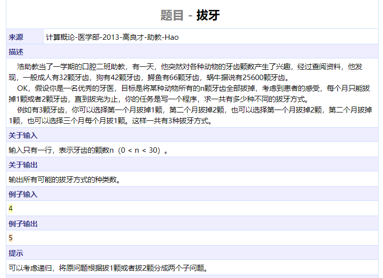
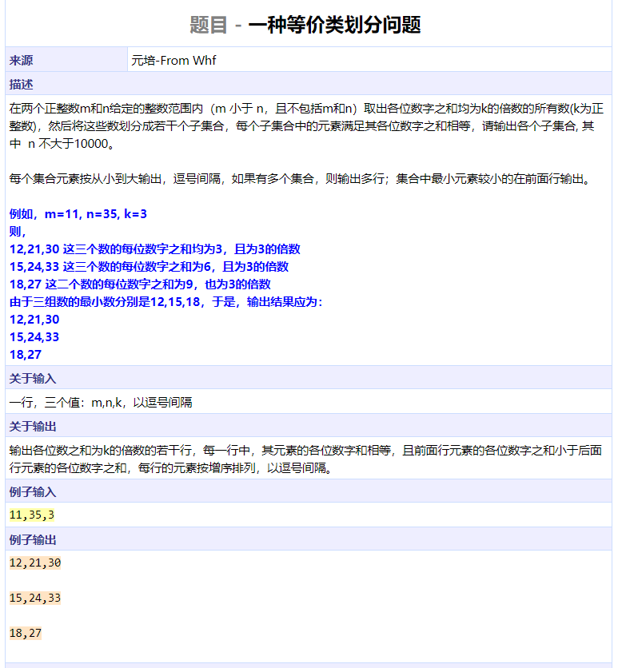
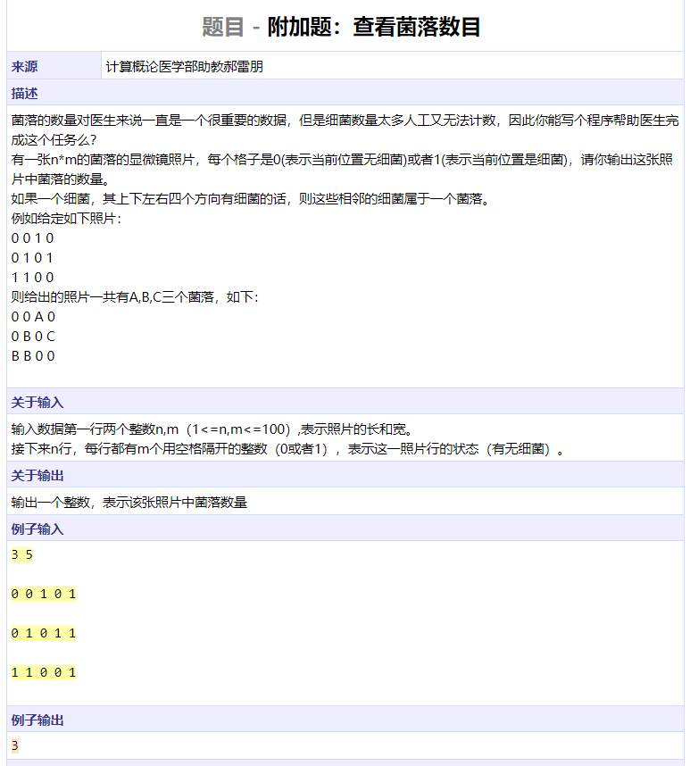
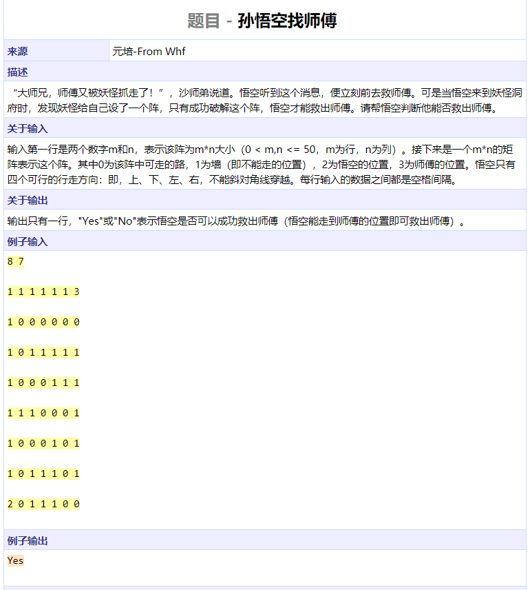
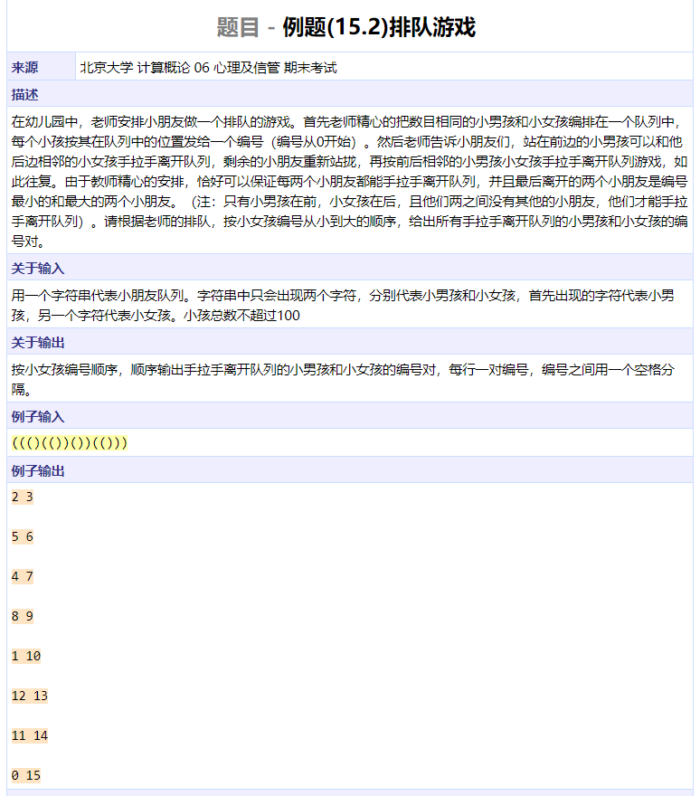
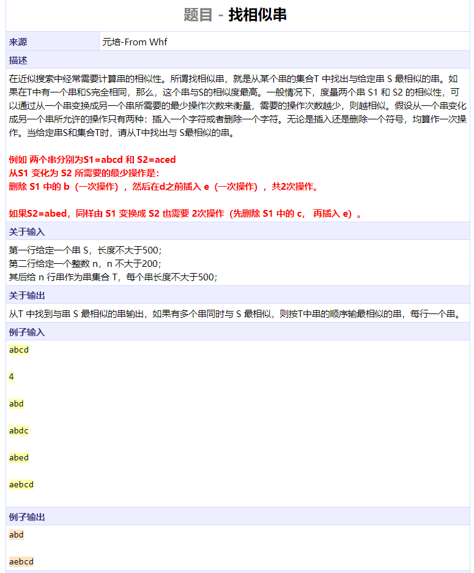
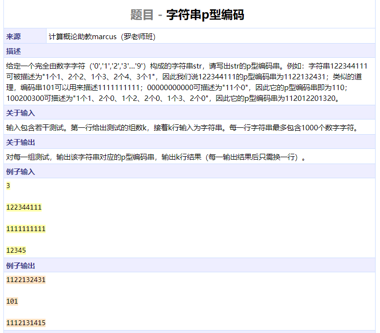
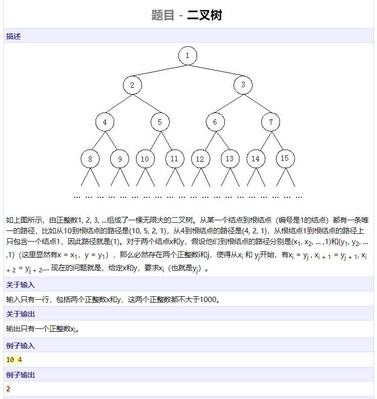
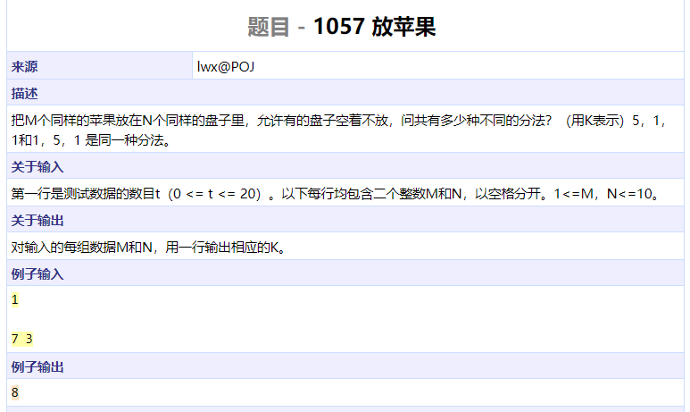
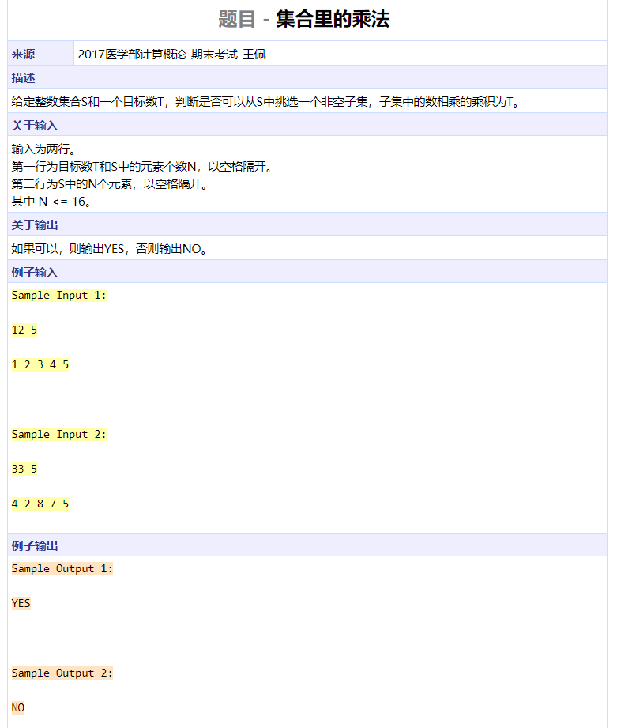

```cpp
#include <iostream>
using namespace std;

int func(int n)
{
	return n <= 1 ? 1 : func(n - 1) + func(n - 2);
}

int main()
{
	int n;
	cin >> n;
	cout << func(n) << endl;
	return 0;
}
```




```cpp
#include <iostream>
using namespace std;

int nums[40][10000];
int idxs[40];

int cal(int n)
{
	int res = 0;
	while (n) {
		res += n % 10;
		n /= 10;
	}
	return res;
}

int main()
{

	char c;
	int m, n, k;
	cin >> m >> c >> n >> c >> k;
	for (int i = m + 1; i < n; ++i) {
		int p = cal(i);
		if (p % k == 0) {
			nums[p / k][idxs[p / k]] = i;
			idxs[p / k]++;
		}
	}
	for (int i = 0; i < 40; ++i) {
		for (int j = 0; j < idxs[i]; ++j) {
			if (j > 0)
				cout << ',';
			cout << nums[i][j];
			if (j == idxs[i] - 1)
				cout << endl;
		}
	}
	return 0;
}
```




```cpp
#include <iostream>
#include <cstring>
#include <queue>
using namespace std;

int nums[100][100];
bool visited[100][100];

void dfs(int i, int j, int m, int n)
{
	if (i < 0 || i >= m || j < 0 || j >= n || visited[i][j] || nums[i][j] == 0)
		return;
	visited[i][j] = true;
	int dx[] = { 0, 1, 0, -1 };
	int dy[] = { 1, 0, -1, 0 };
	for (int dir = 0; dir < 4; ++dir)
		dfs(i + dx[dir], j + dy[dir], m, n);
	return;
}

int main()
{
	
	int m, n, res = 0;
	cin >> m >> n;
	for (int i = 0; i < m; ++i)
		for (int j = 0; j < n; ++j)
			cin >> nums[i][j];
	for (int i = 0; i < m; ++i)
		for (int j = 0; j < n; ++j) {
			if (visited[i][j] || nums[i][j] == 0)
				continue;
			res += 1;
			dfs(i, j, m, n);
		}
	cout << res << endl;
	return 0;
}
```




```cpp
#include <iostream>
#include <cstring>
using namespace std;

bool dfs(int x, int y, int m, int n, int nums[][50], bool visited[][50])
{
	if (x >= m || x < 0 || y >= n || y < 0 || visited[x][y] || nums[x][y] == 1)
		return false;
	if (nums[x][y] == 3)
		return true;
	visited[x][y] = true;
	int dx[] = { 0, 1, 0, -1 };
	int dy[] = { 1, 0, -1, 0 };
	for (int i = 0; i < 4; ++i)
		if (dfs(x + dx[i], y + dy[i], m, n, nums, visited))
			return true;
	return false;
}

int main()
{
	int m, n, nums[50][50], startx, starty;
	bool visited[50][50];
	memset(visited, 0, sizeof(visited));
	cin >> m >> n;
	for (int i = 0; i < m; ++i)
		for (int j = 0; j < n; ++j) {
			cin >> nums[i][j];
			if (nums[i][j] == 2)
				startx = i, starty = j;
		}
	cout << (dfs(startx, starty, m, n, nums, visited) ? "Yes" : "No") << endl;
	return 0;
}
```




```cpp
#include <iostream>
#include <stack>
#include <cstring>
using namespace std;

struct Pos {
	char c;
	int idx;
	Pos(char cc, int iidx) : c(cc), idx(iidx) {}
};

int main()
{
	stack<Pos> st;
	char s[110];
	cin >> s;
	int l = strlen(s);
	char boy = s[0];
	for (int i = 0; i < l; ++i) {
		if (st.empty() || s[i] == boy)
			st.push(Pos(s[i], i));
		else {
			cout << st.top().idx << ' ' << i << endl;
			st.pop();
		}
	}
	return 0;
}
```




```cpp
#include <iostream>
#include <cstring>
using namespace std;

char S[520], T[200][520];
int dp[520][520];
int dist[520];

int similar(char s[], char t[])
{
	int l1 = strlen(s), l2 = strlen(t);
	for (int i = 0; i < l1; ++i)
		dp[i][0] = i;
	for (int j = 0; j < l2; ++j)
		dp[0][j] = j;
	for (int i = 0; i < l1; ++i)
		for (int j = 0; j < l2; ++j)
			dp[i + 1][j + 1] = s[i] == t[j] ? dp[i][j] : min(dp[i + 1][j], dp[i][j + 1]) + 1;
	return dp[l1][l2];
}

int main()
{
	int n;
	cin >> S >> n;
	int mindist = 1000;
	for (int i = 0; i < n; ++i) {
		cin >> T[i];
		dist[i] = similar(S, T[i]);
		mindist = min(mindist, dist[i]);
	}
	for (int i = 0; i < n; ++i)
		if (dist[i] == mindist)
			cout << T[i] << endl;
	return 0;
}
```




```cpp
#include <iostream>
#include <cstring>
#include <algorithm>
using namespace std;

char *fillint2char(int num, char *p)
{
	int cnt = 0;
	while (num) {
		*p++ = num % 10 + '0';
		num /= 10;
		cnt += 1;
	}
	reverse(p - cnt, p);
	*p = '\0';
	return p;
}

void encode(char src[], char *tgt)
{
	int idx = 0;
	int l1 = strlen(src);
	while (idx < l1) {
		int newidx = idx + 1;
		while (newidx < l1 && src[newidx] == src[newidx - 1])
			newidx++;
		tgt = fillint2char(newidx - idx, tgt);
		*tgt++ = src[newidx - 1];
		*tgt = '\0';
		idx = newidx;
	}
}

int main()
{
	char s[1010], t[2010];
	int n;
	cin >> n;
	while (n--) {
		cin >> s;
		encode(s, t);
		cout << t << endl;
	}
	return 0;
}
```




```cpp
#include <iostream>
#include <cstring>
#include <cstdio>
#include <algorithm>
using namespace std;

int main()
{
	int parentlist1[20], idx1 = 0;
	int parentlist2[20], idx2 = 0;
	int a, b;
	cin >> a >> b;
	while (a) {
		parentlist1[idx1++] = a;
		a /= 2;
	}
	while (b) {
		parentlist2[idx2++] = b;
		b /= 2;
	}
	reverse(parentlist1, parentlist1 + idx1);
	reverse(parentlist2, parentlist2 + idx2);
	int i;
	for (i = 0; i < min(idx1, idx2); ++i)
		if (parentlist1[i] != parentlist2[i])
			break;
	cout << parentlist1[i - 1] << endl;
	return 0;
}
```




```cpp
#include <iostream>
#include <cstring>
using namespace std;

int func(int apple, int plate)
{
	if (apple == 0)
		return 1;
	if (plate == 0)
		return 0;
	if (plate > apple)
		return func(apple, apple);
	return func(apple - plate, plate) + func(apple, plate - 1);
}

int main()
{
	int cases, apple, plate;
	cin >> cases;
	while (cases--) {
		cin >> apple >> plate;
		cout << func(apple, plate) << endl;
	}
	return 0;
}
```




```cpp
#include <iostream>
#include <cstring>
#include <cstdio>
using namespace std;

bool dfs(int nums[], int depth, int n, int prod, bool got)
{					// got means at least one element has been used
	if (depth == n)
		return got && prod == 1;
	if (dfs(nums, depth + 1, n, prod, got))
		return true;
	if (prod == 0 && nums[depth] == 0)
		return true;
	if (nums[depth] != 0 && prod % nums[depth] == 0)
		return dfs(nums, depth + 1, n, prod / nums[depth], true);
	return false;
}

int main()
{
	char useless[100];
	int prod;
	while (cin >> prod) {
		int n, nums[20];
		cin >> n;
		for (int i = 0; i < n; ++i)
			cin >> nums[i];
		cout << (dfs(nums, 0, n, prod, false) ? "YES" : "NO") << endl;
	}
	return 0;
}
```

