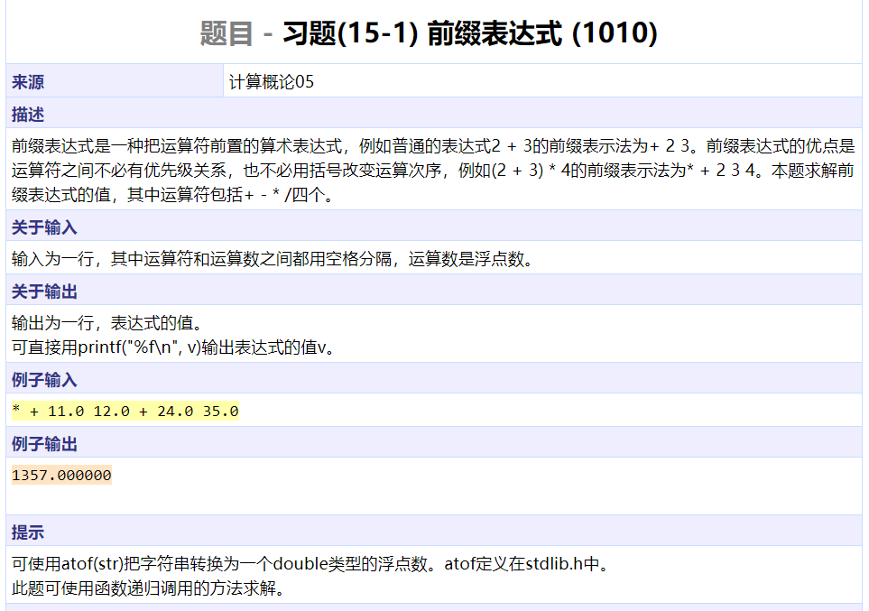
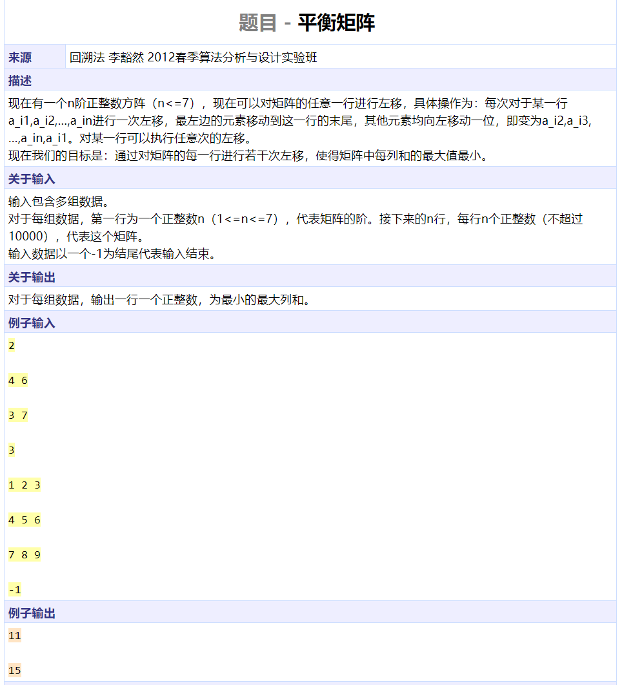
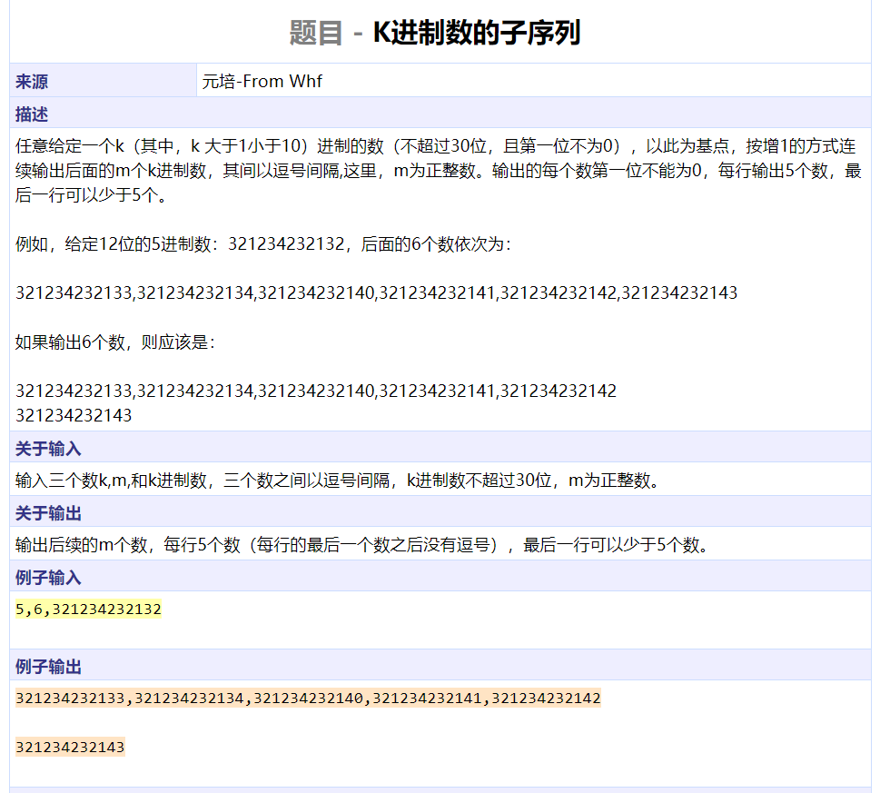
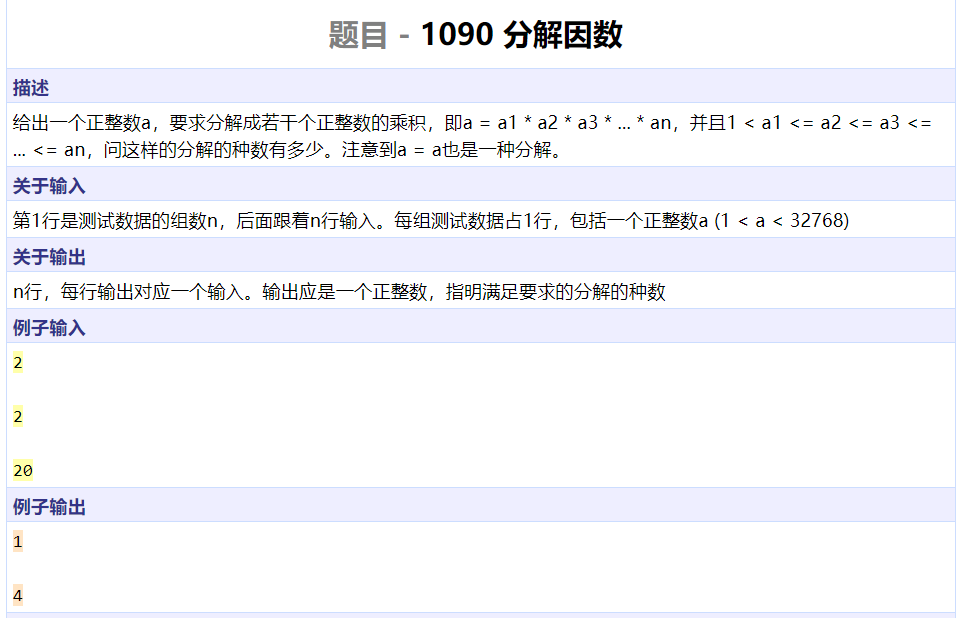
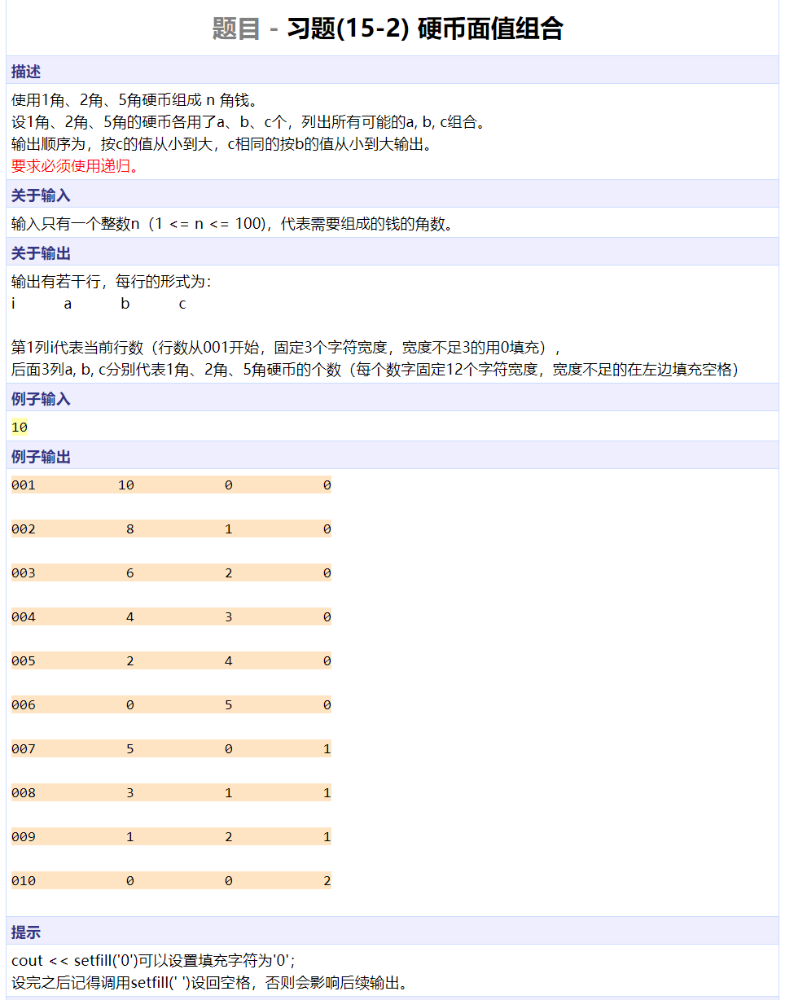
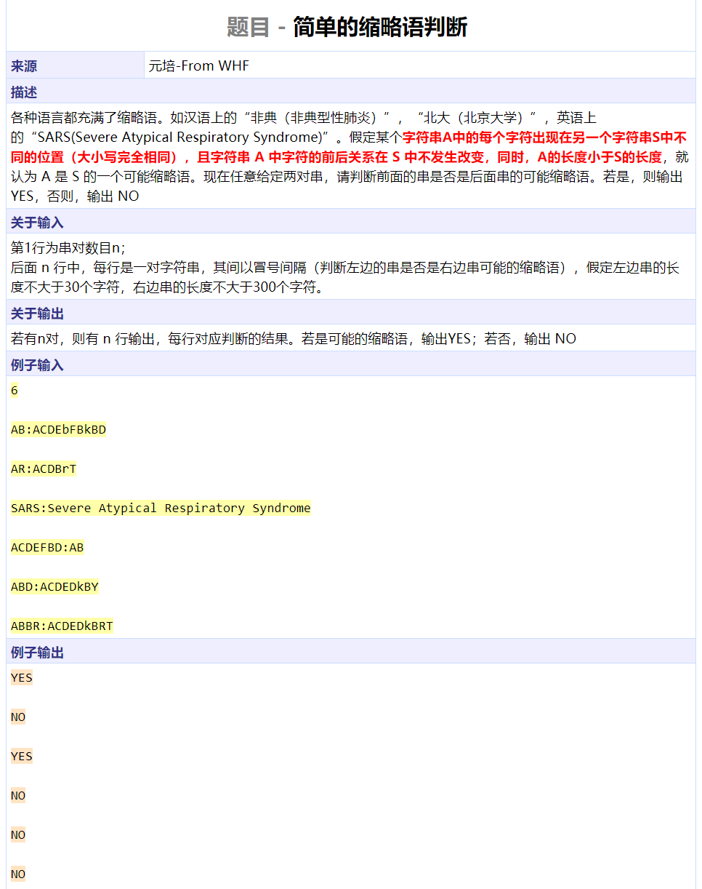
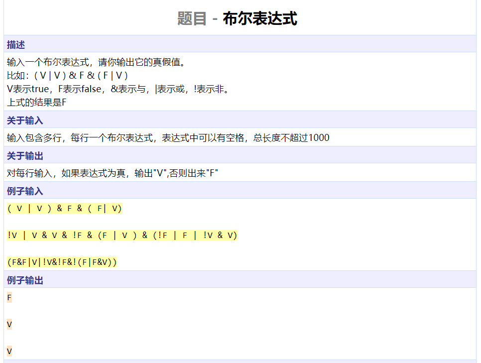
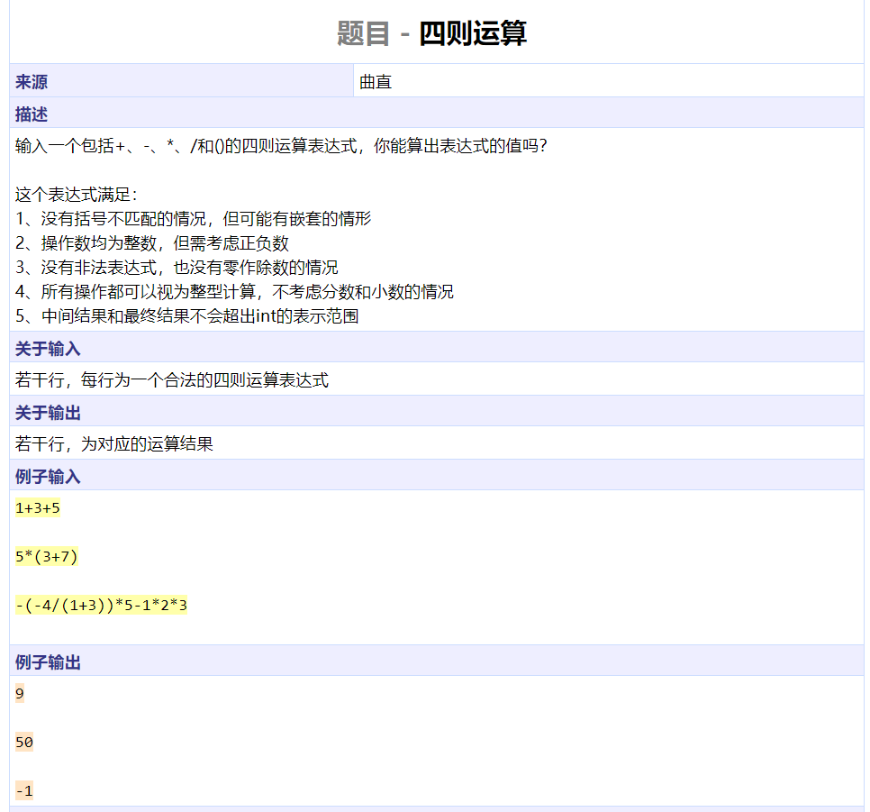
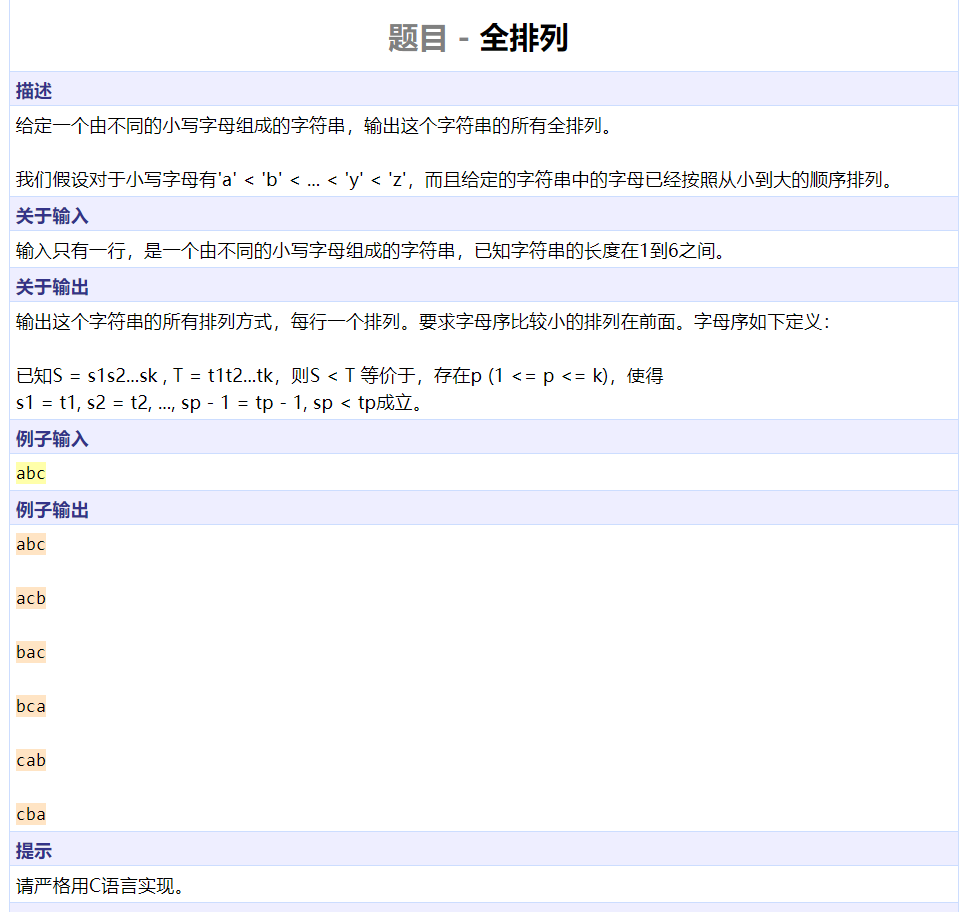
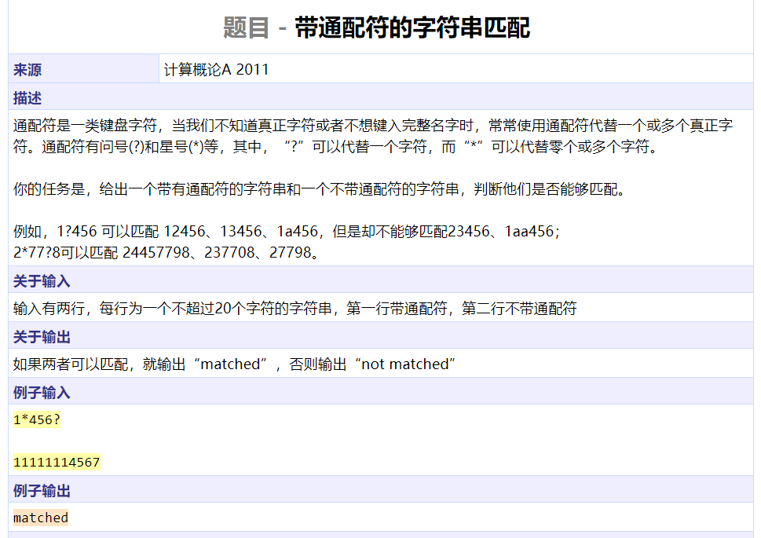

```cpp
#include <iostream>
#include <cstdio>
#include <cstdlib>
using namespace std;

double func()
{
	char c[100];
	cin >> c;
	switch (c[0]) {
		case '*': return func() * func();
		case '+': return func() + func();
		case '-': return func() - func();
		case '/': return func() / func();
		default:
			return atof(c);
	}
}

int main()
{
	printf("%f\n", func());
	return 0;
}
```




```cpp
#include <iostream>
using namespace std;

int res;

int cal(int mat[][7], int n, int offset[])
{
	int ret = 0;
	for (int i = 0; i < n; ++i) {
		int tmp = 0;
		for (int j = 0; j < n; ++j)
			tmp += mat[j][(i + offset[j]) % n];
		ret = max(ret, tmp);
	}
	return ret;
}

void dfs(int mat[][7], int depth, int n, int offset[])
{
	if (depth == n) {
		res = min(res, cal(mat, n, offset));
		return;
	}
	for (int i = 0; i < n; ++i) {
		offset[depth] = i;
		dfs(mat, depth + 1, n, offset);
	}
	return;
}

int main()
{
	int n, mat[7][7], offset[7];
	while (cin >> n && n > 0) {
		res = 100000;
		for (int i = 0; i < n; ++i)
			for (int j = 0; j < n; ++j)
				cin >> mat[i][j];
		dfs(mat, 0, n, offset);
		cout << res << endl;
	}
	return 0;
}
```




```cpp
#include <iostream>
#include <cstring>
#include <algorithm>
using namespace std;

void addone(char s[], int k)
{
	int l = strlen(s);
	reverse(s, s + l);
	s[l] = '0';
	s[0] += 1;
	for (int i = 0; i < l; ++i) {
		s[i + 1] += (s[i] - '0') / k;
		s[i] = (s[i] - '0') % k + '0';
	}
	if (s[l] != '0')
		l++;
	s[l] = '\0';
	reverse(s, s + l);
	return;
}

int main()
{
	int k, m;
	char s[1010], c;
	cin >> k >> c >> m >> c >> s;
	for (int i = 0; i < m; ++i) {
		addone(s, k);
		cout << s;
		if (i != m - 1)
			cout << (i % 5 == 4 ? '\n' : ',');
	}
	cout << endl;
	return 0;
}
```




```cpp
#include <iostream>
#include <iomanip>
using namespace std;

int func(int n, int start)
{
	int res = 0;
	for (int i = start; i * i <= n; ++i)
		if (n % i == 0)
			res += func(n / i, i);
	return res + 1;
}

int main()
{
	int k, n;
	cin >> k;
	while (k--) {
		cin >> n;
		cout << func(n, 2) << endl;
	}
	return 0;
}
```




```cpp
#include <iostream>
#include <cstdio>
using namespace std;

int num;
int cnt[4];
int coin[4] = {5, 2, 1};

void money(int left, int k)
{
	if (k == 3) {
		if (left == 0)
			printf("%03d%12d%12d%12d\n", ++num, cnt[2], cnt[1], cnt[0]);;
		return;
	}
	int prob = left / coin[k];
	for (int i = 0; i <= prob; ++i) {
		cnt[k] = i;
		money(left - coin[k] * i, k + 1);
	}
	return;
}

int main()
{
	int n;
	cin >> n;
	money(n, 0);
	return 0;
}
```




```cpp
#include <iostream>
#include <cstring>
#include <cstdio>
using namespace std;

bool isShort(char s1[], char s2[])
{
	int l1 = strlen(s1);
	int l2 = strlen(s2);
	if (l1 >= l2)
		return false;
	int i = 0, j = 0;
	while (i < l1) {
		while (j < l2 && s2[j] != s1[i])
			j++;
		if (j == l2)
			return false;
		i++, j++;
	}
	return true;
}

int main()
{
	int n;
	cin >> n;
	cin.get();
	char s1[32], s2[320];
	while (n--) {
		cin.getline(s1, 31, ':');
		cin.getline(s2, 310);
		cout << (isShort(s1, s2) ? "YES" : "NO") << endl;
	}
	return 0;
}
```




```cpp
#include <iostream>
#include <stack>
#include <cstring>
#include <algorithm>
using namespace std;

struct op {
	char c;
	int level;	// 0-2 | & !
	op(char _c, int _level) : c(_c), level(_level) {}
};

void cal(stack<op> &ops, stack<int> &vals)
{
	op cur = ops.top();
	ops.pop();
	switch (cur.c)
	{
	bool tmp;
	case '!':
		vals.top() = !vals.top();
		break;
	case '|':
		tmp = vals.top();
		vals.pop();
		vals.top() |= tmp;
		break;
	case '&':
		tmp = vals.top();
		vals.pop();
		vals.top() &= tmp;
		break;
	default:
		cout << "????????" << endl;
		break;
	}
}

int main()
{
	char s[1010];
	while (cin.getline(s, 1000)) {
		int l = strlen(s);
		stack<op> ops;
		stack<int> vals;
		for (int i = 0; i < l; ++i) {
			if (s[i] == ' ')
				continue;
			if (s[i] == '(') {
				ops.push(op('(', -1));
			} else if (s[i] == ')') {
				while (ops.top().c != '(')
					cal(ops, vals);
				ops.pop();
			} else if (s[i] == '|') {
				while (!ops.empty() && ops.top().level > 0)
					cal(ops, vals);
				ops.push(op(s[i], 0));
			} else if (s[i] == '&') {
				while (!ops.empty() && ops.top().level > 1)
					cal(ops, vals);
				ops.push(op(s[i], 1));
			} else if (s[i] == '!') {
				while (!ops.empty() && ops.top().level > 2)
					cal(ops, vals);
				ops.push(op(s[i], 2));
			} else {
				vals.push(s[i] == 'V');
			}
		}
		while (!ops.empty())
			cal(ops, vals);
		cout << (vals.top() ? "V" : "F") << endl;
	}
	return 0;
}
```




```cpp
#include <iostream>
#include <stack>
#include <cstring>
#include <algorithm>
using namespace std;

struct op {
	char c;
	int level;	// 0-2 (+,-), (*,/), -+
	op(char _c, int _level) : c(_c), level(_level) {}
};

void cal(stack<op> &ops, stack<int> &vals)
{
	op cur = ops.top();
	ops.pop();
	switch (cur.c)
	{
	int tmp;
	case '-':
		if (cur.level == 2) {
			vals.top() = -vals.top();
		} else {
			tmp = vals.top();
			vals.pop();
			vals.top() -= tmp;	
		}
		break;
	case '+':
		if (cur.level == 2) {
			
		} else {
			tmp = vals.top();
			vals.pop();
			vals.top() += tmp;	
		}
		break;
	case '*':
		tmp = vals.top();
		vals.pop();
		vals.top() *= tmp;
		break;
	case '/':
		tmp = vals.top();
		vals.pop();
		vals.top() /= tmp;
		break;
	default:
		cout << "????????" << endl;
		break;
	}
}

bool lastOP;

int main()
{
	char s[1010];
	while (cin.getline(s, 1000)) {
		int l = strlen(s);
		stack<op> ops;
		stack<int> vals;
		lastOP = true;
		for (int i = 0; i < l; ++i) {
			if (s[i] == ' ')
				continue;
			if (s[i] == '(') {
				ops.push(op('(', -1));
				lastOP = true;
			} else if (s[i] == ')') {
				while (ops.top().c != '(')
					cal(ops, vals);
				ops.pop();
				lastOP = false;
			} else if (s[i] == '+' || s[i] == '-') {
				if (lastOP) {
					ops.push(op(s[i], 2));
				} else {
					while (!ops.empty() && ops.top().level >= 0)
						cal(ops, vals);
					ops.push(op(s[i], 0));
				}
				lastOP = true;
			} else if (s[i] == '*' || s[i] == '/') {
				while (!ops.empty() && ops.top().level >= 1)
					cal(ops, vals);
				ops.push(op(s[i], 1));
				lastOP = true;
			} else {
				int val = 0;
				while (s[i] <= '9' && s[i] >= '0')
					val = val * 10 + s[i++] - '0';
				i -= 1;
				vals.push(val);
				lastOP = false;
			}
		}
		while (!ops.empty())
			cal(ops, vals);
		cout << vals.top() << endl;
	}
	return 0;
}
```

```c++
#include <iostream>
#include <cstring>
#include <cmath>
using namespace std;

char a[100] = {0};

int matched(int l, int r) //前终止点，后开始点
{
	int cnt = 1, ans = 0;
	for (int i = r - 1; i >= l; i--) {
		if (a[i] == ')')
			cnt++;
		else if (a[i] == '(')
			cnt--;
		if (cnt == 0) {
			ans = i;
			break;
		}
	}
	return ans;
}

int compute(int l, int r)
{
	for (int i = r; i >= l; i--) {
		if (a[i] == ')')
			i = matched(l, i);
		if (a[i] == '+')
			return compute(i + 1, r) + compute(l, i - 1);
		if (a[i] == '-')
			return compute(l, i - 1) - compute(i + 1, r);
	}
	for (int i = r; i >= l; i--) {
		if (a[i] == ')')
			i = matched(l, i);
		if (a[i] == '*')
			return compute(i + 1, r) * compute(l, i - 1);
		if (a[i] == '/')
			return compute(l, i - 1) / compute(i + 1, r);
	}
	//到此处还没返回，说明没有运算符，只有括号和数字
	if (a[r] == ')')
		return compute(l + 1, r - 1);
	if (a[r] >= '0' && a[r] <= '9') {
		int ans = 0, j = 0;
		for (int i = r; i >= l; i--, j++)
			ans += pow(10.0, (double)j) * (a[i] - '0');
		return ans;
	}
	return 0;
}

int main()
{
	while (cin.getline(a, 100)) {
		int x = strlen(a);
		cout << compute(0, x - 1) << endl;
	}
	return 0;
}
```




```cpp
#include <iostream>
#include <cstring>
using namespace std;

void dfs(char s[], int depth, int n, int visited[], int idx[])
{
	if (depth == n) {
		for (int i = 0; i < n; ++i)
			cout << s[idx[i]];
		cout << endl;
		return;
	}
	for (int i = 0; i < n; ++i) {
		if (!visited[i]) {
			visited[i] = true;
			idx[depth] = i;
			dfs(s, depth + 1, n, visited, idx);
			visited[i] = false;
		}
	}
	return;
}

int main()
{
	char s[7];
	int visited[6] = { 0 }, idx[6];
	cin >> s;
	dfs(s, 0, strlen(s), visited, idx);
	return 0;
}
```




```cpp
#include <iostream>
#include <cstring>
using namespace std;

int mem[22][22];

bool match(char s1[], char s2[], int i, int l1, int j, int l2)
{
	if (mem[i][j] != -1)
		return mem[i][j] == 1;
	if (i == l1)
		return mem[i][j] = j >= l2;
	if (s1[i] == '?')
		return mem[i][j] = match(s1, s2, i + 1, l1, j + 1, l2);
	if (s1[i] == '*') {
		for (int p = j; p <= l2; ++p)
			if (match(s1, s2, i + 1, l1, p, l2))
				return mem[i][j] = 1;
		return mem[i][j] = 0;
	}
	return mem[i][j] = j < l2 && s2[j] == s1[i] && match(s1, s2, i + 1, l1, j + 1, l2);
}

int main()
{
	char s1[22], s2[22];
	memset(mem, -1, sizeof(mem));
	cin >> s1 >> s2;
	cout << (match(s1, s2, 0, strlen(s1), 0, strlen(s2)) ? "matched" : "not matched") << endl;
	return 0;
}
```

