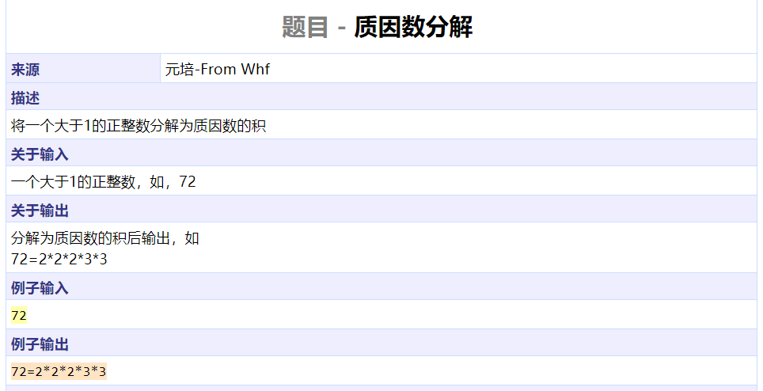
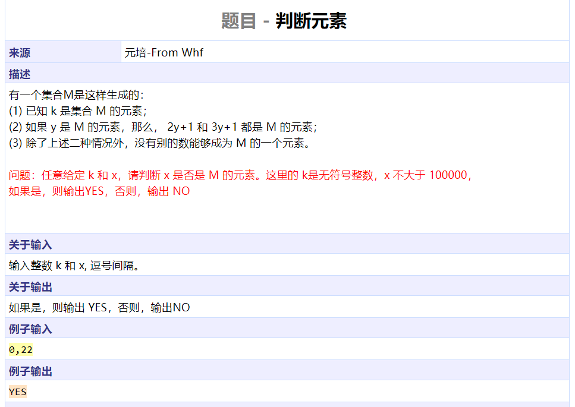
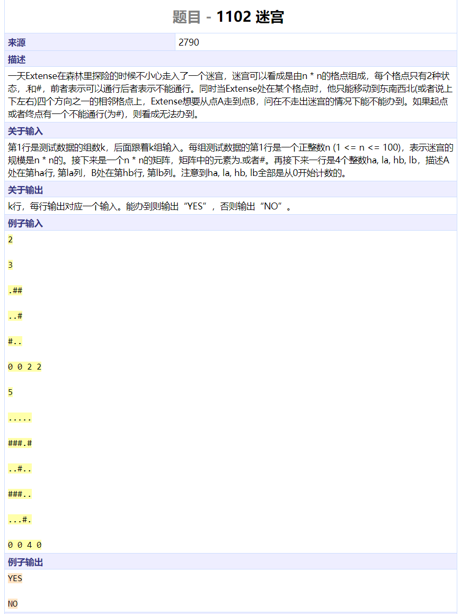
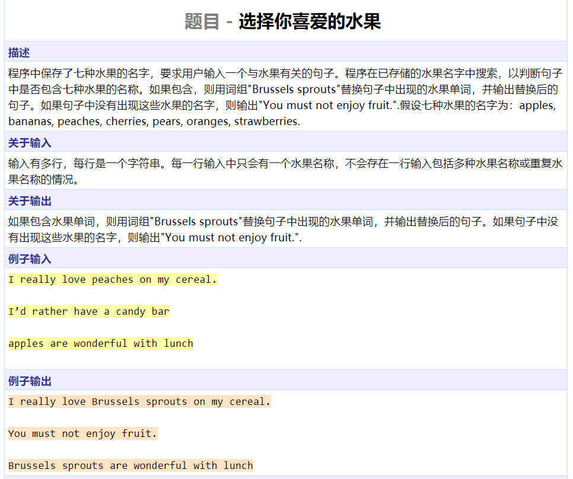
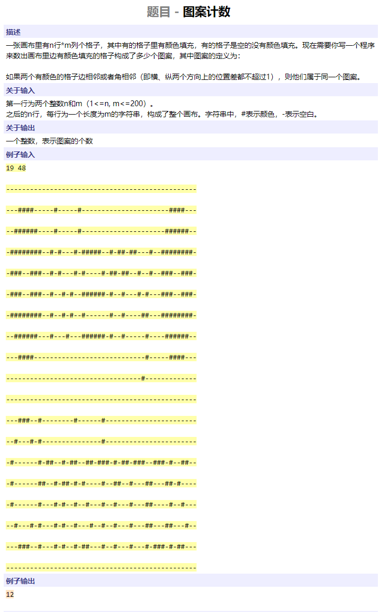
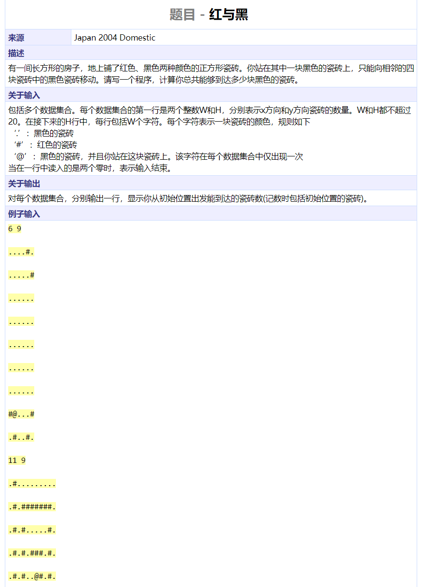
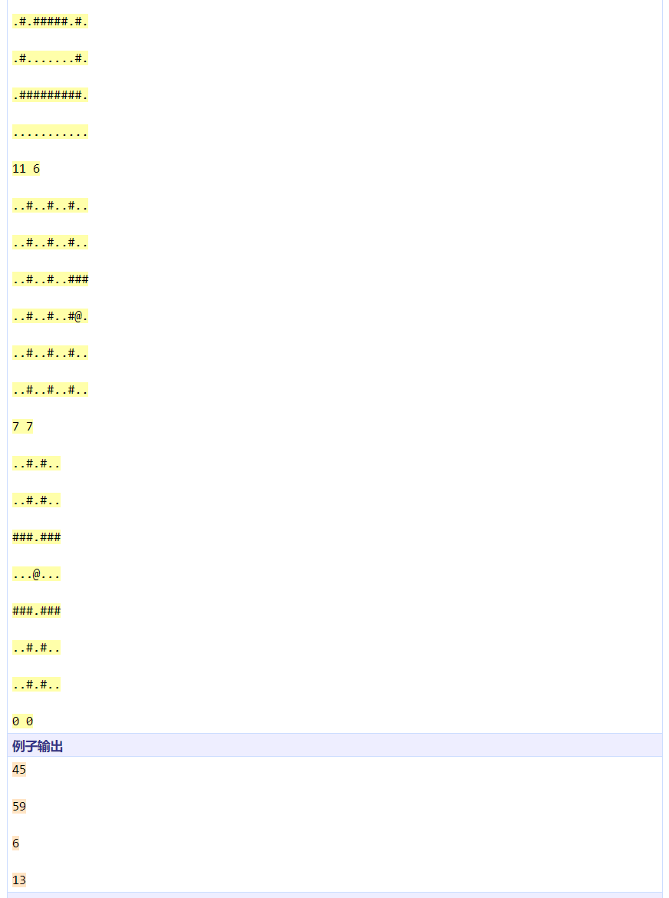
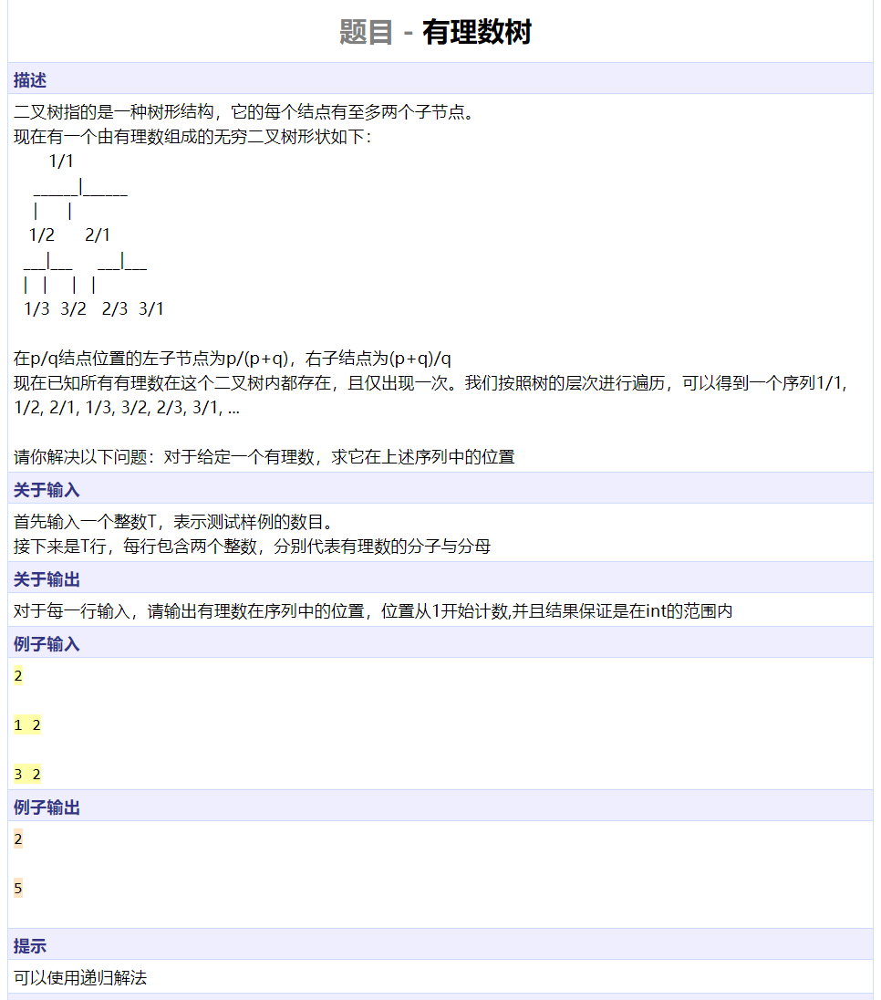
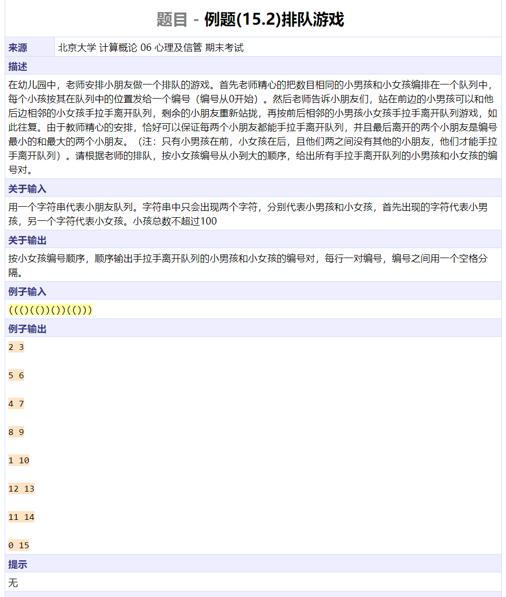
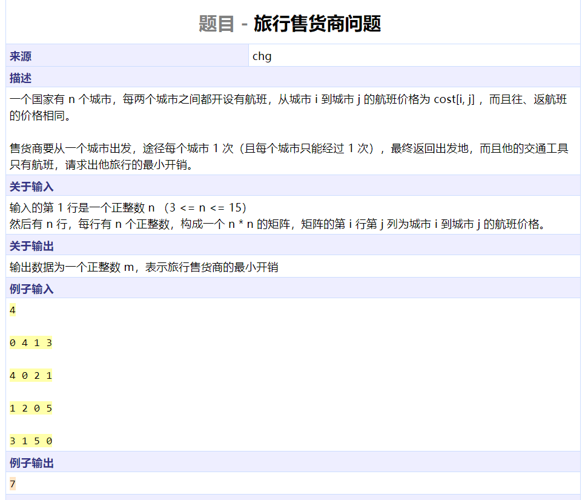

```cpp
#include <iostream>
using namespace std;

bool out = false;

void func(int n, int start)
{
      for (int i = start; i * i <= n; ++i) {
            if (n % i == 0) {
                  if (out)
                        cout << '*';
                  out = true;
                  cout << i;
                  func(n / i, i);
                  return;
            }
      }
      if (out)
            cout << '*';
      out = true;
      cout << n ;
      return;
}

int main()
{
      int n;
      cin >> n;
      cout << n << '=';
      func(n, 2);
      cout << endl;
      return 0;
}
```




```cpp
#include <iostream>
using namespace std;

bool judge(int k, int x)
{
      if (x == k)
            return true;
      if (x < k)
            return false;
      if ((x - 1) % 2 == 0 && judge(k, (x - 1) / 2))
            return true;
      if ((x - 1) % 3 == 0 && judge(k, (x - 1) / 3))
            return true;
      return false;
}

int main()
{
      int k, x;
      char c;
      cin >> k >> c >> x;
      cout << (judge(k, x) ? "YES" : "NO") << endl;
      return 0;
}
```




```cpp
#include <iostream>
#include <cstring>
using namespace std;

int n;

char m[100][100];
bool visited[100][100];

bool dfs(int sx, int sy, int ex, int ey)
{
	if (sx >= n || sx < 0 || sy >= n || sy < 0)
		return false;
	if (visited[sx][sy] || m[sx][sy] == '#')
		return false;
	if (sx == ex && sy == ey)
		return true;
	visited[sx][sy] = true;
	int dx[] = { 0, 1, 0, - 1};
	int dy[] = { 1, 0, -1, 0 };
	for (int i = 0; i < 4; ++i)
		if (dfs(sx + dx[i], sy + dy[i], ex, ey))
			return true;
	return false;
}

int main()
{
	int k;
	cin >> k;
	while (k--) {
		memset(visited, 0, sizeof(visited));
		cin >> n;
		for (int i = 0; i < n; ++i)
			for (int j = 0; j < n; ++j)
				cin >> m[i][j];
		int sx, sy, ex, ey;
		cin >> sx >> sy >> ex >> ey;
		cout << (dfs(sx, sy, ex, ey) ? "YES" : "NO") << endl;
	}
	return 0;
}
```




```cpp
#include <iostream>
#include <cstring>
using namespace std;

int main()
{
	char c[1010];
	const char fruits[][15] = {"apples", "bananas", "peaches", "cherries", "pears", "oranges", "strawberries"};
	const char fail[] = "You must not enjoy fruit.";
	const char replace[] = "Brussels sprouts";
	while (cin.getline(c, 1002)) {
		bool got = false;
		int match = 0;
		int l = strlen(c);
		char *s;
		for (int j = 0; j < 7; ++j) {
			s = strstr(c, fruits[j]);
			if (s != NULL) {
				got = true;
				match = j;
				break;
			}
		}
		if (!got) {
			cout << fail << endl;
		} else {
			*s = '\0';
			cout << c << replace << s + strlen(fruits[match]) << endl;
		}
	}
	return 0;
}
```




```cpp
#include <iostream>
#include <cstring>
#include <queue>
using namespace std;

char grids[200][200];
bool visited[200][200];

void dfs(int i, int j, int m, int n)
{
	if (i < 0 || i >= m || j < 0 || j >= n || visited[i][j] || grids[i][j] != '#')
		return;
	visited[i][j] = true;
	int dx[] = { -1, -1, -1, 0, 0, 1, 1, 1 };
	int dy[] = { -1, 0, 1, -1, 1, -1, 0, 1 };
	for (int dir = 0; dir < 8; ++dir)
		dfs(i + dx[dir], j + dy[dir], m, n);
	return;
}

int main()
{
	
	int m, n, res = 0;
	cin >> m >> n;
	for (int i = 0; i < m; ++i)
		for (int j = 0; j < n; ++j)
			cin >> grids[i][j];
	for (int i = 0; i < m; ++i)
		for (int j = 0; j < n; ++j) {
			if (visited[i][j] || grids[i][j] != '#')
				continue;
			res += 1;
			dfs(i, j, m, n);
		}
	cout << res << endl;
	return 0;
}
```






```cpp
#include <iostream>
#include <cstring>
using namespace std;

int cnt;
int m, n;
char grid[20][20];
void dfs(int x, int y)
{
	if (x >= m || x < 0 || y >= n || y < 0)
		return;
	if (grid[x][y] == '#')
		return;
	cnt++;
	grid[x][y] = '#';
	int dx[] = { 0, 1, 0, -1 };
	int dy[] = { 1, 0, -1, 0 };
	for (int i = 0; i < 4; ++i)
		dfs(x + dx[i], y + dy[i]);
}

int main()
{
	while (cin >> n >> m && m) {
		int x, y;
		for (int i = 0; i < m; ++i)
			for (int j = 0; j < n; ++j) {
				cin >> grid[i][j];
				if (grid[i][j] == '@')
					x = i, y = j;
			}
		cnt = 0;
		dfs(x, y);
		cout << cnt << endl;
	}
	return 0;
}
```




```cpp
#include <cstring>
#include <iostream>
using namespace std;

int solve(int p, int q)
{
	if (p == 1 && q == 1)
		return 1;
	if (p > q)
		return 2 * solve(p - q, q) + 1;
	return 2 * solve(p, q - p);
}

int main()
{
	int n, p, q;
	cin >> n;
	while (n--) {
		cin >> p >> q;
		cout << solve(p, q) << endl;
	}
	return 0;
}
```


```cpp
#include <iostream>
using namespace std;

int res;

int cal(int mat[][7], int n, int offset[])
{
	int ret = 0;
	for (int i = 0; i < n; ++i) {
		int tmp = 0;
		for (int j = 0; j < n; ++j)
			tmp += mat[j][(i + offset[j]) % n];
		ret = max(ret, tmp);
	}
	return ret;
}

void dfs(int mat[][7], int depth, int n, int offset[])
{
	if (depth == n) {
		res = min(res, cal(mat, n, offset));
		return;
	}
	for (int i = 0; i < n; ++i) {
		offset[depth] = i;
		dfs(mat, depth + 1, n, offset);
	}
	return;
}

int main()
{
	int n, mat[7][7], offset[7];
	while (cin >> n && n > 0) {
		res = 100000;
		for (int i = 0; i < n; ++i)
			for (int j = 0; j < n; ++j)
				cin >> mat[i][j];
		dfs(mat, 0, n, offset);
		cout << res << endl;
	}
	return 0;
}
```




```cpp
#include <iostream>
#include <stack>
#include <cstring>
using namespace std;

struct Pos {
	char c;
	int idx;
	Pos(char cc, int iidx) : c(cc), idx(iidx) {}
};

int main()
{
	stack<Pos> st;
	char s[110];
	cin >> s;
	int l = strlen(s);
	char boy = s[0];
	for (int i = 0; i < l; ++i) {
		if (st.empty() || s[i] == boy)
			st.push(Pos(s[i], i));
		else {
			cout << st.top().idx << ' ' << i << endl;
			st.pop();
		}
	}
	return 0;
}
```




```cpp
#include <cstring>
#include <iostream>
using namespace std;

int cost[15][15];
int mem[1 << 15][15];
bool visited[15];
int n;

void dfs(int depth, int curpos, int curcost, int state)
{
	if (depth == n - 1) {
		mem[(1 << n) - 1][0] = min((unsigned)mem[(1 << n) - 1][0], unsigned(curcost + cost[curpos][0]));
		return;
	}
	for (int i = 1; i < n; ++i) {
		if (visited[i])
			continue;
		int nextstate = state | (1 << i);
		int nextcost = curcost + cost[curpos][i];
		if (mem[nextstate][i] > 0 && mem[nextstate][i] <= nextcost)
			continue;
		mem[nextstate][i] = nextcost;
		visited[i] = true;
		dfs(depth + 1, i, nextcost, nextstate);
		visited[i] = false;
	}
}

int main()
{
	cin >> n;
	for (int i = 0; i < n; ++i)
		for (int j = 0; j < n; ++j)
			cin >> cost[i][j];
	memset(mem, -1, sizeof(mem));
	dfs(0, 0, 0, 0);
	cout << mem[(1 << n) - 1][0] << endl;
	return 0;
}
```

