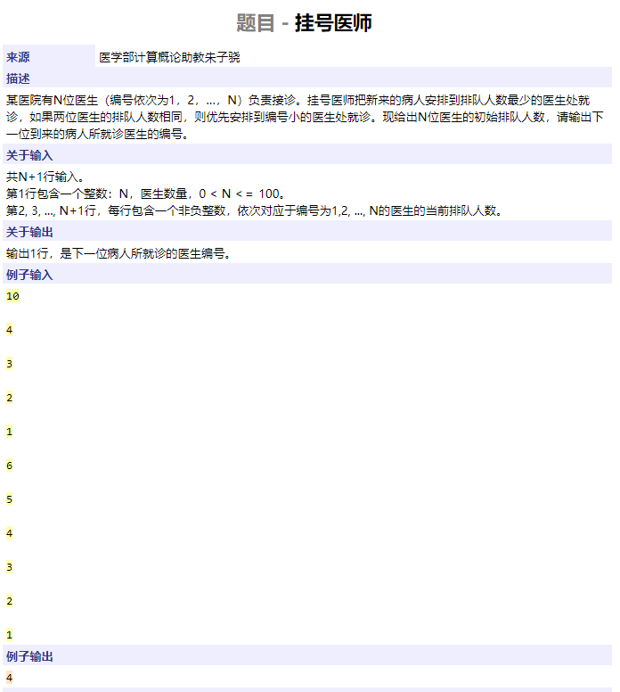
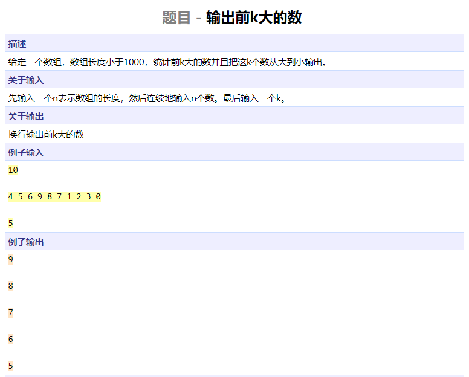
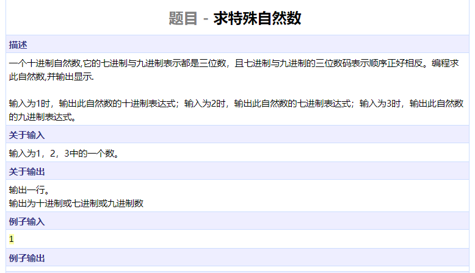
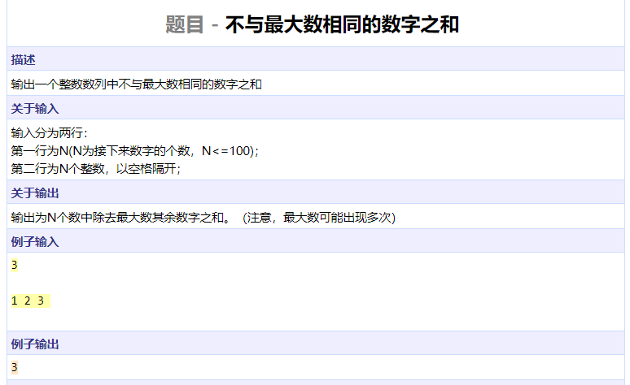
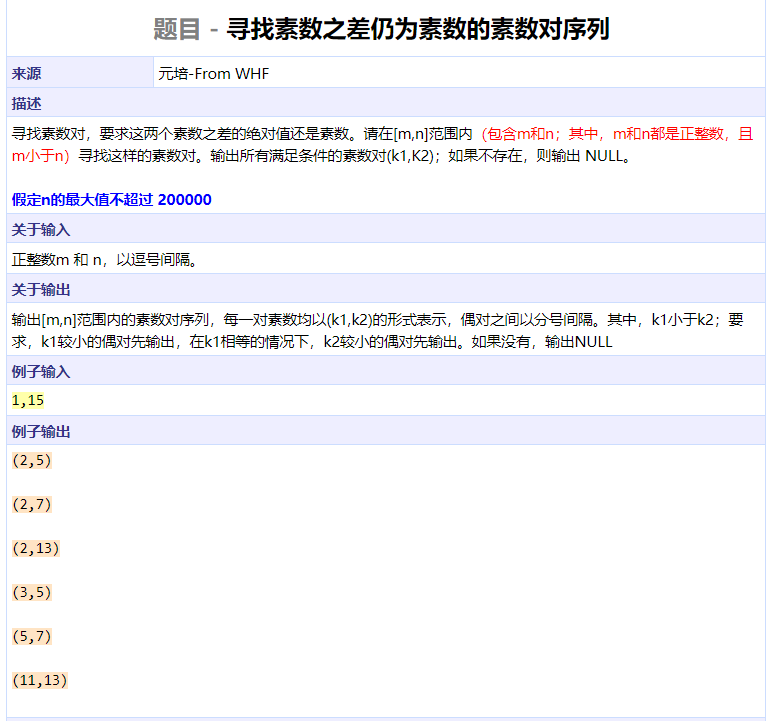

```cpp
#include <iostream>
using namespace std;

int main()
{
	int num[100];
	int n;
	cin >> n;
	for (int i = 0; i < n; ++i)
		cin >> num[i];
	int minn = num[0];
	for (int i = 1; i < n; ++i)
		minn = min(minn, num[i]);
	for (int i = 0; i < n; ++i)
		if (num[i] == minn) {
			cout << i + 1 << endl;
			break;
		}	
	return 0;
}
```




```cpp
#include <iostream>
using namespace std;

int main()
{
	int n, k, nums[1000];
	cin >> n;
	for (int i = 0; i < n; ++i)
		cin >> nums[i];
	cin >> k;
	for (int i = 0; i < n - 1; ++i)
		for (int j = 0; j < n - 1 - i; ++j)
			if (nums[j] < nums[j + 1])
				swap(nums[j], nums[j + 1]);
	for (int i = 0; i < k; ++i)
		cout << nums[i] << endl;
	return 0;
}
```




```cpp
#include <iostream>
#include <cstring>
#include <algorithm>
using namespace std;

int changebase(char nums[], int base, int num)
{
	int i = 0;
	while (num) {
		nums[i++] = num % base + '0';
		num /= base;
	}
	return i;
}

int main()
{
	char num1[10], num2[10];
	int i;
	for (i = 0; i < 1000; ++i) {
		int a = changebase(num1, 7, i);
		int b = changebase(num2, 9, i);
		if (a == b && a == 3 && num1[0] == num2[2] && num1[1] == num2[1] && num1[2] == num2[0])
			break;
	}
	int n;
	cin >> n;
	memset(num1, 0, sizeof(num1));
	n = n == 1 ? 10 : n == 2 ? 7 : 9;
	changebase(num1, n, i);
	reverse(num1, num1 + 3);
	cout << num1 << endl;
	return 0;
}
```




```cpp
#include <iostream>
using namespace std;

int main()
{
	int nums[100];
	int n;
	cin >> n;
	for (int i = 0; i < n; ++i)
		cin >> nums[i];
	int res = 0;
	int maxn = nums[0];
	for (int i = 1; i < n; ++i)
		maxn = max(maxn, nums[i]);
	for (int i = 0; i < n; ++i)
		res += maxn == nums[i] ? 0 : nums[i];
	cout << res << endl;
	return 0;
}
```




```cpp
#include <iostream>
#include <cstdio>
using namespace std;

bool nprime[200001];

int main()
{
	int m, n;
	char c;
	cin >> m >> c >> n;
	nprime[0] = nprime[1] = true;
	for (int i = 2; i <= n; ++i) {
		if (nprime[i])
			continue;
		for (int j = i * 2; j <= n; j += i)
			nprime[j] = true;
	}
	bool flag = false;
	for (int i = m; i < n; ++i)
		for (int j = i + 1; j <= n; ++j)
			if (!nprime[i] && !nprime[j] && !nprime[j - i]) {
				printf("(%d,%d)\n", i, j);
				flag = true;
			}
	if (!flag)
		cout << "NULL" << endl;
	return 0;
}
```


