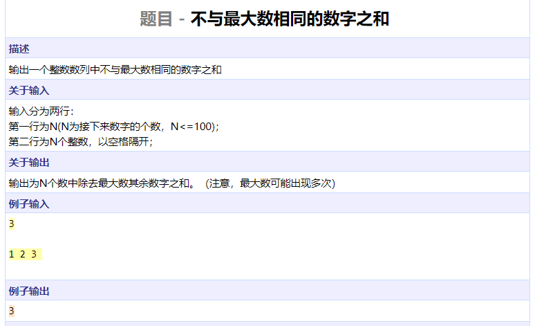
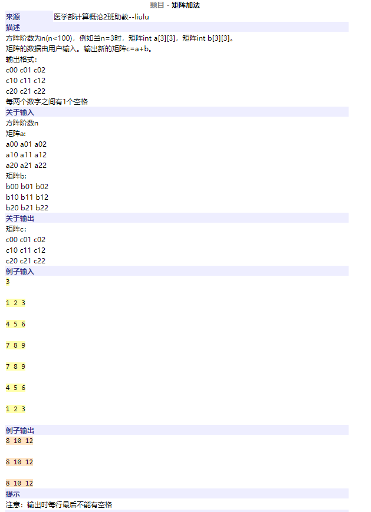
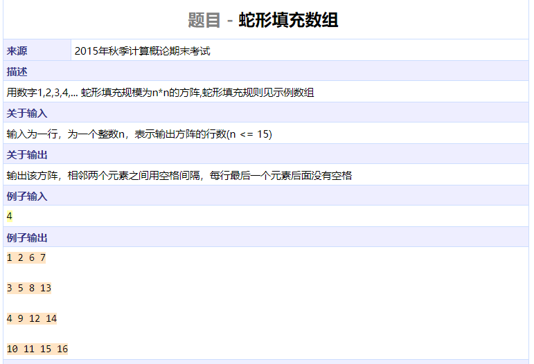
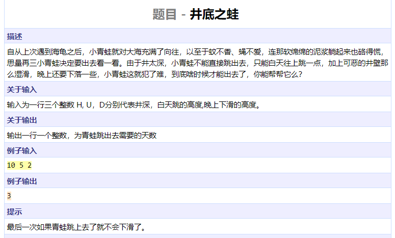
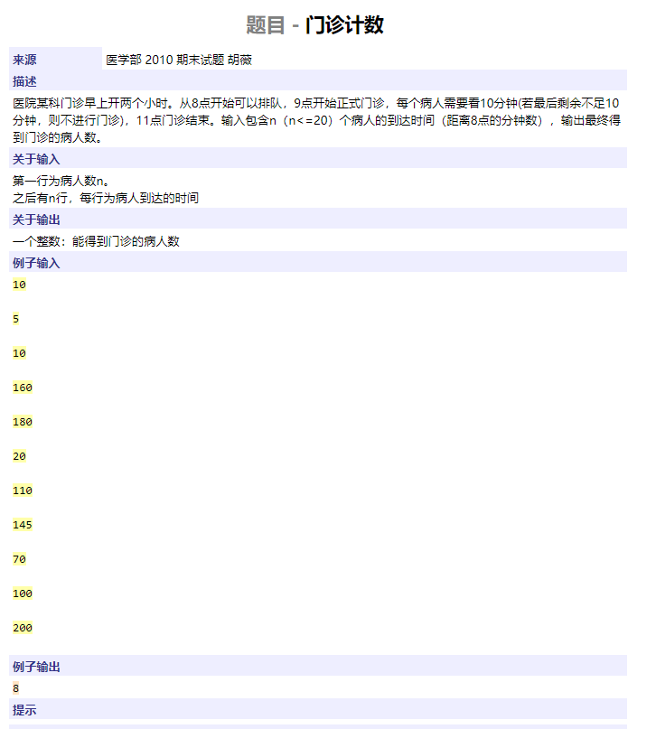

```cpp
#include <iostream>
using namespace std;

int main()
{
	int nums[100];
	int n;
	cin >> n;
	for (int i = 0; i < n; ++i)
		cin >> nums[i];
	int res = 0;
	int maxn = nums[0];
	for (int i = 1; i < n; ++i)
		maxn = max(maxn, nums[i]);
	for (int i = 0; i < n; ++i)
		res += maxn == nums[i] ? 0 : nums[i];
	cout << res << endl;
	return 0;
}
```




```cpp
#include <algorithm>
#include <iostream>
#include <functional>
#include <vector>
using namespace std;

int main()
{
	int a[100][100], tmp;
	int n;
	cin >> n;
	for (int i = 0; i < n; ++i)
		for (int j = 0; j < n; ++j)
			cin >> a[i][j];
	for (int i = 0; i < n; ++i)
		for (int j = 0; j < n; ++j) {
			cin >> tmp;
			a[i][j] += tmp;
		}
	for (int i = 0; i < n; ++i) {
		for (int j = 0; j < n; ++j)
			if (j > 0)
				cout << " " << a[i][j];
			else
				cout << a[i][j];
		cout << endl;
	}
	return 0;
}
```




```cpp
#include <algorithm>
#include <iostream>
#include <functional>
#include <vector>
using namespace std;

bool out(int n, int i, int j)
{
	return i < 0 || j < 0 || i >= n || j >= n;
}

int main()
{
	int mat[15][15];
	int n;
	cin >> n;
	int i = 0, j = 0, cnt = 0;
	bool rightup = true;		// moving direction
	while (cnt < n * n) {
		mat[i][j] = ++cnt;
		if (rightup) {
			if (out(n, i - 1, j + 1)) {	// reach boudary of matrix
				if (out(n, i, j + 1))	// can not move to right, move down
					i++;
				else			// can move to right
					j++;
				rightup = !rightup;	// change direction if reach boudary
			} else {
				i--, j++;
			}
		} else {
			if (out(n, i + 1, j - 1)) {
				if (out(n, i + 1, j))
					j++;
				else
					i++;
				rightup = !rightup;
			} else {
				i++, j--;
			}
		}
	}
	for (int i = 0; i < n; ++i) {
		for (int j = 0; j < n; ++j)
			if (j > 0)
				cout << " " << mat[i][j];
			else
				cout << mat[i][j];
		cout << endl;
	}
	return 0;
}
```




```cpp
#include <algorithm>
#include <iostream>
#include <functional>
#include <vector>
using namespace std;

int main()
{
	int h, u, d;
	cin >> h >> u >> d;
	int res = 0, curh = 0;
	while (curh < h) {
		res++;
		curh += u;
		if (curh >= h)
			break;
		curh -= d;
	}
	cout << res << endl;
	return 0;
}
```




```cpp
#include <algorithm>
#include <iostream>
#include <functional>
#include <vector>
using namespace std;

int main()
{
	int n, t[20];
	cin >> n;
	for (int i = 0; i < n; ++i)
		cin >> t[i];
	sort(t, t + n);			// 排队 -> 排序
	for (int i = 0; i < n; ++i)	// 8点前到达的人可以看作八点到达
		if (t[i] < 60)
			t[i] = 60;
	int T = 60, res = 0;
	for (int i = 0; i < n; ++i) {	// T维护当前病人看完病的时间
		T = max(T, t[i]) + 10;
		if (T > 180)
			break;
		res++;
	}
	cout << res << endl;
	return 0;
}
```


