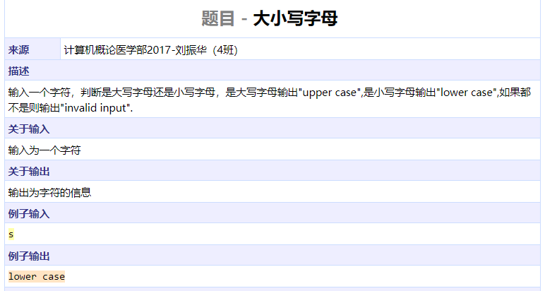
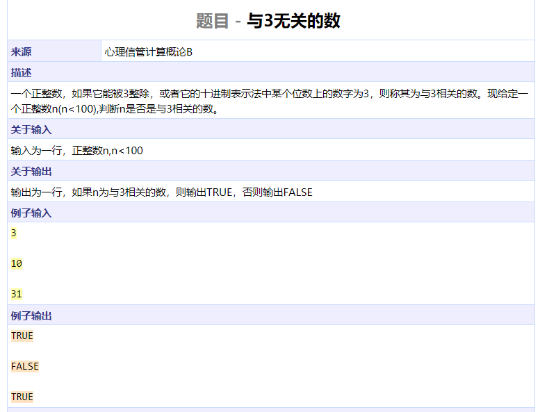
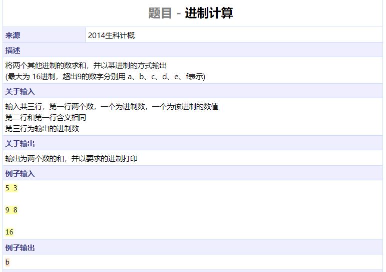
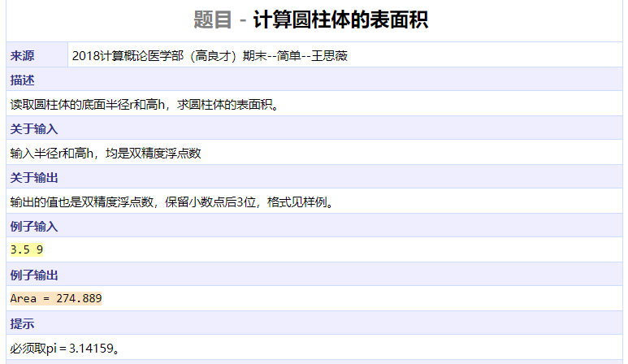
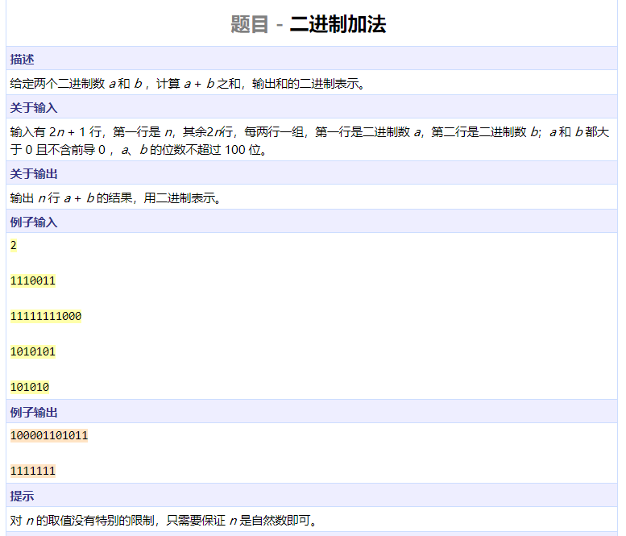
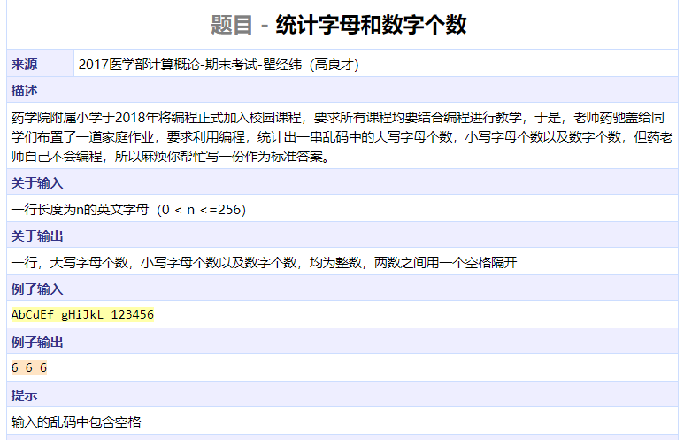
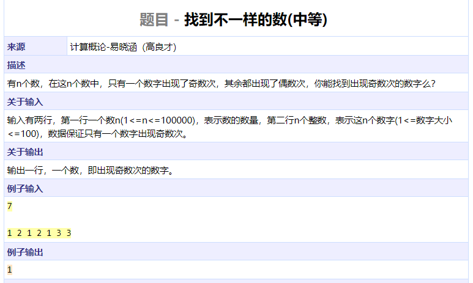

```cpp
#include <iostream>
using namespace std;

int main()
{
	char c;
	cin >> c;
	if (c <= 'z' && c >= 'a')
		cout << "lower case" << endl;
	else if (c <= 'Z' && c >= 'A')
		cout << "upper case" << endl;
	else
		cout << "invalid input" << endl;
	return 0;
}
```




```cpp
#include <iostream>
using namespace std;

bool check(int n)
{
	return n % 3 == 0 || n / 10 == 3 || n % 10 == 3;
}

int main()
{
	int n;
	while (cin >> n)
		cout << (check(n) ? "TRUE" : "FALSE") << endl;
	return 0;
}
```




```cpp
#include <iostream>
#include <algorithm>
using namespace std;

char chs[] = "0123456789abcdef";

int convert(char num[], int base)
{
	int res = 0, i = 0;
	while (num[i] != '\0') {
		char c = num[i];
		int tmp = (c >= '0' && c <= '9') ? c - '0' : c - 'a' + 10;
		res = res * base + tmp;
		i++;
	}
	return res;
}

int main()
{
	char num1[1000], num2[1000];
	int base1, base2, base3;
	cin >> base1 >> num1;
	cin >> base2 >> num2;
	cin >> base3;
	int sum = convert(num1, base1) + convert(num2, base2);
	int i = 0;
	while (sum) {
		num1[i++] = chs[sum % base3];
		sum /= base3;
	}
	num1[i] = '\0';
	reverse(num1, num1 + i);
	cout << num1 << endl;
	return 0;
}
```




```cpp
#include <iostream>
#include <iomanip>
using namespace std;

#define PI 3.14159

int main()
{
	double r, h;
	cin >> r >> h;
	double area = 2 * PI * r * (r + h);
	cout << "Area = " << setprecision(3)
			<< setiosflags(ios::fixed) << area << endl;
	return 0;
}
```




```cpp
#include <iostream>
#include <cstring>
#include <algorithm>
using namespace std;

int main()
{
	int n;
	char num1[110], num2[110];
	int num3[110];
	cin >> n;
	while (n--) {
		memset(num1, '0', sizeof(num1));
		memset(num2, '0', sizeof(num2));
		memset(num3, 0, sizeof(num3));
		cin >> num1 >> num2;
		int l1 = strlen(num1);
		int l2 = strlen(num2);
		num1[l1] = num2[l2] = '0';
		reverse(num1, num1 + l1);
		reverse(num2, num2 + l2);
		for (int i = 0; i < max(l1, l2); ++i) {
			int t = num1[i] - '0' + num2[i] - '0';
			num3[i] += t;
			num3[i + 1] += num3[i] / 2;
			num3[i] %= 2;
		}
		int i = max(l1, l2);
		while (i >= 1 && num3[i] == 0)
			i--;
		while (i >= 0)
			cout << num3[i--];
		cout << endl;
	}
	return 0;
}
```




```cpp
#include <iostream>
using namespace std;

int main()
{
	char c;
	int cnt[3] = {0};
	while ((c = cin.get()) != '\n') {
		if (c >= 'A' && c <= 'Z')
			cnt[0]++;
		else if (c >= 'a' && c <= 'z')
			cnt[1]++;
		else if (c >= '0' && c <= '9')
			cnt[2]++;
	}
	cout << cnt[0] << ' ' << cnt[1] << ' ' << cnt[2] << endl;
	return 0;
}
```




```cpp
#include <iostream>
using namespace std;

int main()
{
	int n;
	cin >> n;
	int res = 0, tmp;
	while (n--) {
		cin >> tmp;
		res ^= tmp;
	}
	cout << res << endl;
	return 0;
}
```

