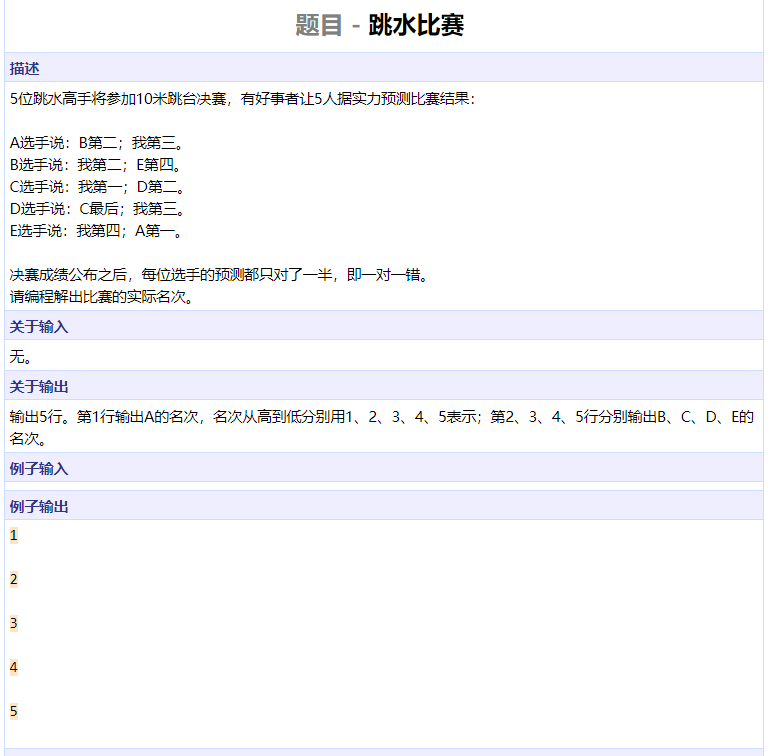

```cpp
#include <iomanip>
#include <iostream>
using namespace std;

int main()
{
	double res = 1, tmp = 1;
	int i = 1;
	while (tmp > 1e-7) {
		tmp /= i++;
		res += tmp;
	}
	cout << setprecision(6)	<< setiosflags(ios::fixed) << res << endl;
	return 0;
}
```


```cpp
#include <iomanip>
#include <iostream>
using namespace std;

int main()
{
	int id, num;
	char cls;
	double money;
	double peoples[3] = {0.}, classes[3] = {0.};
	while (cin >> id) {
		cin >> num;
		while (num--) {
			cin >> cls >> money;
			classes[cls - 'A'] += money;
			peoples[id - 1] += money;
		}
	}
	for (int i = 0; i < 3; ++i)
		cout << i + 1 << " " << setprecision(2)
			<< setiosflags(ios::fixed) << peoples[i] << endl;
	for (int i = 0; i < 3; ++i)
		cout << char('A' + i) << " " << setprecision(2)
			<< setiosflags(ios::fixed) << classes[i] << endl;
	return 0;
}
```


```cpp
#include <algorithm>
#include <iostream>
using namespace std;

int main()
{
	for (int py = 1; py <= 4; ++py)
		for (int dt = 1; dt <= 4; ++dt)
			for (int tai = 1; tai <= 4; ++tai)
				for (int hz = 1; hz <= 4; ++hz) {
					int tmp[4] = {py, dt, tai, hz};
					sort(tmp, tmp + 4);
					bool flag = false;
					for (int t = 0; t < 4; ++t)
						if (tmp[t] != t + 1) {
							flag = true;
							break;
						}
					if (flag)
						continue;
					int A = (dt == 1) + (hz == 4) + (py == 3);
					int B = (hz == 1) + (dt == 4) + (py == 2) + (tai == 3);
					int C = (hz == 4) + (dt == 3);
					int D = (py == 1) + (tai == 4) + (hz == 2) + (dt == 3);
					if (A == 1 && B == 1 && C == 1 && D == 1) {
						cout << py << endl << dt << endl;
						cout << tai << endl << hz << endl;
						goto end;
					}
				}
end:
	return 0;
}
```


```cpp
#include <algorithm>
#include <iostream>
using namespace std;

int main()
{
	for (int i = 0; i < 16; ++i) {
		
		bool S1 = i & 1, S2 = (i >> 1) & 1;
		bool S3 = (i >> 2) & 1, S4 = (i >> 3) & 1;
		if (S1 + S2 + S3 + S4 != 1)
			continue;
		bool A = S2, B = S4, C = !S3, D = !S4;
		if (A + B + C + D == 1) {
			bool car[4] = {S1, S2, S3, S4};
			bool expert[4] = {A, B, C, D};
			for (int i = 0; i < 4; ++i)
				if (car[i])
					cout << i + 1 << endl;
			for (int i = 0; i < 4; ++i)
				if (expert[i])
					cout << char('A' + i) << endl;
			goto end;
		}
	}
end:
	return 0;
}
```




```cpp
#include <algorithm>
#include <iostream>
#include <functional>
#include <vector>
using namespace std;

/*
 * 常规做法参考四大湖
 * 这里给了一个非常规做法，不要求掌握
 */

int main()
{
	int ranks[] = {1, 2, 3, 4, 5};
	bool have_next = true;
	while (have_next) {
		bool A = (ranks[1] == 2) + (ranks[0] == 3);
		bool B = (ranks[1] == 2) + (ranks[4] == 4);
		bool C = (ranks[2] == 1) + (ranks[3] == 2);
		bool D = (ranks[2] == 5) + (ranks[3] == 3);
		bool E = (ranks[4] == 4) + (ranks[0] == 1);
		int v[] = {A, B, C, D, E};
		sort(v, v + 5);
		if (v[0] == 1 && v[4] == 1) {
			for (int i = 0; i < 5; ++i)
				cout << ranks[i] << endl;
			goto end;
		}
		have_next = next_permutation(ranks, ranks + 5);
	}
end:
	return 0;
}
```


