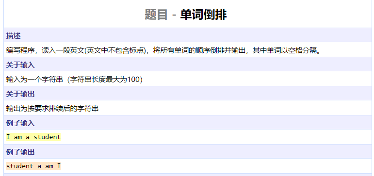
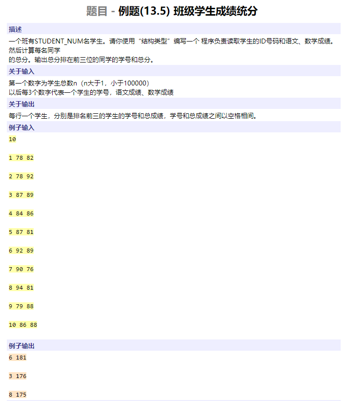
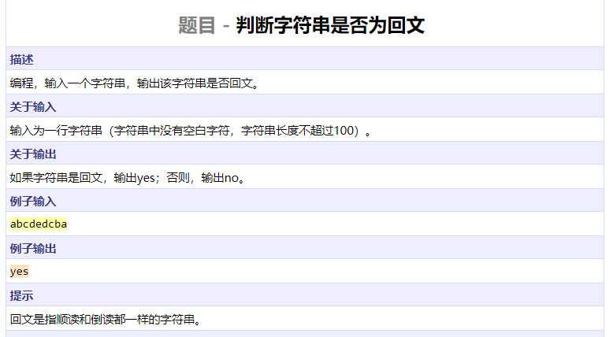
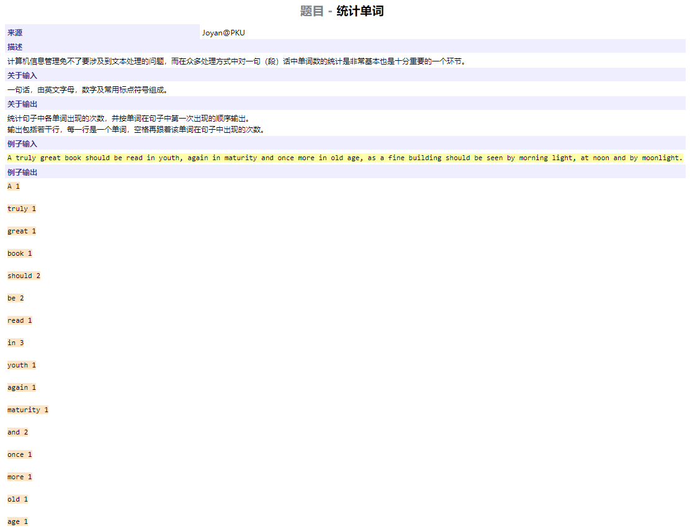
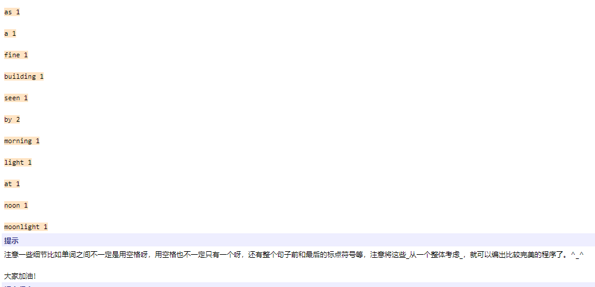

```cpp
#include <iostream>
#include <cstring>
#include <algorithm>
using namespace std;

int findend(char s[], int start, int maxlen)
{
	int i = start;
	while (i < maxlen && s[i] <= 'z' && s[i] >= 'a' || s[i] <= 'Z' && s[i] >= 'A')
		i++;
	return i;
}

int main()
{
	char s[1010];
	cin.get(s, 110);
	int l = strlen(s);
	int i = 0;
	while (i < l) {
		int j = findend(s, i, l);	// find a word [i, j)
		reverse(s + i, s + j);		// reverse this word
		i = j;
		while (i < l && s[i] == ' ')
			i++;
	}
	reverse(s, s + l);			// reverse the sentence
	cout << s << endl;
	return 0;
}
```


```cpp
#include <iostream>
#include <cstring>
#include <algorithm>
using namespace std;

int main()
{
	char s[1010];
	cin.get(s, 1000);
	int l = strlen(s);
	sort(s, s + l / 2);
	reverse(s, s + l);
	reverse(s, s + l / 2);
	cout << s << endl;
	return 0;
}
```




```cpp
#include <iostream>
#include <cstring>
#include <algorithm>
using namespace std;

struct STU {
	int id;
	int chinese;
	int math;
	int sum;
} stus[100000];

int main()
{
	int n;
	cin >> n;
	for (int i = 0; i < n; ++i) {
		cin >> stus[i].id >> stus[i].chinese >> stus[i].math;
		stus[i].sum = stus[i].chinese + stus[i].math;
	}
	for (int i = 0; i < 3; ++i)		// execute bubble sort three times
		for (int j = n - i - 2; j >= 0; --j)
			if (stus[j].sum < stus[j + 1].sum)
				swap(stus[j], stus[j + 1]);
	for (int i = 0; i < 3; ++i)
		cout << stus[i].id << " " << stus[i].sum << endl;
	return 0;
}
```




```cpp
#include <iostream>
#include <cstring>
using namespace std;

bool judge(char s[])
{
	int l = strlen(s);
	int i = 0, j = l - 1;
	while (i < j) {
		if (s[i] == s[j])
			i++, j--;
		else
			return false;
	}
	return true;
}

int main()
{
	char s[110];
	cin >> s;
	cout << (judge(s) ? "yes" : "no") << endl;
	return 0;
}
```






```cpp
#include <iostream>
#include <cstring>
using namespace std;

char sent[10010];
char words[100][100];
int wordcnt[1000];
int wordidx = 0;
const char puncs[20] = ",. ;:?!-()~";

bool punc(char c)
{
	int l = strlen(puncs);
	for (int i = 0; i < l; ++i)
		if (puncs[i] == c)
			return true;
	return false;
}

int extract(char sent[], int start, int maxlen)
{
	char curword[100];
	int idx = 0;
	while (start < maxlen && punc(sent[start]))		// find start of word
		start++;
	if (start == maxlen)
		return maxlen;
	while (start < maxlen && !punc(sent[start]))		// find end of word
		curword[idx++] = sent[start++];
	curword[idx] = '\0';
	bool same = false;					// insert word to word list
	for (int i = 0; i < wordidx; ++i)
		if (strcmp(words[i], curword) == 0) {
			wordcnt[i]++;
			same = true;
			break;
		}
	if (!same) {
		strcpy(words[wordidx], curword);
		wordcnt[wordidx] += 1;
		wordidx++;
	}
	return start;
}

int main()
{
	cin.getline(sent, 10000);
	int l = strlen(sent);
	int i = 0;
	while (i < l)
		i = extract(sent, i, l);			// extract a word and update index i
	for (int i = 0; i < wordidx; ++i)
		cout << words[i] << ' ' << wordcnt[i] << endl;
	return 0;
}
```


