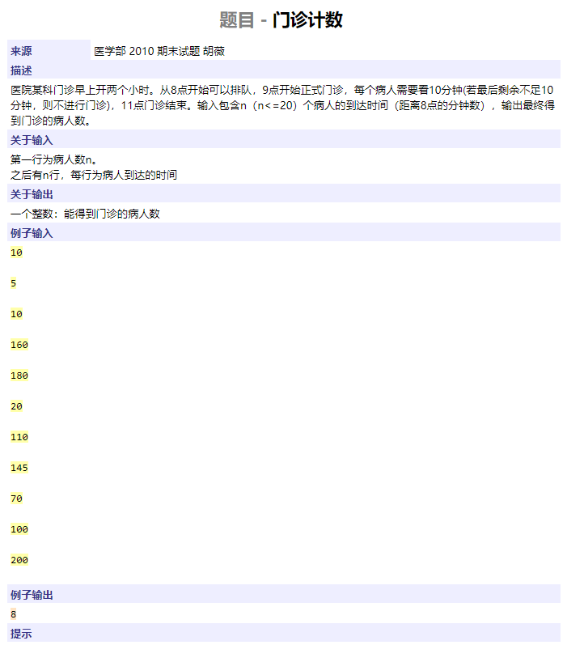
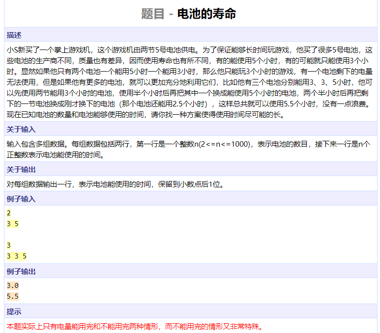
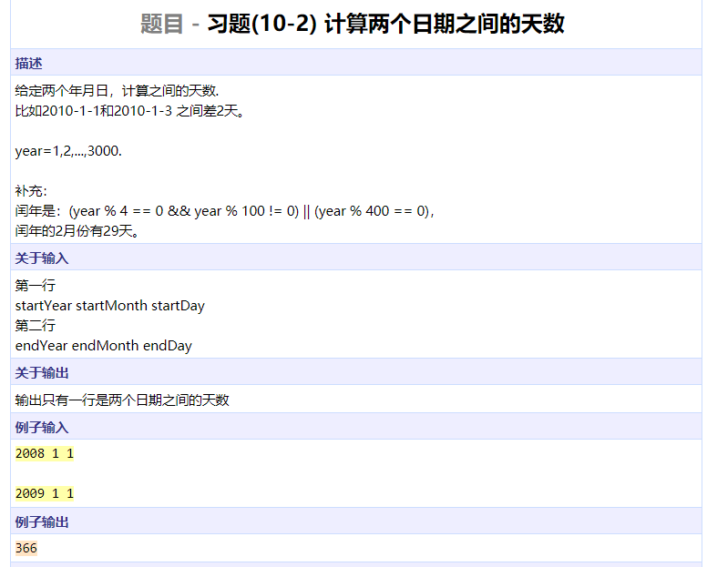
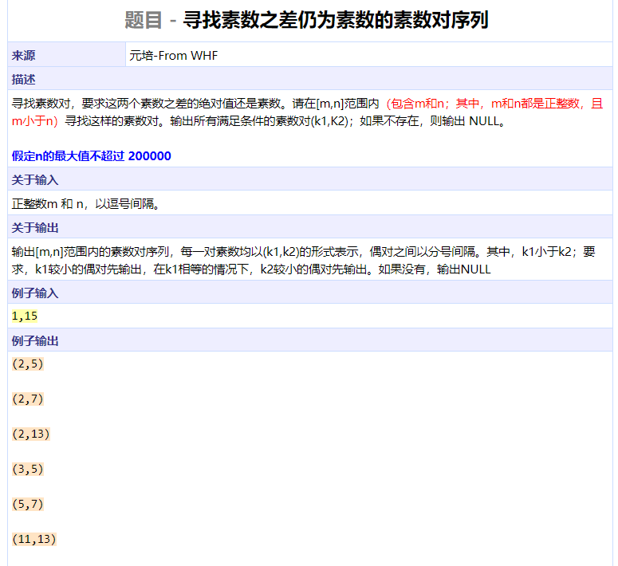
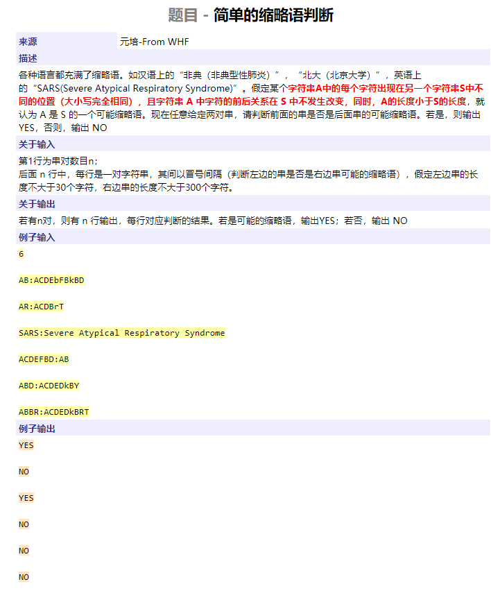
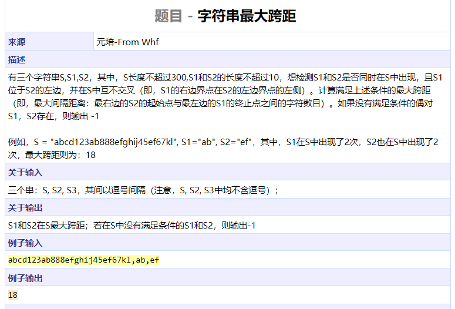

```cpp
#include <algorithm>
#include <iostream>
#include <functional>
#include <vector>
using namespace std;

int main()
{
	int n, t[20];
	cin >> n;
	for (int i = 0; i < n; ++i)
		cin >> t[i];
	sort(t, t + n);			// 排队 -> 排序
	for (int i = 0; i < n; ++i)	// 8点前到达的人可以看作八点到达
		if (t[i] < 60)
			t[i] = 60;
	int T = 60, res = 0;
	for (int i = 0; i < n; ++i) {	// T维护当前病人看完病的时间
		T = max(T, t[i]) + 10;
		if (T > 180)
			break;
		res++;
	}
	cout << res << endl;
	return 0;
}
```




```cpp
#include <iostream>
#include <cstring>
#include <cstdio>
#include <iomanip>
using namespace std;

int main()
{
	int n;
	int nums[1000];
	ios::sync_with_stdio(false);
	while (cin >> n) {
		double sum = 0, res, maxn = -1;
		for (int i = 0; i < n; ++i) {
			cin >> nums[i];
			maxn = max(maxn, 1.0 * nums[i]);
			sum += nums[i];
		}
		if (maxn * 2 > sum)
			res = sum - maxn;
		else
			res = sum / 2;
		printf("%.1lf\n", res);
	}
	return 0;
}
```




```cpp
#include <iostream>
#include <cstring>
#include <cstdio>
using namespace std;

bool leap(int year)
{
	return (year % 4 == 0 && year % 100 != 0) || year % 400 == 0;
}

int caldays(int year, int month, int day)
{
	int months[] = { 0, 31, 28, 31, 30, 31, 30, 31, 31, 30, 31, 30, 31 };
	int d = 0;
	for (int i = 0; i < year; ++i)
		if (leap(i))
			d += 366;
		else
			d += 365;
	if (leap(year))
		months[2] = 29;
	for (int i = 1; i < month; ++i)
		d += months[i];
	d += day - 1;
	return d;
}

int main()
{
	int year1, month1, day1;
	int year2, month2, day2;
	cin >> year1 >> month1 >> day1;
	cin >> year2 >> month2 >> day2;
	cout << caldays(year2, month2, day2) - caldays(year1, month1, day1) << endl;
}
```




```cpp
#include <iostream>
#include <cstdio>
using namespace std;

bool nprime[200001];

int main()
{
	int m, n;
	char c;
	cin >> m >> c >> n;
	nprime[0] = nprime[1] = true;
	for (int i = 2; i <= n; ++i) {
		if (nprime[i])
			continue;
		for (int j = i * 2; j <= n; j += i)
			nprime[j] = true;
	}
	bool flag = false;
	for (int i = m; i < n; ++i)
		for (int j = i + 2; j <= n; ++j) {
			if (!nprime[i] && !nprime[j] && !nprime[j - i]) {
				printf("(%d,%d)\n", i, j);
				flag = true;
			}
			if (i != 2)
				break;
		}
	if (!flag)
		cout << "NULL" << endl;
	return 0;
}
```




```cpp
#include <iostream>
#include <cstring>
#include <cstdio>
using namespace std;

bool isShort(char s1[], char s2[])
{
	int l1 = strlen(s1);
	int l2 = strlen(s2);
	if (l1 >= l2)
		return false;
	int i = 0, j = 0;
	while (i < l1) {
		while (j < l2 && s2[j] != s1[i])
			j++;
		if (j == l2)
			return false;
		i++, j++;
	}
	return true;
}

int main()
{
	int n;
	cin >> n;
	cin.get();
	char s1[32], s2[320];
	while (n--) {
		cin.getline(s1, 31, ':');
		cin.getline(s2, 310);
		cout << (isShort(s1, s2) ? "YES" : "NO") << endl;
	}
	return 0;
}
```




```cpp
#include <iostream>
#include <cstring>
#include <cstdio>
using namespace std;

int main()
{
	char s[320], s1[20], s2[20];
	cin.getline(s, 302, ',');
	cin.getline(s1, 12, ',');
	cin.getline(s2, 12);
	int l = strlen(s);
	int l1 = strlen(s1);
	int l2 = strlen(s1);
	char *find1 = strstr(s, s1);
	char *find2 = NULL;
	int j = l - 1;
	while (find2 == NULL && j >= 0)
		find2 = strstr(s + j--, s2);
	if (find1 == NULL || find2 == NULL)
		cout << -1 << endl;
	else {
		int res = find2 - find1 - l1;
		cout << ((res >= 0) ? res : -1) << endl;
	}
	return 0;
}
```

