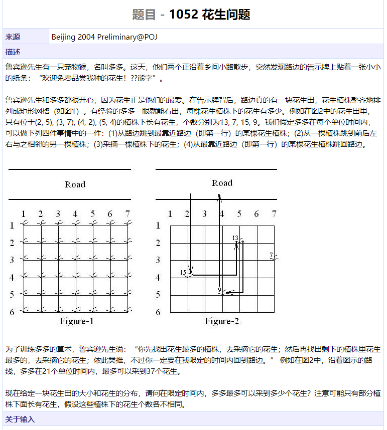
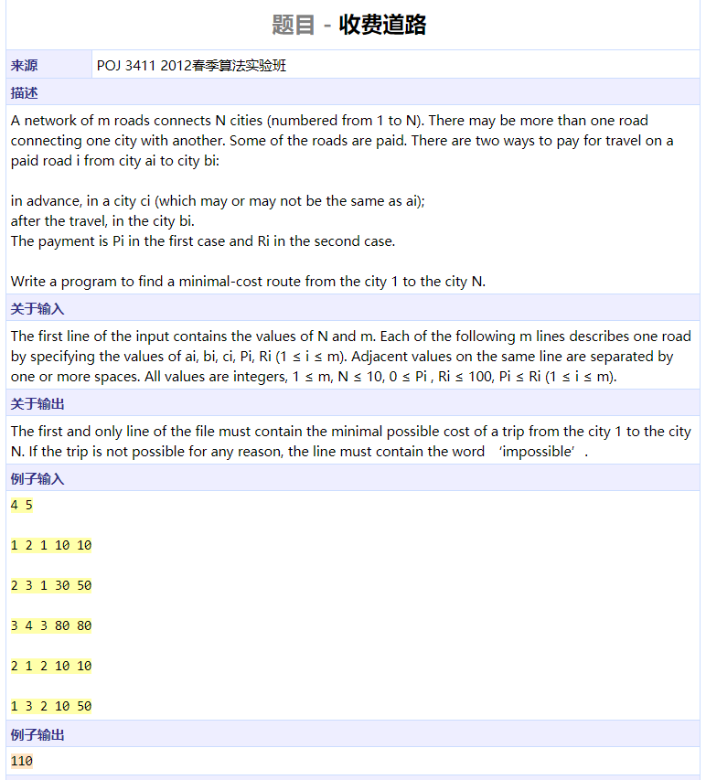

```cpp
#include <cstring>
#include <cmath>
#include <cstdio>
#include <algorithm>
using namespace std;

int main()
{
	char s[100];
	scanf("%s", s);
	int l = strlen(s);
	bool flag = false;
	for (int i = 0; i < l; ++i)
		if (s[i] == '.')
			flag = true;
	int integer[3] = { 0 };
	double d[3] = { 0 };
	if (!flag)
		sscanf(s, "%d,%d,%d", integer, integer + 1, integer + 2);
	else
		sscanf(s, "%lf,%lf,%lf", d, d + 1, d + 2);
	sort(integer, integer + 3);
	sort(d, d + 3);
	if (!flag)
		printf("%d,%d,%d\n", integer[0], integer[1], integer[2]);
	else
		for (int i = 0; i < 3; ++i)
			if (abs(round(d[i]) - d[i]) < 1e-8)
				printf("%.0f%c", d[i], "\n,"[i < 2]);
			else
				printf("%.2f%c", d[i], "\n,"[i < 2]);
	return 0;
}
```


```cpp
#include <iostream>
#include <cstring>
using namespace std;

int main()
{
	int m, n, k;
	int a[100][100], b[100][100], c[100][100];
	int t;
	cin >> t;
	while (t--) {
		cin >> m >> n >> k;
		for (int i = 0; i < m; ++i)
			for (int j = 0; j < n; ++j)
				cin >> a[i][j];
		for (int i = 0; i < n; ++i)
			for (int j = 0; j < k; ++j)
				cin >> b[i][j];
		memset(c, 0, sizeof(c));
		for (int i = 0; i < m; ++i)
			for (int j = 0; j < k; ++j)
				for (int l = 0; l < n; ++l)
					c[i][j] += a[i][l] * b[l][j];
		for (int i = 0; i < m; ++i) {
			for (int j = 0; j < k - 1; ++j)
				cout << c[i][j] << ' ';
			cout << c[i][k - 1] << endl;
		}
	}
	return 0;
}
```


```cpp
#include <iostream>
#include <map>
#include <algorithm>
using namespace std;

int num[5010];
int length[5010][5010];

int main()
{
	int n;
	cin >> n;
	for (int i = 0; i < n; ++i)
		cin >> num[i];
	sort(num, num + n);
	int maxn = 0, v1, v2;
	for (int i = 1; i < n; ++i) {
		int p = 0;
		for (int j = 0; j < i; ++j) {
			length[j][i] = 2;
			while (p < j && num[p] + num[i] < 2 * num[j])
				p++;
			if (num[p] + num[i] == 2 * num[j])
				length[j][i] = length[p][j] + 1;
			if (length[j][i] > maxn ||
				length[j][i] == maxn && num[i] - num[j] >= num[v1] - num[v2]) {
				maxn = length[j][i];
				v1 = i;
				v2 = j;
			}
		}
	}
	int i = 0, j = 0;
	while (true) {
		while (j < n && num[j] == num[i])
			j++;
		if (j - i > maxn) {
			maxn = j - i;
			v1 = v2 = i;
		}
		if (j == n)
			break;
		i = j;
	}
	if (maxn < 3) {
		cout << "NO" << endl;
	} else {
		int val1 = num[v1];
		int dif = val1 - num[v2];
		cout << val1 - dif * (maxn - 1);
		for (int i = 0; i < maxn - 1; ++i)
			cout << ',' << val1 - dif * (maxn - 2 - i);
		cout << endl;
	}
	return 0;
}
```


```cpp
#include <iostream>
#include <cstring>
#include <algorithm>
using namespace std;

void addone(char s[], int k)
{
	int l = strlen(s);
	reverse(s, s + l);
	s[l] = '0';
	s[0] += 1;
	for (int i = 0; i < l; ++i) {
		s[i + 1] += (s[i] - '0') / k;
		s[i] = (s[i] - '0') % k + '0';
	}
	if (s[l] != '0')
		l++;
	s[l] = '\0';
	reverse(s, s + l);
	return;
}

int main()
{
	int k, m;
	char s[1010], c;
	cin >> k >> c >> m >> c >> s;
	for (int i = 0; i < m; ++i) {
		addone(s, k);
		cout << s;
		if (i != m - 1)
			cout << (i % 5 == 4 ? '\n' : ',');
	}
	cout << endl;
	return 0;
}
```


```cpp
#include <iostream>
#include <cstring>
#include <algorithm>
using namespace std;

char s[510];
char words[500][10];
int words_idx;
char tmp[10];
int cnts[500];

int main()
{
	int k;
	cin >> k >> s;
	int l = strlen(s);
	for (int i = 0; i < l - k + 1; ++i) {
		char saved = s[i + k];
		s[i + k] = '\0';
		strcpy(tmp, s + i);
		s[i + k] = saved;
		bool flag = false;
		for (int i = 0; i < words_idx; ++i) {
			if (strcmp(words[i], tmp) == 0) {
				cnts[i]++;
				flag = true;
				break;
			}
		}
		if (!flag)
			strcpy(words[words_idx++], tmp);
	}
	int maxn = 0;
	for (int i = 0; i < words_idx; ++i)
		maxn = max(maxn, cnts[i]);
	if (maxn == 0) {
		cout << "NO" << endl;
		return 0;
	}
	cout << maxn + 1 << endl;
	for (int i = 0; i < words_idx; ++i)
		if (cnts[i] == maxn)
			cout << words[i] << endl;
	return 0;
}
```





```cpp
#include <algorithm>
#include <iostream>
using namespace std;

struct Peanut {
	int x, y;
	int value;
} ps[400];

bool cmp(const Peanut &a, const Peanut &b)
{
	return a.value > b.value || 
		a.value == b.value && a.x > b.y || 
		a.value == b.value && a.x == b.x && a.y > b.y;
}

int main()
{
	int k;
	cin >> k;
	while (k--) {
		int m, n, t, idx = 0;
		cin >> m >> n >> t;
		for (int i = 0; i < m; ++i)
			for (int j = 0; j < n; ++j) {
				int tmp;
				cin >> tmp;
				if (tmp > 0) {
					ps[idx].value = tmp;
					ps[idx].x = i;
					ps[idx++].y = j;
				}
			}
		sort(ps, ps + idx, cmp);
		int res = 0, curx = 0, cury = 0, curidx = 0;
		while (t > 0 && curidx < idx) {
			int x = ps[curidx].x;
			int y = ps[curidx].y;
			if (res == 0) {
				if (t >= 2 * x + 3) {
					res += ps[curidx].value;
					curx = x;
					cury = y;
					t -= x + 2;
					curidx += 1;
				} else {
					break;
				}
			} else {
				int movcost = abs(x - curx) + abs(y - cury);
				if (t >= movcost + 1 + x + 1) {
					res += ps[curidx].value;
					curx = x;
					cury = y;
					t -= movcost + 1;
					curidx += 1;
				} else {
					break;
				}
			}
		}
		cout << res << endl;
	}
	return 0;
}
```


```cpp
#include <cstring>
#include <iostream>
using namespace std;

void strip(char *s)
{
	int l = strlen(s);
	int idx = 0;
	for (int i = 0; i <= l; ++i)
		if (s[i] != ' ')
			s[idx++] = s[i];
}

void CNT(char *s, int &cnt1, int &cnt2)
{
	strip(s);
	int l = strlen(s);
	const char word[4][10] = { "if", "switch", "while", "for" };
	for (int i = 0; i < l; ++i) {
		for (int j = 0; j < 4; ++j) {
			char saved = s[i + strlen(word[j])];
			s[i + strlen(word[j])] = '\0';
			if (strcmp(word[j], s + i) == 0 && saved == '(') {
				if (i < 2)
					cnt1 += 1;
				else
					cnt2 += 1;
			}
			s[i + strlen(word[j])] = saved;
		}
	}
}

int main()
{
	char s[1010];
	int n1, n2, cnt11 = 0, cnt12 = 0, cnt21 = 0, cnt22 = 0;
	cin >> n1;
	cin.get();
	while (n1--) {
		cin.getline(s, 1000);
		CNT(s, cnt11, cnt12);
	}
	cin >> n2;
	cin.get();
	while (n2--) {
		cin.getline(s, 1000);
		CNT(s, cnt21, cnt22);
	}
	bool res = cnt11 == cnt21 && cnt12 == cnt22;
	cout << (res ? "Yes" : "No") << endl;
	return 0;
}
```


```cpp
#include <cstring>
#include <iostream>
using namespace std;

int main()
{
	char s[110];
	char s1[100], s2[100], s3[100];
	int a, b, c;
	while (cin >> a >> b >> c && a) {
		cin.get();
		cin.getline(s, 100);
		int idx1 = 0, idx2 = 0, idx3 = 0;
		int l = strlen(s);
		for (int i = 0; i < l; ++i) {
			if (s[i] >= 'a' && s[i] <= 'i') {
				s1[idx1++] = s[i];
			} else if (s[i] >= 'j' && s[i] <= 'r') {
				s2[idx2++] = s[i];
			} else {
				s3[idx3++] = s[i];
			}
		}
		int idx21 = 0, idx22 = 0, idx23 = 0;
		for (int i = 0; i < l; ++i) {
			if (s[i] >= 'a' && s[i] <= 'i') {
				s[i] = s1[(idx21++ - a + 100000 * idx1) % idx1];
			} else if (s[i] >= 'j' && s[i] <= 'r') {
				s[i] = s2[(idx22++ - b + 100000 * idx2) % idx2];
			} else {
				s[i] = s3[(idx23++ - c + 100000 * idx3) % idx3];
			}			
		}
		cout << s << endl;
	}
	return 0;
}
```


```cpp
#include <iostream>
using namespace std;

int main()
{
	int n;
	cin >> n;
	int nums[100];
	int i = 0;
	while (n >= i + 2) {
		nums[i] = i + 2;
		n -= i + 2;
		i++;
	}
	while (n > 0) {
		for (int j = i - 1; n > 0 && j >= 0; j--, n--)
			nums[j] += 1;
	}
	for (int j = 0; j < i - 1; ++j)
		cout << nums[j] << ' ';
	cout << nums[i - 1] << endl;
	return 0;
}
```




```cpp
#include <cstring>
#include <iostream>
using namespace std;

int n, m;
int edge1[10][10][10];
int edge2[10][10][10];
int edgecnt[10][10];
int pv[10][10][10];
bool visited[10];
int mincost = 1e8;

void dfs(int depth, int cost, int cur)
{
	if (cur == n - 1) {
		mincost = min(mincost, cost);
		return;
	}
	for (int i = 0; i < n; ++i) {
		if (visited[i])
			continue;
		for (int j = 0; j < edgecnt[cur][i]; ++j) {
			int path = visited[pv[cur][i][j]] ? edge1[cur][i][j] : edge2[cur][i][j];
			visited[i] = true;
			dfs(depth + 1, cost + path, i);
			visited[i] = false;
		} 
	}
}

int main()
{
	cin >> n >> m;
	for (int i = 0; i < m; ++i) {
		int from, to;
		cin >> from >> to;
		from -= 1;
		to -= 1;
		cin >> pv[from][to][edgecnt[from][to]] >> edge1[from][to][edgecnt[from][to]] >> edge2[from][to][edgecnt[from][to]];
		pv[from][to][edgecnt[from][to]] -= 1;
		edgecnt[from][to] += 1;
	}
	visited[0] = true;
	dfs(1, 0, 0);
	if (mincost == 1e8)
		cout << "impossible" << endl;
	else
		cout << mincost << endl;
	return 0;
}
```

