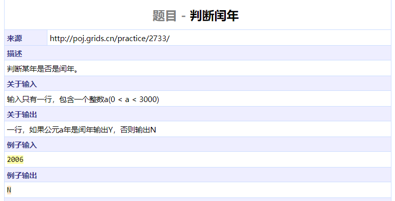
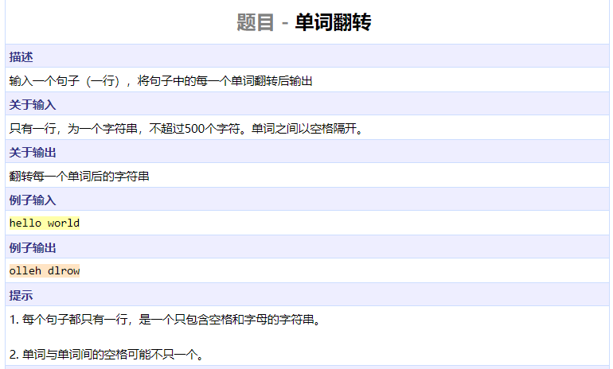
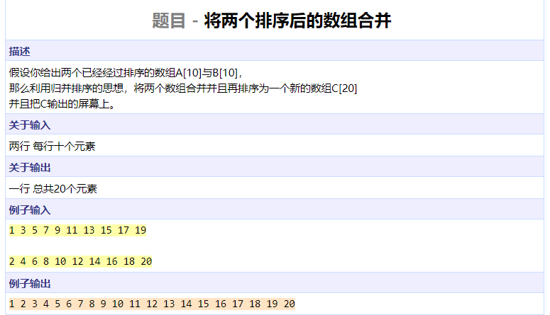
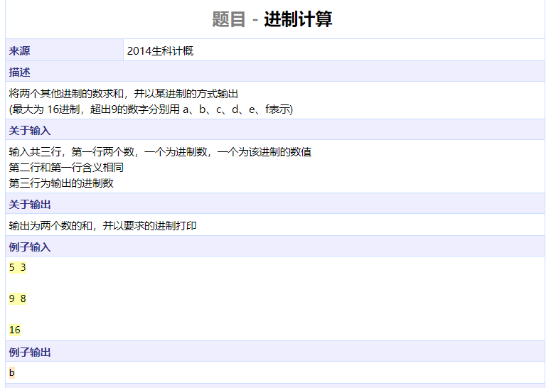
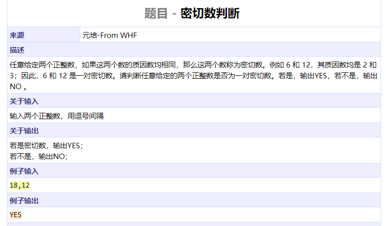
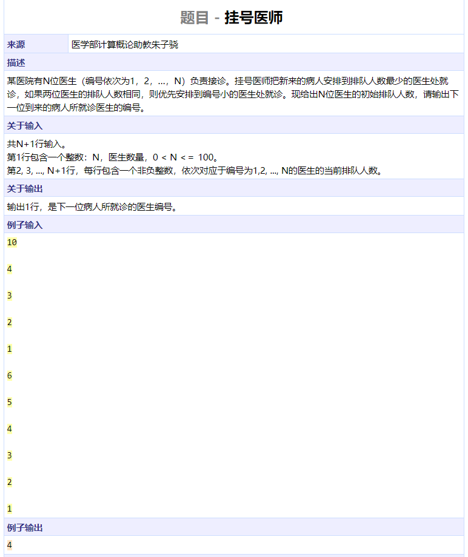
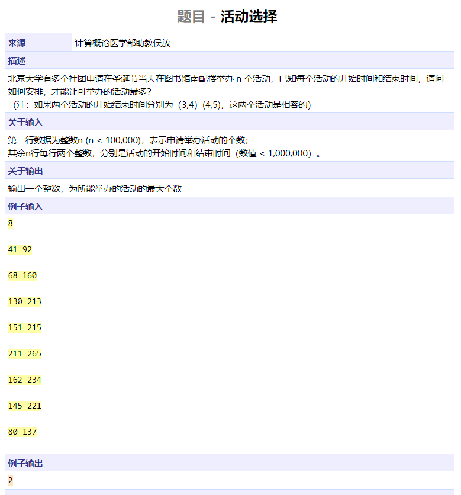
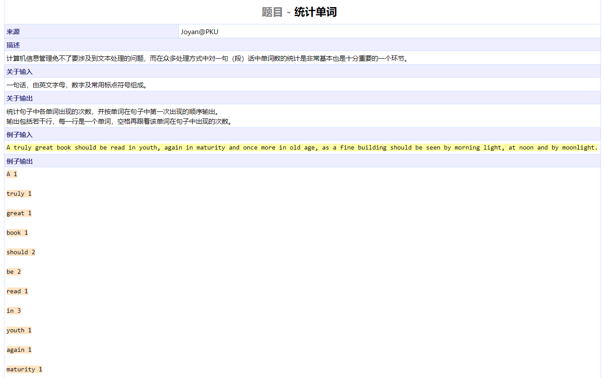
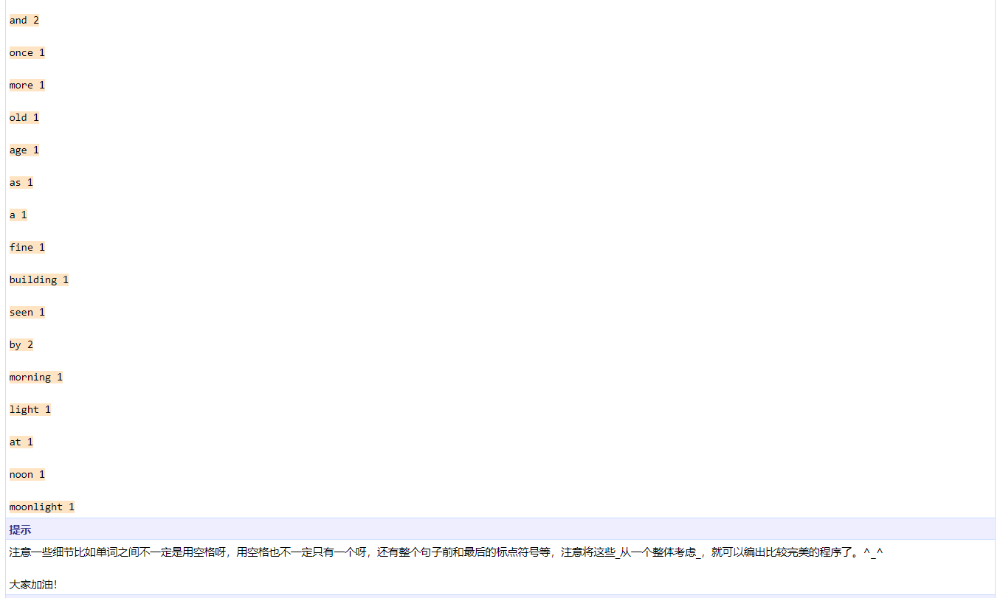
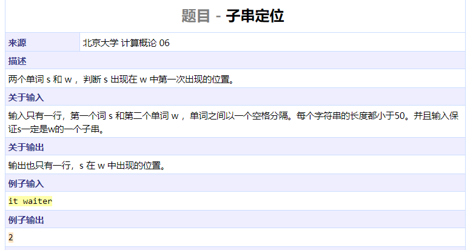

```cpp
#include <iostream>
#include <cstring>
#include <cstdio>
using namespace std;

int main()
{
	int n;
	cin >> n;
	cout << (((n % 4 == 0 && n % 100 != 0) || n % 400 == 0) ? "Y" : "N") << endl;
	return 0;
}
```




```cpp
#include <iostream>
#include <cstring>
#include <algorithm>
using namespace std;

int findend(char s[], int start, int maxlen)
{
	int i = start;
	while (i < maxlen && s[i] != ' ')
		i++;
	return i;
}

int main()
{
	char s[1010];
	cin.get(s, 110);
	int l = strlen(s);
	int i = 0;
	while (i < l) {
		int j = findend(s, i, l);	// find a word [i, j)
		reverse(s + i, s + j);		// reverse this word
		i = j;
		while (i < l && s[i] == ' ')
			i++;
	}			// reverse the sentence
	cout << s << endl;
	return 0;
}
```




```cpp
#include <iostream>
#include <cstring>
#include <algorithm>
using namespace std;

int main()
{
	int a[10], b[10], c[20];
	for (int i = 0; i < 10; ++i)
		cin >> a[i];
	for (int i = 0; i < 10; ++i)
		cin >> b[i];
	int i = 0, j = 0, k = 0;
	while (i < 10 && j < 10) {
		if (a[i] < b[j])
			c[k++] = a[i++];
		else
			c[k++] = b[j++];
	}
	while (i < 10)
		c[k++] = a[i++];
	while (j < 10)
		c[k++] = b[j++];
	cout << c[0];
	for (int i = 1; i < 20; ++i)
		cout << ' ' << c[i];
	cout << endl;
	return 0;
}
```




```cpp
#include <iostream>
#include <algorithm>
using namespace std;

char chs[] = "0123456789abcdef";

int convert(char num[], int base)
{
	int res = 0, i = 0;
	while (num[i] != '\0') {
		char c = num[i];
		int tmp = (c >= '0' && c <= '9') ? c - '0' : c - 'a' + 10;
		res = res * base + tmp;
		i++;
	}
	return res;
}

int main()
{
	char num1[1000], num2[1000];
	int base1, base2, base3;
	cin >> base1 >> num1;
	cin >> base2 >> num2;
	cin >> base3;
	int sum = convert(num1, base1) + convert(num2, base2);
	int i = 0;
	while (sum) {
		num1[i++] = chs[sum % base3];
		sum /= base3;
	}
	num1[i] = '\0';
	reverse(num1, num1 + i);
	cout << num1 << endl;
	return 0;
}
```




```cpp
#include <iostream>
using namespace std;

#define MAXN 10000
bool nprime[MAXN +10];
bool factor1[MAXN], factor2[MAXN];

int main()
{
	int a, b;
	char c;
	cin >> a >> c >> b;
	nprime[0] = nprime[1] = true;
	for (int i = 2; i < MAXN; ++i) {
		if (nprime[i])
			continue;
		for (int j = i * 2; j < MAXN; j += i)
			nprime[j] = true;
	}
	for (int i = 2; i * i <= a; ++i)
		if (!nprime[i] && a % i == 0) {
			factor1[i] = true;
			while (a % i == 0)
				a /= i;
		}
	if (!nprime[a])
		factor1[a] = true;
	for (int i = 2; i * i <= b; ++i)
		if (!nprime[i] && b % i == 0) {
			factor2[i] = true;
			while (b % i == 0)
				b /= i;
		}
	if (!nprime[b])
		factor2[b] = true;
	bool flag = true;
	for (int i = 2; i <= max(a, b); ++i) {
		if (factor1[i] != factor2[i]) {
			flag = false;
			break;
		}
	}
	cout << (flag ? "YES" : "NO") << endl;
	return 0;
}
```




```cpp
#include <iostream>
using namespace std;

int main()
{
	int num[100];
	int n;
	cin >> n;
	for (int i = 0; i < n; ++i)
		cin >> num[i];
	int minn = num[0];
	for (int i = 1; i < n; ++i)
		minn = min(minn, num[i]);
	for (int i = 0; i < n; ++i)
		if (num[i] == minn) {
			cout << i + 1 << endl;
			break;
		}	
	return 0;
}
```




```cpp
#include <iostream>
#include <cstring>
#include <algorithm>
using namespace std;

struct Interval {
	int start;
	int end;
} intervals[100000];

bool cmp(const Interval &a, const Interval &b)
{
	return a.end < b.end || a.end == b.end && a.start < b.start;
}

int main()
{
	int n;
	ios::sync_with_stdio(false);
	cin >> n;
	for (int i = 0; i < n; ++i)
		cin >> intervals[i].start >> intervals[i].end;
	sort(intervals, intervals + n, cmp);
	int curend = 0, res = 0;
	for (int i = 0; i < n; ++i) {
		if (intervals[i].start < curend)
			continue;
		res++;
		curend = intervals[i].end;
	}
	cout << res << endl;
	return 0;
}
```






```cpp
#include <iostream>
#include <cstring>
using namespace std;

char sent[10010];
char words[100][100];
int wordcnt[1000];
int wordidx = 0;
const char puncs[20] = ",. ;:?!-()~";

bool punc(char c)
{
	int l = strlen(puncs);
	for (int i = 0; i < l; ++i)
		if (puncs[i] == c)
			return true;
	return false;
}

int extract(char sent[], int start, int maxlen)
{
	char curword[100];
	int idx = 0;
	while (start < maxlen && punc(sent[start]))		// find start of word
		start++;
	if (start == maxlen)
		return maxlen;
	while (start < maxlen && !punc(sent[start]))		// find end of word
		curword[idx++] = sent[start++];
	curword[idx] = '\0';
	bool same = false;					// insert word to word list
	for (int i = 0; i < wordidx; ++i)
		if (strcmp(words[i], curword) == 0) {
			wordcnt[i]++;
			same = true;
			break;
		}
	if (!same) {
		strcpy(words[wordidx], curword);
		wordcnt[wordidx] += 1;
		wordidx++;
	}
	return start;
}

int main()
{
	cin.getline(sent, 10000);
	int l = strlen(sent);
	int i = 0;
	while (i < l)
		i = extract(sent, i, l);			// extract a word and update index i
	for (int i = 0; i < wordidx; ++i)
		cout << words[i] << ' ' << wordcnt[i] << endl;
	return 0;
}
```




```cpp
#include <iostream>
#include <cstring>
using namespace std;

int main()
{
	char s1[60], s2[60];
	cin >> s1 >> s2;
	int l1 = strlen(s1);
	int l2 = strlen(s2);
	for (int i = 0; i < l2 - l1 + 1; ++i) {
		int cnt = 0;
		for (int j = 0; j < l1; ++j)
			cnt += s1[j] == s2[j + i];
		if (cnt == l1) {
			cout << i << endl;
			break;
		}
	}
	return 0;
}
```


```cpp
#include <iostream>
#include <cstring>
using namespace std;

char s[1000][100];

int main()
{
	int n;
	cin >> n;
	for (int i = 0; i < n; ++i)
		cin >> s[i];
	int curidx = 0;
	for (int i = 0; i < n; ++i) {
		int l = strlen(s[i]);
		if (curidx + l + 1 <= 80) {
			if (curidx != 0) {
				cout << ' ';
				curidx += 1;
			}
			cout << s[i];
			curidx += l;
		} else {
			cout << endl << s[i];
			curidx = l;
		}
	}
	return 0;
}
```

